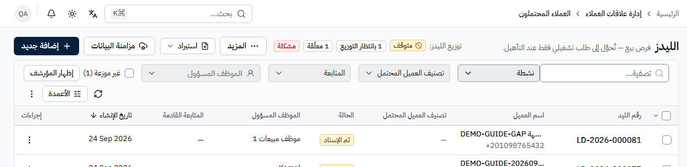
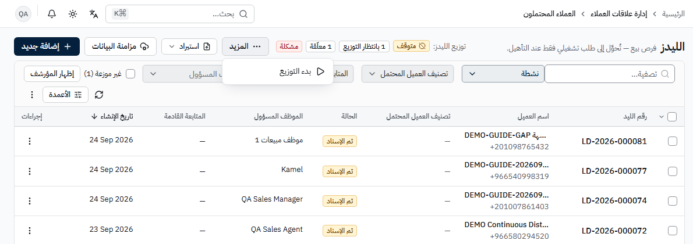
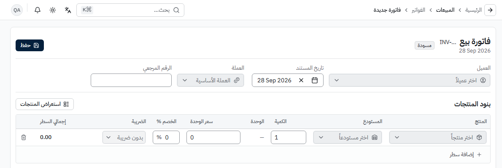
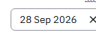
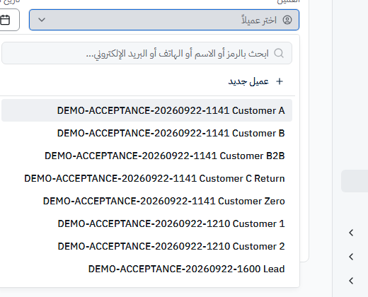
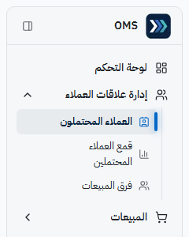
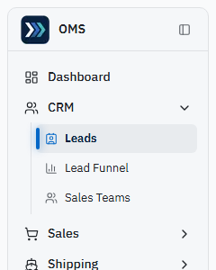
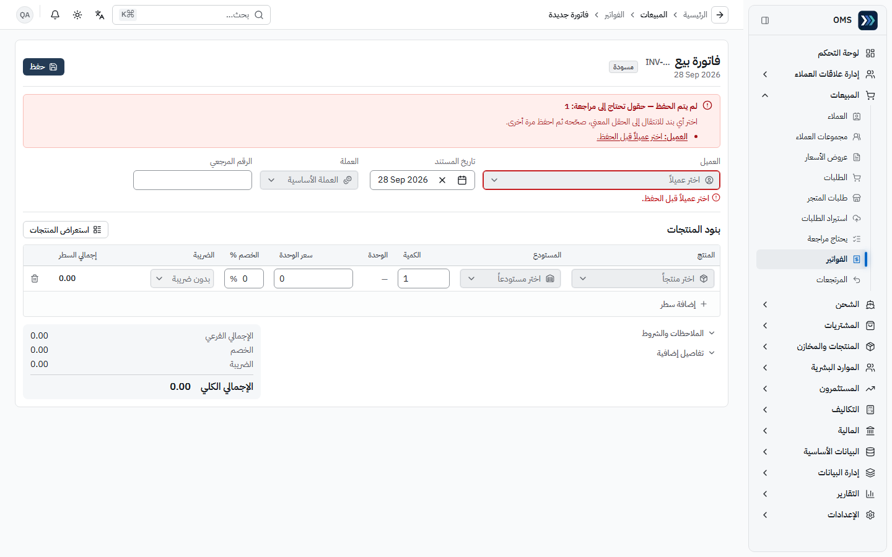
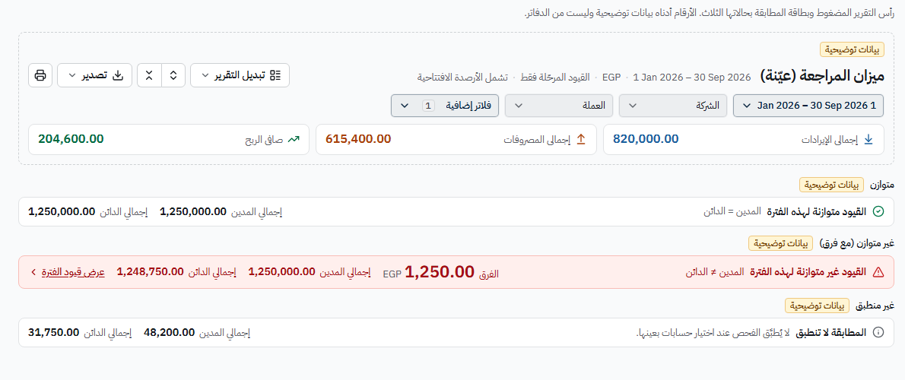

# دليل مستخدم OMS (عربي)

دليل عملي للموظفين غير التقنيين، مرتّب **حسب الدور**. مبني على **أدلة إنتاج موثّقة فقط** — لا يصف ميزة غير مختبرة كأنها تعمل، ويذكر العيوب المعروفة صراحة.

| البند                         | القيمة                                                                                                                                                                                                                                                                           |
| ----------------------------- | -------------------------------------------------------------------------------------------------------------------------------------------------------------------------------------------------------------------------------------------------------------------------------- |
| الإنتاج                       | https://oms.haseb.org                                                                                                                                                                                                                                                            |
| إصدار الدليل (Production SHA) | **0331a58 (acceptance code; final release SHA in specs/payment-declaration-reconciliation/handoff.md)** (معلَم المدفوعات) — الأقسام العامة من **91b5086** (`91b50861a13838a8594afd0f6e69fa483b5abe78`)                                                                           |
| معلَم المدفوعات               | **DEMO-PDR-20260927** — قبول إنتاج على **0331a58** (`0331a58af49cce9d4979e30265dcb440e5d3e4e7`، بداية ونهاية الجولة، 2026-09-27): الإبلاغ عن الدفع، الجاهزية، المطابقة، التسوية، أسعار الصرف — [`summary.md`](./evidence/PAYMENT-RECON-20260927/summary.md)                      |
| الجولة النهائية (مرجع الدليل) | **DEMO-AUDIT-20260927-FINAL** — جولة واجهة إنتاج بـ 8 شخصيات على 91b5086 (بداية ونهاية الجولة، 2026-09-26 21:11–21:25 UTC)                                                                                                                                                       |
| أمان الإنتاج                  | 64679e7: منتقي الشركاء حسب الدور **62 PASS** · عزل الجلسة **25 PASS**                                                                                                                                                                                                            |
| عناصر التحكم الموحدة          | **86/86 PASS** على 7e61bd5، وأُعيد التشغيل بعد إصلاح هامش القوائم على الجوال: **86/86 PASS** على 8679510 (390/820/1440 × عربي/إنجليزي × فاتح/داكن) — [`controls-8679510`](./evidence/SYSTEM-AUDIT-UI-20260926/controls-8679510/controls-visual-report.json)                      |
| جولات سابقة                   | DEMO-AUDIT-20260926 على 7e61bd5 (116 PASS · 17 FAIL · 4 BLOCKED — كشفت D1–D11) · DEMO-GUIDE-20260924 + DEMO-GUIDE-GAP-20260924 (API F1–F7، مستثمرون API 82/82)                                                                                                                   |
| العملة الوظيفية               | **EGP**                                                                                                                                                                                                                                                                          |
| الواجهة الافتراضية            | عربية + RTL                                                                                                                                                                                                                                                                      |
| تحديث الواجهة                 | **الواجهة المؤسسية الجديدة** منذ 2026-09-27 (إنتاج f28d692 / a81c898) — انظر [القسم أدناه](#الواجهة-المؤسسية-الجديدة-تحديث-2026-09-27)؛ **الجولة الثانية** منذ 2026-09-28 (إنتاج **a3b22dc**) — انظر [أين تغيّرت الأشياء](#الجولة-الثانية-للواجهة--أين-تغيرت-الأشياء-2026-09-28) |

### النتيجة النهائية

| الجولة                                                                                                                                              | SHA     | فحوص | PASS    | FAIL  | BLOCKED |
| --------------------------------------------------------------------------------------------------------------------------------------------------- | ------- | ---- | ------- | ----- | ------- |
| **DEMO-PDR-20260927** (المدفوعات؛ إصدار الدليل 0331a58 (acceptance code; final release SHA in specs/payment-declaration-reconciliation/handoff.md)) | 0331a58 | 93   | **92**  | **0** | **1**   |
| **DEMO-AUDIT-20260927-FINAL**                                                                                                                       | 91b5086 | 137  | **134** | **0** | **3**   |
| DEMO-AUDIT-20260926 (سابقة)                                                                                                                         | 7e61bd5 | 137  | 116     | 17    | 4       |

البنود المحجوبة الثلاثة قرارات إعداد لا عيوب: J041 (مستودع نشط واحد — تحويل المخزون)، J077/J081 (دور الشحن بلا `shipping.manage`). العيوب D1–D11 كلها مغلقة — التفاصيل في [issues.md](./issues.md).

**معلَم المدفوعات (DEMO-PDR-20260927):** كل المعايير S0، C1–C8، S1–S5 **PASS** عدا **C3** — **BLOCKED** بسبب ربط Google Sheets (يحتاج جدولاً مُشارَكاً مع حساب الخدمة؛ إجراء مالك). إجراء مالك آخر: ربط حساب تسوية وسيط بطرق الدفع الحقيقية قبل تفعيل «تتطلب مطابقة». التفاصيل: [coverage.md — القسم ج](./coverage.md) · [issues.md](./issues.md).

## كيف تستخدم هذا الدليل

1. افتح ملف **دورك** من الفهرس أدناه. كل ملف يحتوي: الأقسام المتاحة لك ومتى تستخدمها، المهام بخطوات مرقّمة بأسماء الأزرار كما تظهر على الشاشة، مراحل المعاملات وأثرها، التقارير، والأخطاء الشائعة وحلولها.
2. الخطوات تستخدم **نفس النصوص العربية الظاهرة على الشاشة** (بالخط العريض) مع لقطة من الإنتاج لكل خطوة رئيسية.
3. **عناصر التحكم:** القائمة المنسدلة تظهر **زراً رمادياً بسهم ⌄** (يختلف عن حقل الكتابة الأبيض)، وكل قائمة منسدلة قابلة للبحث بالكتابة (صيغ الحروف العربية مثل أ/ا/إ و ة/ه تتطابق)، وصف **«+ جديد»** مثبت أعلى القائمة حين يُسمح لك بالإنشاء، و **×** يمسح الحقل الاختياري. فلاتر القوائم نوافذ منبثقة فيها خيار **«الكل»** (على الهاتف خلف زر **«الفلاتر»**).
4. للمراحل والأثر اللاحق (مخزون، قيود، أرصدة) راجع [workflows.md](./workflows.md)، وللتقارير [reports.md](./reports.md).
5. للتدريب افتح سجلات الجولة النهائية في [demo-records.md](./demo-records.md) (موسومة `DEMO-AUDIT-20260927-FINAL`، وسجلات المدفوعات موسومة `DEMO-PDR-20260927`).
6. قبل الاعتماد على ميزة راجع حالتها في [coverage.md](./coverage.md) (63 مساراً PASS، 51 NOT TESTED من 114؛ ومعلَم المدفوعات 13 PASS · 1 BLOCKED) والملاحظات في [issues.md](./issues.md).
7. إن ظهرت لك **«الوصول مرفوض»** فهذا يعني أن حسابك لا يملك صلاحية تلك الصفحة أو العملية — اطلب من مدير النظام **الصلاحية المحددة** لها.

**كلمات السر غير مذكورة في الدليل.** حسابات QA للتحقق الداخلي فقط.

## الواجهة المؤسسية الجديدة (تحديث 2026-09-27)

منذ **2026-09-27** تعمل على الإنتاج واجهة مؤسسية موحّدة (معلَم `enterprise-ui-overhaul`، إنتاج **f28d692** ثم **a81c898** — إصلاحات تركيز فقط دون تغيير بصري). المهام والصلاحيات والمراحل **لم تتغير**؛ تغيّر مكان بعض الأزرار وشكل الصفحات. لقطات الدليل أُعيد التقاطها على الواجهة الجديدة — التفاصيل في [screenshot-index.md](./screenshot-index.md#تحديث-الواجهة-المؤسسية--2026-09-27).

| العنصر                               | أين أصبح                                                                                                                                                                                                |
| ------------------------------------ | ------------------------------------------------------------------------------------------------------------------------------------------------------------------------------------------------------- |
| مسار التنقل (الرئيسية › المالية › …) | داخل **الشريط العلوي** مع زر **رجوع** (←) قبله؛ لم يعد سطراً فوق عنوان الصفحة                                                                                                                           |
| القائمة الجانبية                     | مجموعات قابلة للطي (مجموعة واحدة مفتوحة في كل مرة). مجموعة **المالية** مقسّمة إلى أربع مجموعات فرعية: **العمليات اليومية** · **الدفاتر والقيود** · **الأصول والتحليل** · **الإعداد والفترات**           |
| الأجهزة اللوحية والهواتف             | القائمة تُفتح من زر **☰** في الشريط العلوي كلوحة جانبية؛ فلاتر القوائم والتقارير خلف زر **«الفلاتر»**، وأدوات التقرير (**تصدير** / **طباعة**) في قائمة **⋯**؛ الجداول تُعرض كبطاقات دون تمرير أفقي     |
| الجداول                              | الفرز **بنقرة واحدة على عنوان العمود**؛ خيارات العمود (إخفاء، تثبيت، تصفية) من زر القائمة الصغير بجانب العنوان؛ إظهار الأعمدة و**الكثافة** (مضغوط / مريح) من زر **«الأعمدة»**؛ إجراءات الصف من زر **⋮** |
| مراجعة المدفوعات                     | في كل صف: الإجراء الأساسي (**تأكيد وترحيل** أو **المطابقة في مساحة العمل**) و**«رفض»** ظاهران مباشرة؛ **«عرض»** و**«مزامنة السند»** (حين تنطبق) و**«اعتراض»** في قائمة الصف **⋮**                       |
| التقارير المالية                     | على سطح المكتب: **توسيع الكل / طي الكل** و**تصدير** (Excel / CSV) و**طباعة** فوق الجدول؛ الأرصدة الجارية والختامية تظهر بجانبها **مدين** أو **دائن** بدل الإشارة السالبة، والصفر يظهر «—»               |
| لوحة التحكم                          | قسم **«أعمال بانتظارك»** أولاً (مثل «مدفوعات بانتظار المراجعة» للمالية)، ثم **«أداء المبيعات»**، ثم «ترتيبك لهذه الفترة»                                                                                |
| قيد اليومية                          | جدول الأسطر أصبح بعنوان **«بنود القيد»**                                                                                                                                                                |
| الأرقام                              | أرقام لاتينية (0–9) في الشاشة والطباعة، والمبالغ محاذاة إلى اليسار في العربية                                                                                                                           |

## الجولة الثانية للواجهة — أين تغيرت الأشياء (2026-09-28)

منذ **2026-09-28** تعمل على الإنتاج الجولة الثانية من الواجهة المؤسسية (إنتاج **a3b22dc**). المهام والصلاحيات والمراحل والقيود **لم تتغير** — تغيّر ترتيب الرؤوس والأزرار وشكل الحقول والتنبيهات. لقطات الجولة الثانية في [`screenshots/ui-r2/`](./screenshots/ui-r2/) والتفاصيل في [screenshot-index.md](./screenshot-index.md#الجولة-الثانية-للواجهة--2026-09-28).

| العنصر                           | أين أصبح / كيف يبدو                                                                                                                                                                                                                                                                                                                              |
| -------------------------------- | ------------------------------------------------------------------------------------------------------------------------------------------------------------------------------------------------------------------------------------------------------------------------------------------------------------------------------------------------ |
| القوائم المنسدلة وحقول الكتابة   | زر اختيار القائمة المنسدلة (العميل، المستودع، الدولة، الحالة…) أصبح **زراً رمادياً بسهم ⌄**، يغمق قليلاً عند المرور ويُحاط بإطار أزرق عند فتحه. **حقول الكتابة** (الاسم، المبلغ، المرجع، التاريخ) تبقى **بيضاء** — فتعرف من الشكل هل تكتب أم تختار                                                                                               |
| الإجراء الأساسي و«المزيد»        | لكل صفحة **إجراء أساسي واحد** بلون داكن (مثل **إضافة جديد** في القوائم، **حفظ** في المستندات، **إبلاغ دفع العميل** على الطلب). بقية الإجراءات أزرار ثانوية أو داخل زر **«المزيد ⋯»** في الرأس (مثل **بدء التوزيع** في الليدز، **إنشاء مرتجع** في الفاتورة)                                                                                       |
| الإجراءات الحساسة                | الإلغاء والحذف والعكس وما شابهها **داخل «المزيد»** مفصولة عن غيرها، ولا تُنفَّذ إلا بعد **حوار تأكيد**                                                                                                                                                                                                                                           |
| رأس السجل (مثل طلب المتجر)       | الرقم والحالة ثم سطر السياق (العميل · التاريخ · العملة)، ثم مجموعتان منفصلتان: **الدفع** (إبلاغ المبيعات · تحقق المالية) و**التنفيذ والشحن** (التنفيذ · الشحن)، ثم الإجمالي والمدفوع والمتبقي                                                                                                                                                    |
| ملخص الأخطاء في النماذج          | عند الحفظ مع نقص أو خطأ يظهر **أعلى النموذج** مربع أحمر «لم يتم الحفظ — حقول تحتاج إلى مراجعة: N» فيه **رابط لكل حقل**؛ اضغط البند فينتقل المؤشر إلى الحقل المعني، وتحت الحقل نفسه رسالة الخطأ. لا يُنشأ أي سجل حتى تُصحَّح الحقول                                                                                                               |
| رأس التقارير المالية             | سطر **سياق** بجانب العنوان (الفترة · العملة · «القيود المرحّلة فقط» · «تشمل الأرصدة الافتتاحية»)، ثم **صف الفلاتر** (نطاق التاريخ، الشركة، العملة) وزر **«فلاتر إضافية»** (الفرع، مركز التكلفة، المشروع، «المرحّل فقط»، «تضمين الرصيد الافتتاحي»)؛ الأدوات: **تبديل التقرير**، توسيع/طي، **تصدير**، **طباعة**                                    |
| شريط المطابقة (الميزان والأستاذ) | **«القيود متوازنة لهذه الفترة — المدين = الدائن»** بعلامة ✓: تعني فقط أن مجموع المدين = مجموع الدائن **لقيود الفترة المعروضة**، **ولا تعني أن المحاسبة كلها صحيحة**. **«القيود غير متوازنة لهذه الفترة»** (أحمر): يعرض **الفرق** بوضوح ورابط **«عرض قيود الفترة»** لمراجعتها. **«المطابقة لا تنطبق»**: عند اختيار حسابات بعينها لا يُطبَّق الفحص |
| رسائل النجاح والخطأ              | الإشعارات المنبثقة تظهر الآن **أعلى الشاشة** (أعلى اليسار في العربية، أعلى اليمين في الإنجليزية، وفي الوسط على الهاتف)                                                                                                                                                                                                                           |
| القائمة الجانبية                 | الصفحة الحالية معلَّمة بـ **شريط سميك** على الحافة الخارجية للعنصر (يمين في العربية، يسار في الإنجليزية) مع خلفية خفيفة وخط أعرض                                                                                                                                                                                                                 |

  

 

## فهرس الأدوار

| الدور           | الملف                                              | حساب التحقق                      | مجموعات القائمة الجانبية (J###)                                              |
| --------------- | -------------------------------------------------- | -------------------------------- | ---------------------------------------------------------------------------- |
| مدير النظام     | [roles/super-admin.md](./roles/super-admin.md)     | `qa-admin@oms.haseb.org`         | كل المجموعات — 113 رابطاً (J001)                                             |
| مندوب المبيعات  | [roles/sales-agent.md](./roles/sales-agent.md)     | `qa-sales-agent@oms.haseb.org`   | علاقات العملاء، المبيعات، المنتجات والمخازن — 11 رابطاً (J010)               |
| مدير المبيعات   | [roles/sales-manager.md](./roles/sales-manager.md) | `qa-sales-manager@oms.haseb.org` | + إدارة البيانات — 11 رابطاً (J006)                                          |
| المالية         | [roles/finance.md](./roles/finance.md)             | `qa-finance@oms.haseb.org`       | المبيعات، التكاليف، المالية، التقارير — 43 رابطاً (J002)                     |
| المشتريات       | [roles/purchasing.md](./roles/purchasing.md)       | `qa-purchasing@oms.haseb.org`    | المبيعات، المشتريات، المنتجات والمخازن، المالية، التقارير — 37 رابطاً (J018) |
| الشحن           | [roles/shipping.md](./roles/shipping.md)           | `qa-shipping@oms.haseb.org`      | المبيعات، الشحن — 6 روابط (J014)                                             |
| المستثمرون      | [roles/investors.md](./roles/investors.md)         | `qa-investors@oms.haseb.org`     | المبيعات، المنتجات والمخازن، المستثمرون — 9 روابط (J022)                     |
| الموارد البشرية | [roles/hr.md](./roles/hr.md)                       | `qa-hr@oms.haseb.org`            | الموارد البشرية — 11 رابطاً (J026)                                           |

مصدر الصلاحيات: `apps/api/prisma/scripts/ensure-qa-users.ts` · مصدر القائمة الجانبية: `apps/web/src/navigation/navigation.config.ts` (الصلاحيات تُمنح مباشرة لكل مستخدم من محرر المستخدم؛ لا صفحة أدوار).

## فهرس الملفات

| الملف                                        | المحتوى                                                                                                                                                                                              |
| -------------------------------------------- | ---------------------------------------------------------------------------------------------------------------------------------------------------------------------------------------------------- |
| [workflows.md](./workflows.md)               | المراحل، المسؤول، الأثر اللاحق لكل مسار؛ مسرد الحالات؛ **القسم 9: إبلاغ ← تنفيذ ← مطابقة ← تسوية** مع جدول القيود                                                                                    |
| [reports.md](./reports.md)                   | التقارير العاملة وكيف تُقرأ؛ **أرصدة مزوّدي الدفع**؛ فئات «قريباً»                                                                                                                                   |
| [coverage.md](./coverage.md)                 | جرد كل مسارات القائمة والميزات: PASS / FAIL / BLOCKED / NOT TESTED (AC-AUD-1)؛ **القسم ج: معايير المدفوعات**                                                                                         |
| [issues.md](./issues.md)                     | معلَم المدفوعات (Sheets BLOCKED، إجراءات المالك، القيود المعروفة، العيوب المصلحة)؛ العيوب D1–D11 (مغلقة)                                                                                             |
| [demo-records.md](./demo-records.md)         | **جولة DEMO-PDR-20260927 (المدفوعات)** + مجموعة الدليل النهائية بروابط مباشرة + سجلات الجولات السابقة                                                                                                |
| [screenshot-index.md](./screenshot-index.md) | فهرس لقطات `screenshots/payments/` (86 لقطة) و`screenshots/audit/` (144 لقطة) و`screenshots/ui-r2/` (17 لقطة) ومن يستخدمها؛ **قسما تحديث الواجهة 2026-09-27 و2026-09-28** (المُحدَّث مقابل التاريخي) |
| [evidence/](./evidence/)                     | الأدلة: `SYSTEM-AUDIT-UI-20260926/journeys/` (الجولة النهائية)، `security/`، `controls/`، وأدلة الجولات السابقة                                                                                      |

المواصفة ومعايير القبول (AC-AUD-1..6) والتحقق: [`specs/system-audit-ui/`](../../specs/system-audit-ui/) — `spec.md`، `tasks.md`، `verification.md`. معلَم المدفوعات: [`specs/payment-declaration-reconciliation/`](../../specs/payment-declaration-reconciliation/) — القواعد المؤكدة في `spec.md`، مصدر الأسعار في `fx-source-research.md`، القيود المعروفة في `verification.md`.

### أقسام معلَم المدفوعات في الدليل

| الموضوع                                                                             | أين                                                                                                    |
| ----------------------------------------------------------------------------------- | ------------------------------------------------------------------------------------------------------ |
| الإبلاغ عن الدفع (لم يدفع / كامل / جزئي) وتحويل الليد                               | [المندوب — المهمتان 2 و3](./roles/sales-agent.md) · [مدير المبيعات — 2أ و2ب](./roles/sales-manager.md) |
| قاعدة الجاهزية، الاستلام من المقر، «تعارض في الدفع»                                 | [الشحن — 1أ، 3أ، 3ب](./roles/shipping.md)                                                              |
| مراجعة المدفوعات، مطابقة المدفوعات، التسوية، رصيد المزوّد، أسعار الصرف، قفل الفترات | [المالية — 1 إلى 1هـ](./roles/finance.md)                                                              |
| إعداد طرق الدفع وحسابات العمولة وفروق الصرف                                         | [مدير النظام — 11 و12](./roles/super-admin.md)                                                         |
| الحالات والقيود                                                                     | [workflows.md — القسم 9](./workflows.md)                                                               |

## قواعد ذهبية موثّقة

1. **حالة الدفع ≠ حالة الشحن** — طلب «مدفوع بالكامل (مُسوّى)» قد يبقى «جاهز للشحن»، وطلب «الدفع عند الاستلام» قد يُسلَّم قبل التحصيل.
2. **«أبلغ العميل بالدفع» ≠ «تحققت المالية/مرحّل»** — المبيعات تُبلغ (بلا قيد)، والمالية تطابق وترحّل. الإبلاغ **الكامل** يكفي لتجهيز طلب مدفوع مسبقاً قبل المالية؛ **الجزئي لا يكفي أبداً**.
3. **تأكيد وترحيل** آمن للتكرار (`alreadyPosted`) — لا قيد مزدوج.
4. تحويل ليد بمبلغ **صفر** مرفوض؛ ودفعة على مستند مسدَّد مرفوضة.
5. **أمر البيع المؤكد يحجز** المخزون، و**فاتورة البيع المؤكدة تصرفه**؛ **أمر الشراء لا يحرّك** مخزوناً ولا قيداً — الاستلام يحدث بتأكيد **فاتورة الشراء**.
6. حركات المخزون لا تُعدَّل ولا تُحذف — التصحيح بتسوية أو جرد.
7. القيود **النظامية** لا تُعدَّل ولا تُعاد لمسودة — صحّح المستند المصدر.
8. المرتجع الزائد عن الكمية المفوترة/المستلمة مرفوض؛ بعد مرتجع البيع يُغلق رصيد العميل الدائن بـ **«رد المبلغ»** (CRF).
9. أرقام المستندات تُنشأ تلقائياً — لا تُكتب يدوياً.
10. العمليات الناجحة تُظهر رسالة تأكيد (مثل «تم الحفظ»، «تم التأكيد.»)؛ إن لم تظهر فتحقق من حالة المستند قبل التكرار.
11. العملة الافتراضية في المستندات هي العملة الأساسية **EGP** (ومنها «تكلفة مرحلة» لفواتير الشراء بالعملة الأساسية).

## أدلة الجولة النهائية

- [`evidence/SYSTEM-AUDIT-UI-20260926/journeys/journey-audit-summary.md`](./evidence/SYSTEM-AUDIT-UI-20260926/journeys/journey-audit-summary.md) — الجداول والسجلات (DEMO-AUDIT-20260927-FINAL)
- [`journey-audit-report.json`](./evidence/SYSTEM-AUDIT-UI-20260926/journeys/journey-audit-report.json) — حالة كل فحص (بما فيها القائمة الجانبية لكل شخصية)
- [`journey-audit-created.json`](./evidence/SYSTEM-AUDIT-UI-20260926/journeys/journey-audit-created.json) — السجلات المنشأة وروابطها
- الأمان: [`security/partner-catalog-access.json`](./evidence/SYSTEM-AUDIT-UI-20260926/security/partner-catalog-access.json)، [`security/session-isolation-report.json`](./evidence/SYSTEM-AUDIT-UI-20260926/security/session-isolation-report.json)
- عناصر التحكم: [`controls/controls-visual-report.json`](./evidence/SYSTEM-AUDIT-UI-20260926/controls/controls-visual-report.json)
- اللقطات: [`screenshots/audit/`](./screenshots/audit/) (132 لقطة من الجولة النهائية + 12 لقطة شحن بأسماء جديدة؛ أُعيد التقاط معظمها على الجولة الثانية للواجهة في 2026-09-28)
- معلَم المدفوعات: [`evidence/PAYMENT-RECON-20260927/summary.md`](./evidence/PAYMENT-RECON-20260927/summary.md)، [`payment-recon-report.json`](./evidence/PAYMENT-RECON-20260927/payment-recon-report.json)، [`statement-DEMO-PDR-20260927.csv`](./evidence/PAYMENT-RECON-20260927/statement-DEMO-PDR-20260927.csv)، اللقطات [`screenshots/payments/`](./screenshots/payments/) (86 لقطة)
- الجولات السابقة: `evidence/SUMMARY.md`، `evidence/VERSION-REFUND-RESOLUTION.md`، `evidence/DEMO-GUIDE-20260924/`
