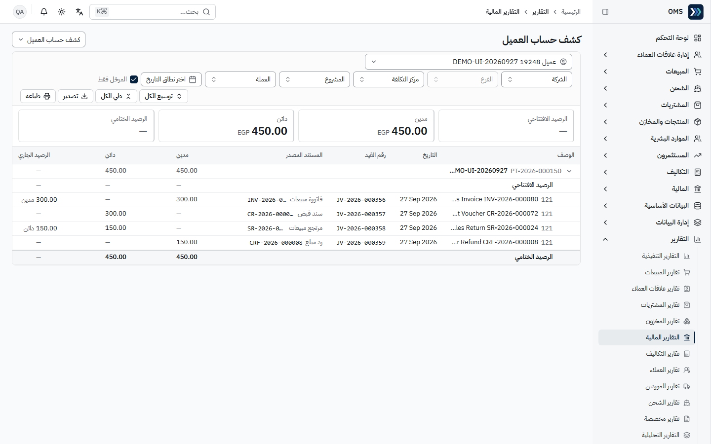
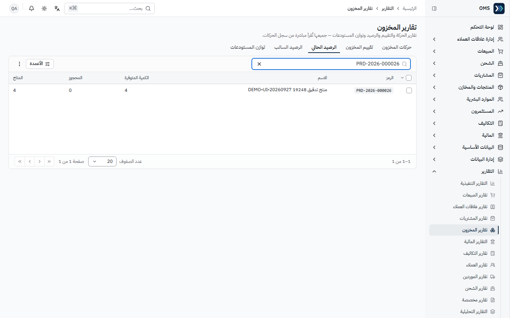
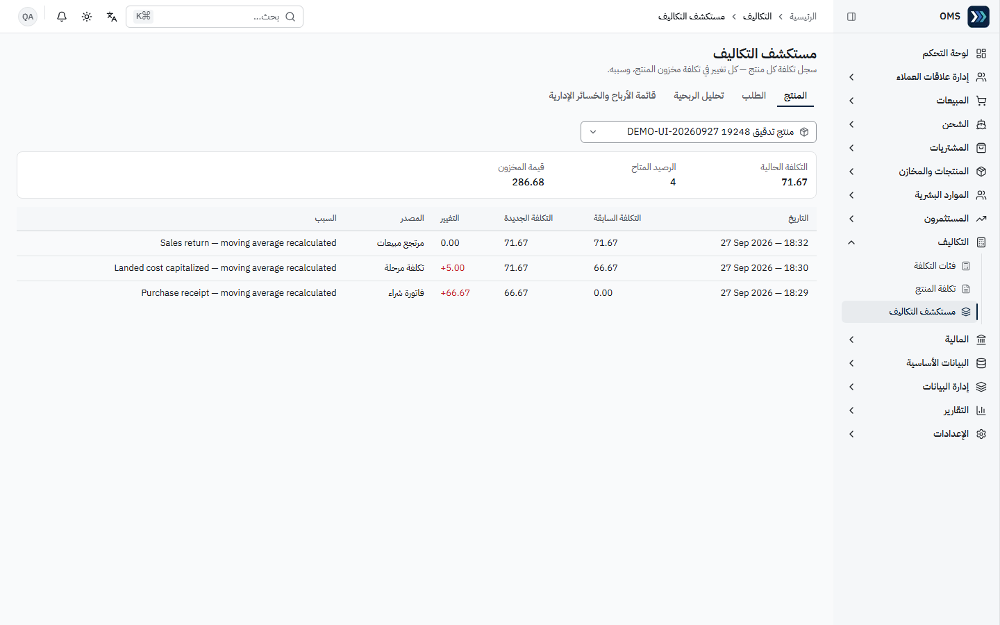

# التقارير

المصدر: الجولة النهائية **DEMO-AUDIT-20260927-FINAL** على الإنتاج 91b5086 (فحوص `J092`–`J103`) + تحقق F7 السابق (API، 20260924) + أرصدة مزوّدي الدفع من **DEMO-PDR-20260927** على 0331a58 (C8). العملة: **EGP**.

## التقارير المالية — عاملة

المسار: التقارير ← **التقارير المالية** (`/reports/finance`)؛ و**دفتر الأستاذ العام** أيضاً من قائمة المالية. بدّل نوع التقرير من القائمة المنسدلة أعلى الصفحة.

**الفلاتر المشتركة:** نطاق التاريخ، الشركة، الفرع، مركز التكلفة، المشروع، العملة، «المرحّل فقط»، و«تضمين الرصيد الافتتاحي» (للميزان). **الأدوات:** توسيع الكل / طي الكل، **تصدير** (Excel ‎.xlsx أو CSV)، **طباعة** (تخطيط طباعة مخصص في تبويب جديد). **على الهاتف والجهاز اللوحي** (الواجهة المؤسسية منذ 2026-09-27): الفلاتر خلف زر **«الفلاتر»**، وتوسيع/طي الكل والتصدير والطباعة في قائمة **⋯**.

**قراءة الأرصدة:** الأرصدة الافتتاحية والجارية والختامية في الميزان والأستاذ العام وكشف الحساب وكشوف العملاء والموردين تُعرض رقماً موجباً ومعه **مدين** أو **دائن** (بدل الإشارة السالبة)؛ الصفر يظهر «—»، والأحمر فقط لصافي الخسارة أو فرق عدم التوازن. قائمة الدخل والميزانية والتدفق النقدي والتقادم تستخدم علامة الناقص للقيم السالبة.

| التقرير                   | الغرض                  | كيف تقرأه                                                                                                        | الدليل                                      |
| ------------------------- | ---------------------- | ---------------------------------------------------------------------------------------------------------------- | ------------------------------------------- |
| ميزان المراجعة            | مجموع المدين = الدائن  | بطاقة **المدين = الدائن ← متوازن**؛ أعمدة: الرصيد الافتتاحي، مدين، دائن، الرصيد الختامي لكل حساب ومجموعة         | J092 PASS (هذا الشهر، متوازن + صف إجماليات) |
| — تصدير / طباعة           | نسخة خارجية            | ملف `trial-balance.csv`؛ الطباعة تحمل اسم الشركة و«طُبع بواسطة» وتاريخ الطباعة والفترة وتذييل الصفحة             | J093، J094 PASS                             |
| دفتر الأستاذ العام        | حركة حساب              | اختر الحساب؛ الرصيد الافتتاحي + مدين − دائن = الختامي؛ كل سطر برقم القيد واليومية والمستند المصدر والرصيد الجاري | J095 PASS (حساب 552 يعرض JV-2026-000336)    |
| كشف حساب العميل           | حركة ذمة عميل          | الافتتاحي + الحركات = الختامي؛ مثال الجولة: فاتورة 300، قبض 300، مرتجع 150، رد 150 ← **0.00**                    | J096 PASS (المالية) · J097 PASS (مدير)      |
| كشف حساب المورد           | حركة ذمة مورد          | نفس المنطق للمورد                                                                                                | F7 سابق (API)                               |
| الميزانية                 | أصول = خصوم + حقوق     | يجب «متوازن»                                                                                                     | F7 سابق (API)                               |
| قائمة الدخل               | إيراد − مصروف          | صافي الدخل = أرباح الفترة في الميزانية                                                                           | F7 سابق (API)                               |
| التدفق النقدي             | حركة النقدية           | صافي التغير والرصيد الختامي                                                                                      | F7 سابق (API)                               |
| تقادم المدينين / الدائنين | أعمار الأرصدة المفتوحة | مجموع التقادم ≈ الفواتير المفتوحة                                                                                | F7 سابق (API)                               |

تقارير إضافية في القائمة (تقرير يومية، كشف حساب، توفر نقدية) **لم تُفحص** — لا تعتمد عليها دون تحقق.

روابط سريعة: [ميزان المراجعة](https://oms.haseb.org/reports/finance?report=trialBalance) · [الأستاذ العام](https://oms.haseb.org/reports/finance?report=generalLedger) · [كشف عميل الجولة](https://oms.haseb.org/reports/finance?report=customerStatement&partner=3fffa657-a844-47da-8c07-8e21d028590b) · [الميزانية](https://oms.haseb.org/reports/finance?report=balanceSheet) · [قائمة الدخل](https://oms.haseb.org/reports/finance?report=incomeStatement) · [التدفق النقدي](https://oms.haseb.org/reports/finance?report=cashFlow)

## أرصدة مزوّدي الدفع — عاملة (C8 PASS)

المسار: المالية ← **مطابقة المدفوعات** ← الطريقة ← تبويب **بانتظار التسوية** (بطاقة **رصيد المزوّد**)، مع كشف حساب التسوية الوسيط من التقارير المالية.

| العنصر                                              | الغرض                                              | كيف تقرأه                                                                                              | الدليل    |
| --------------------------------------------------- | -------------------------------------------------- | ------------------------------------------------------------------------------------------------------ | --------- |
| رصيد حساب التسوية الوسيط                            | رصيد الأستاذ العام لحساب الطريقة (مثل 114)         | ما رُحّل بالمطابقة ولم يُسوَّ بعد                                                                      | P073–P080 |
| المطالبات غير المسوّاة (القيمة الدفترية)            | مجموع المطالبات «بانتظار التسوية» بقيمتها المرحّلة | يجب أن يساوي رصيد الحساب                                                                               | P073–P080 |
| الفرق                                               | الرصيد − المطالبات                                 | **0.00 = «متطابق»**. غير الصفر يعني قيداً على الحساب خارج مسار المطابقة/التسوية                        | P073–P080 |
| غير المسوّى حسب العملة                              | عدد ومبلغ المطالبات لكل عملة                       | مثال قبل التسوية: EGP 10 مطالبة · 5,000.00؛ USD 2 مطالبة · 400.00                                      | P073      |
| كشف حساب (التقارير المالية) على حساب التسوية الوسيط | حركة الحساب                                        | قيود القبض مديناً (JV-2026-000337 … 000348) والتسويات دائناً (JV-2026-000349)؛ الرصيد الجاري = البطاقة | P081      |

أرقام الجولة: 25,713.28 = 25,713.28 قبل التسوية ← 5,000.00 = 5,000.00 بعد تسوية الدولار ← 0.00 بعد تسوية الجنيه؛ الفرق 0.00 دائماً. التفاصيل في [المالية — 1ج](./roles/finance.md).

## أعمدة التحويل بالعملة في التقارير

- التقارير التي تحوّل مبالغ بعملة أجنبية إلى EGP تستخدم الآن **نفس خدمة أسعار الصرف** التي يستخدمها الترحيل: السعر المخصص داخل فترته أولاً، ثم أحدث سعر يومي ضمن **أقصى عمر للسعر** (10 أيام افتراضياً)، وإلا لا يُفترض سعر (المصدر: `specs/payment-declaration-reconciliation/handoff.md` — تكامل 6636a6d).
- **ملاحظة تغطية:** هذا السلوك في أعمدة التقارير **لم يُفحص في جولة الإنتاج** (C7 فحص صفحة أسعار الصرف والقيود المرحّلة فقط). القيود المرحّلة تحتفظ بسعرها المجمَّد ولا تتغير بتعديل الأسعار لاحقاً (P085، P089، P091).

## تقارير المخزون — عاملة

المسار: التقارير ← **تقارير المخزون** (`/reports/inventory`) — تتطلب صلاحية المخزون.

| التبويب         | الغرض                                | كيف تقرأه                                                        | الدليل                                   |
| --------------- | ------------------------------------ | ---------------------------------------------------------------- | ---------------------------------------- |
| الرصيد الحالي   | الكمية لكل منتج/مستودع (فلتر المنتج) | **الكمية المتوفرة**، **المحجوز**، **المتاح** = المتوفر − المحجوز | J099 PASS (PRD-2026-000025: 23 / 0 / 23) |
| — لحساب المالية | —                                    | «الوصول مرفوض» — متوقع (لا صلاحية مخزون)                         | J098 PASS                                |

صفحة **الرصيد الفعلي** (المنتجات والمخازن) تعرض أيضاً التكلفة والقيمة وطريقة التقييم (متوسط التكلفة افتراضياً) — J044.

## تحليل التكلفة

| الصفحة                                    | الغرض                                                                                                            | الدليل                                       |
| ----------------------------------------- | ---------------------------------------------------------------------------------------------------------------- | -------------------------------------------- |
| التكاليف ← مستكشف التكاليف (تبويب المنتج) | سجل كل تغيير في تكلفة مخزون المنتج وسببه؛ تبويبات: المنتج، الطلب، تحليل الربحية، قائمة الأرباح والخسائر الإدارية | J101 PASS (مدير)؛ J100 مرفوض للمالية (متوقع) |
| التكاليف ← تكلفة المنتج                   | التكلفة الحالية للقراءة فقط (متوسط التكلفة، الرصيد المتاح، القيمة)                                               | J102 PASS (المالية)، J103 PASS (مدير)        |

## فئات التقارير — قشرة «قريباً»

لا تولّد تقريراً تشغيلياً بعد: `/reports/executive`، `/reports/sales`، `/reports/crm`، `/reports/purchasing`، `/reports/expenses`، `/reports/customers`، `/reports/suppliers`، `/reports/shipping`، `/reports/custom`، `/reports/analytics` — **NOT TESTED** وظيفياً (تحميل صفحة فقط في مسح 20260924).

## تفسير سريع

- بعد مرتجع دون رد نقدي: كشف العميل يُظهر رصيداً دائناً (سالب) بينما تقادم الفواتير المفتوحة = 0. بعد «رد المبلغ» يعود الختامي إلى 0.00.
- بعد مرتجع مورد مدفوع: المورد قد يظهر مديناً للشركة بمبلغ المرتجع حتى تُسوّى حركة لاحقة.
- أرصدة العملاء/الموردين تتغير بعمليات لاحقة — استخدم الكشف بتاريخ محدد لا أرقام لقطة قديمة.
- «المرحّل فقط» مفعّل في لقطات الجولة؛ ألغِه لرؤية أثر المسودات قبل الترحيل.
