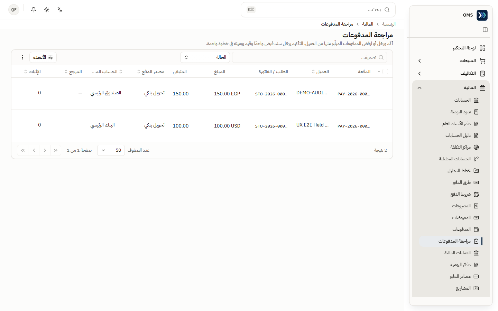
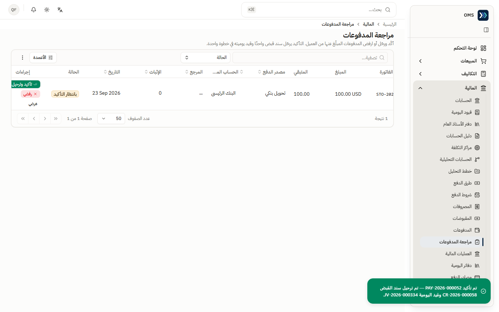

# المالية (Finance)

حساب التحقق: `qa-finance@oms.haseb.org` (المسمى: المحاسب) — القائمة: **المبيعات، التكاليف، المالية، التقارير** (43 رابطاً، J002).
مصدر الأدلة: الجولة النهائية **DEMO-AUDIT-20260927-FINAL** على الإنتاج 91b5086.

## الأقسام المتاحة

| القسم / الصفحة                                               | الغرض                                                 | متى تستخدمه                        |
| ------------------------------------------------------------ | ----------------------------------------------------- | ---------------------------------- |
| المالية ← مراجعة المدفوعات                                   | تأكيد وترحيل (أو رفض) دفعات طلبات المتجر المبلّغ عنها | يومياً بعد إبلاغ المبيعات بالدفعات |
| المبيعات ← طلبات المتجر                                      | **إصدار فاتورة** للطلب المسدَّد                       | بعد تأكيد الدفعة                   |
| المبيعات ← المرتجعات                                         | **رد المبلغ** للعميل مقابل مرتجع مؤكد                 | بعد تأكيد المرتجع                  |
| المالية ← المقبوضات                                          | سندات قبض العملاء + قائمة «المبالغ المردودة»          | تحصيل فواتير B2B                   |
| المالية ← المدفوعات                                          | سندات صرف الموردين                                    | سداد فواتير الشراء                 |
| المالية ← قيود اليومية                                       | عرض القيود (الإنشاء لمن يملك الصلاحية)                | المراجعة والتدقيق                  |
| المالية ← دفتر الأستاذ العام / دليل الحسابات                 | حركة حساب / شجرة الحسابات مع البحث بالرمز أو الاسم    | المطابقات                          |
| المالية ← العمليات المالية                                   | التدفق النقدي بين الحسابات البنكية/النقدية والمستندات | مطابقة البنك والخزينة              |
| المالية ← أسعار الصرف والعملات                               | أسعار الصرف وإعادة التقييم                            | نهاية الفترة / عمليات بعملة أجنبية |
| المالية ← السنوات والفترات المالية                           | فتح وإغلاق الفترات (لا ترحيل في فترة مغلقة)           | نهاية الشهر                        |
| المالية ← الأصول الثابتة، المصروفات المدفوعة مقدماً/المستحقة | الرسملة والإطفاء                                      | حسب الحدث                          |
| التقارير ← التقارير المالية                                  | ميزان المراجعة، الأستاذ، القوائم، كشوف الشركاء        | المراجعة الدورية والإقفال          |
| التكاليف ← تكلفة المنتج                                      | تكلفة المخزون الحالية لكل منتج (للقراءة)              | تحليل التكلفة (J102)               |

## المهام

### 1) تأكيد وترحيل دفعة طلب متجر

- **المتطلبات المسبقة:** المندوب سجّل الدفعة (الحالة «بانتظار المطابقة»).

1. المالية ← **مراجعة المدفوعات** ← استخدم فلتر **الحالة** أو ابحث برقم الطلب.
2. راجع **المبلغ**، **مصدر الدفع**، **الحساب المستلم**، **الإثبات**.
3. اضغط **تأكيد وترحيل** (أو **رفض**).

- **النتيجة المتوقعة:** «تم تأكيد PAY-… — تم ترحيل سند القبض CR-… وقيد اليومية JV-…»؛ حالة الطلب «مدفوع بالكامل (مُسوّى)» (J073). التكرار آمن (`alreadyPosted`).

### 2) إصدار فاتورة لطلب متجر مسدَّد

1. المبيعات ← **طلبات المتجر** ← افتح الطلب ← **إصدار فاتورة**.

- **النتيجة المتوقعة:** «تم إصدار الفاتورة.» وتظهر الفاتورة والدفعة وسند القبض والقيد في **السجلات المرتبطة** (J074). إعادة الإصدار مرفوضة.

### 3) رد مبلغ للعميل بعد مرتجع

- **المتطلبات المسبقة:** مرتجع بيع «مؤكد» وللعميل رصيد دائن > 0.

1. المبيعات ← **المرتجعات** ← افتح المرتجع ← **رد المبلغ**.
2. في «رد مبلغ للعميل» راجع **إجمالي المرتجع**، **تم رده سابقاً**، **الرصيد الدائن للعميل**، **المتاح للرد الآن**.
3. أدخل **مبلغ الرد** (≤ المتاح)، **يُصرف من (خزينة / بنك)**، **التاريخ**، و**الرقم المرجعي** اختيارياً ← **تأكيد الرد**.

- **النتيجة المتوقعة:** «تم تأكيد وترحيل رد المبلغ CRF-…»؛ المتاح للرد يصبح 0 (J070: 150→0)، وكشف العميل يغلق على 0.00 (J097).

### 4) سند قبض عميل لفاتورة B2B

1. المالية ← **المقبوضات** ← **سند قبض جديد**: **نوع الحركة** «تحصيل من عميل»، **العميل** (اكتب للبحث)، **المبلغ**، **حساب الاستلام**، **الرقم المرجعي**.
2. في **التخصيصات** تظهر الفواتير المفتوحة للعميل — أضف الفاتورة أو **سداد كل المتبقي** ← **تأكيد**.

- **النتيجة المتوقعة:** «تم التأكيد.»، سند `CR-…` «مؤكد» وقيد «مرحّل» في **السجلات المرتبطة**، والفاتورة «مدفوعة بالكامل» (J066: CR-2026-000057، JV-2026-000331).
- قائمة العميل تعرض الاسم والرمز فقط (بلا جهات اتصال أو أرصدة) — كافية للاختيار.

### 5) مراجعة قيود اليومية والحسابات

1. المالية ← **قيود اليومية**: فلاتر **الحالة**، **دفتر اليومية**، **نطاق التاريخ**؛ حساب المالية يرى القائمة دون زر الإنشاء (J085).
2. **دليل الحسابات**: ابحث بالرمز أو الاسم (مثل `552` مصروفات متنوعة، J088).
3. العمليات المالية، أسعار الصرف (7 أسعار)، السنوات والفترات المالية — عرض (J089–J091).

### 6) تكلفة المنتج

1. التكاليف ← **تكلفة المنتج** ← اختر المنتج من القائمة (بحث بالاسم أو الرمز).

- **النتيجة المتوقعة:** **متوسط التكلفة**، **الرصيد المتاح**، **قيمة المخزون**، **آخر حركة** (J102). سجل التغييرات التفصيلي في **مستكشف التكاليف** لمن يملك صلاحيته (المالية: «الوصول مرفوض»، J100).
- التكاليف المرحلة المرحّلة (مثل الشحن الوارد) تُرسمَل في تكلفة المخزون — انظر [المشتريات](./purchasing.md).

### 7) الأصول الثابتة والمصروفات المقدمة

- الرسملة والتفعيل مثبتة سابقاً عبر API (FA-2026-000013، PE-2026-000018 — جولة 20260924).
- **الإهلاك الدفعي وإثبات المقدمات الدوري: NOT TESTED** — لا تُشغَّل دفعة على كامل الشركة دون موافقة.

## مراحل المعاملات

| الحدث                 | المسؤول             | الأثر اللاحق                                                                     |
| --------------------- | ------------------- | -------------------------------------------------------------------------------- |
| تأكيد وترحيل دفعة طلب | المالية             | سند قبض `CR` + قيد (مدين نقدية/بنك، دائن العميل)؛ الطلب «مدفوع بالكامل (مُسوّى)» |
| إصدار فاتورة طلب متجر | المالية             | قيد فاتورة (إيراد + تكلفة مبيعات)؛ مرة واحدة فقط                                 |
| فاتورة بيع B2B مؤكدة  | المبيعات            | قيد إيراد وتكلفة + ذمة مدينة (JV-2026-000330 للفاتورة INV-2026-000078)           |
| سند قبض مؤكد          | المالية / المخول    | قيد قبض؛ الفاتورة «مدفوعة» (JV-2026-000331)                                      |
| مرتجع بيع مؤكد        | المبيعات            | قيد عكسي + مخزون يعود + رصيد دائن للعميل (JV-2026-000332)                        |
| رد مبلغ (CRF)         | المالية             | صرف من خزينة/بنك + قيد رد (JV-2026-000333)؛ الرصيد الدائن = 0                    |
| فاتورة شراء مؤكدة     | المشتريات + المعتمد | مدين مخزون / دائن مورد + حركة استلام                                             |
| سداد مورد             | المشتريات / المالية | الفاتورة «مدفوعة»                                                                |
| تكلفة مرحلة مرحّلة    | مدير النظام         | رسملة في قيمة المخزون + قيد (LC-2026-000002 ← JV-2026-000329)                    |
| تسليم الشحنة          | الشحن               | قيد تكلفة الشحن مرة واحدة (تحقق سابق F2)                                         |
| قيد نظامي             | النظام              | لا يُعدَّل ولا يُعاد لمسودة — صحّح المستند المصدر                                |

## التقارير

المسار: التقارير ← **التقارير المالية** (والأستاذ العام أيضاً من قائمة المالية). بدّل التقرير من القائمة أعلى اليسار.

| التقرير                                        | الفلاتر                                                                                             | كيف تقرأه                                                                                 |
| ---------------------------------------------- | --------------------------------------------------------------------------------------------------- | ----------------------------------------------------------------------------------------- |
| ميزان المراجعة                                 | نطاق التاريخ، الشركة، الفرع، مركز التكلفة، المشروع، العملة، «المرحّل فقط»، «تضمين الرصيد الافتتاحي» | بطاقة **المدين = الدائن ← متوازن**؛ أي فرق يعني خللاً في الترحيل (J092)                   |
| دفتر الأستاذ العام                             | الحساب (مثل 552)، نطاق التاريخ، نفس الفلاتر                                                         | الرصيد الافتتاحي + مدين − دائن = الرصيد الختامي؛ كل سطر برقم القيد والمستند المصدر (J095) |
| كشف حساب العميل / المورد                       | الشريك + الفلاتر                                                                                    | الختامي 0.00 يعني التسوية الكاملة (J096 المالية، J097 المدير: مدين 450 / دائن 450)        |
| الميزانية، قائمة الدخل، التدفق النقدي، التقادم | الفترة                                                                                              | مثبتة سابقاً (F7 — API، 20260924)                                                         |

- **تصدير** ← CSV (J093) · **طباعة** ← تخطيط طباعة في تبويب جديد باسم الشركة، «طُبع بواسطة» وتاريخ الطباعة والفترة (J094).
- **توسيع الكل / طي الكل** للتنقل في شجرة الحسابات.

## أخطاء شائعة وطريقة المعالجة

| السلوك                                           | السبب                                                       | المعالجة                                              |
| ------------------------------------------------ | ----------------------------------------------------------- | ----------------------------------------------------- |
| «الوصول مرفوض» على صفحة أو زر                    | حسابك لا يملك الصلاحية المحددة (مثل فئات التكلفة، الموظفين) | اطلب من مدير النظام **الصلاحية المحددة** لتلك العملية |
| قائمة العميل تعرض الاسم والرمز فقط               | المنتقي يعرض ما يحتاجه دورك فقط                             | طبيعي — التفاصيل الكاملة من صفحة العميل لمن يملكها    |
| تقارير المخزون / مستكشف التكاليف: «الوصول مرفوض» | لا صلاحية مخزون/مستكشف لهذا الدور                           | متوقع (J098، J100)                                    |
| `alreadyPosted`                                  | تأكيد مكرر                                                  | طبيعي — لا قيد جديد                                   |
| «Journal entry is not balanced»                  | المدين ≠ الدائن                                             | صحّح الأسطر حتى يظهر «متوازن»                         |
| مبلغ الرد أكبر من المتاح                         | مرفوض                                                       | ردّ ≤ «المتاح للرد الآن»                              |
| تعديل قيد نظامي                                  | ممنوع                                                       | عدّل المستند المصدر                                   |

التفاصيل: [issues.md](../issues.md) · [reports.md](../reports.md).
