# الموارد البشرية (HR)

حساب التحقق: `qa-hr@oms.haseb.org` (أخصائي الموارد البشرية) — القائمة: **الموارد البشرية** فقط (11 رابطاً، J026).
مصدر الأدلة: الجولة النهائية **DEMO-AUDIT-20260927-FINAL** على الإنتاج 91b5086.

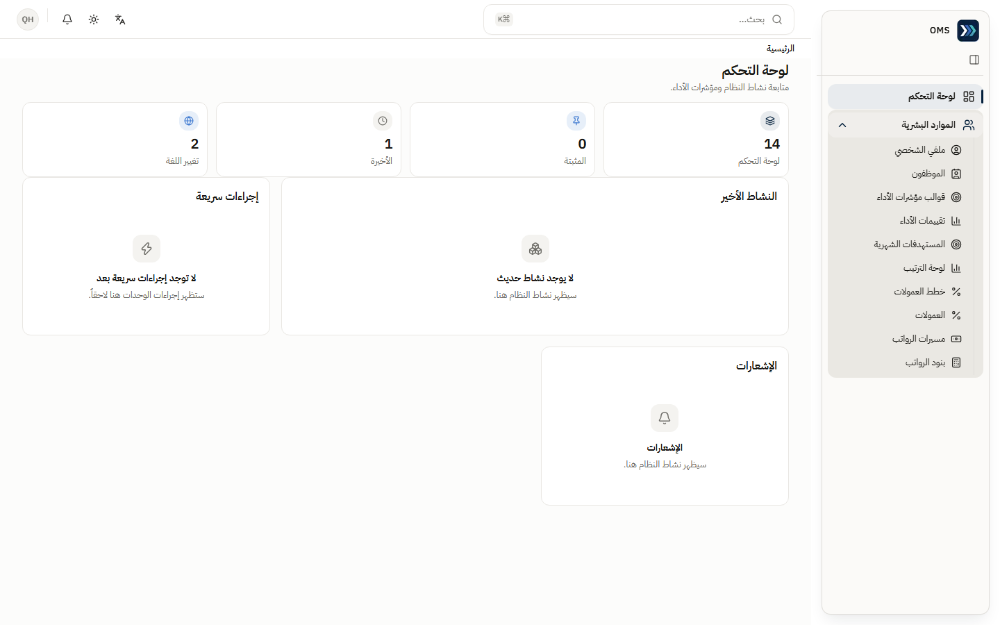

## الأقسام المتاحة

| القسم / الصفحة                | الغرض                                                    | متى تستخدمه             |
| ----------------------------- | -------------------------------------------------------- | ----------------------- |
| ملفي الشخصي                   | ملف الموظف المرتبط بحسابك وترتيب مبيعاتك                 | متاح لكل مستخدم         |
| الموظفون                      | السجل المركزي: البيانات الوظيفية والتعويضات وحساب الدخول | تعيين أو تعديل موظف     |
| قوالب مؤشرات الأداء           | معايير التقييم الشهري الموزونة (مجموع 100%) وتعييناتها   | قبل أي تقييم            |
| تقييمات الأداء                | تقييم شهري للموظف وفق القالب المعيّن له                  | نهاية كل شهر            |
| المستهدفات الشهرية            | هدف المبيعات لكل موظف/فريق                               | بداية الشهر             |
| لوحة الترتيب                  | المحقق مقابل المستهدف                                    | المتابعة                |
| خطط العمولات / العمولات       | قواعد العمولة والعمولات المحتسبة شهرياً                  | إعداد الخطط ثم المراجعة |
| مسيرات الرواتب / بنود الرواتب | المسير الشهري وبنود البدلات والاستقطاعات                 | دورة الرواتب            |

**الأقسام** (الإعدادات ← الأقسام) ليست ضمن صلاحيات هذا الدور — فتحها يعرض «الوصول مرفوض»؛ ينشئها مدير النظام (J106، J107). فتح فواتير البيع أو القيود يعرض «الوصول مرفوض» (J027، J028).

## المهام

### 1) إضافة موظف

- **المتطلبات المسبقة:** القسم والمسمى الوظيفي موجودان (مدير النظام).

1. الموارد البشرية ← **الموظفون** ← إضافة ← «إضافة موظف جديد» بأربع خطوات: **البيانات، العمل، التعويضات، الحساب**.
2. أكمل الخطوات؛ في **الحساب** اترك «إنشاء حساب دخول لهذا الموظف» غير مفعّل إن لم يحتج دخولاً.
3. **حفظ الموظف**.

- **النتيجة المتوقعة:** «تم إضافة الموظف»، رمز `EMP-…` تلقائي، الحالة «نشط» (J108).

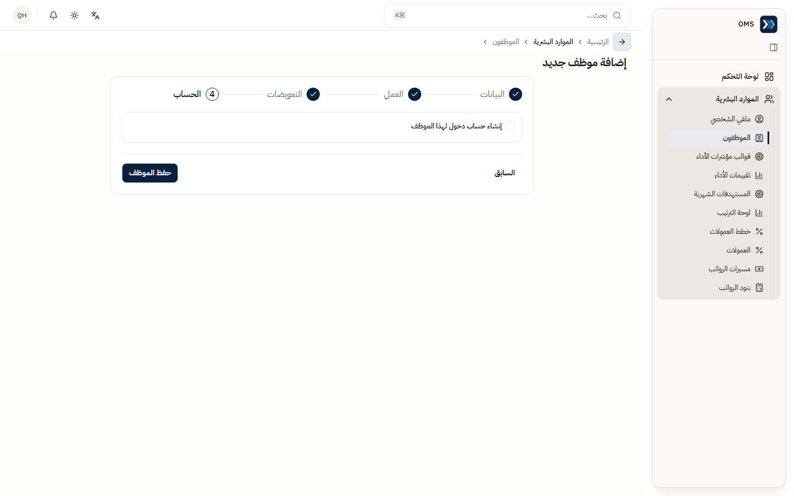
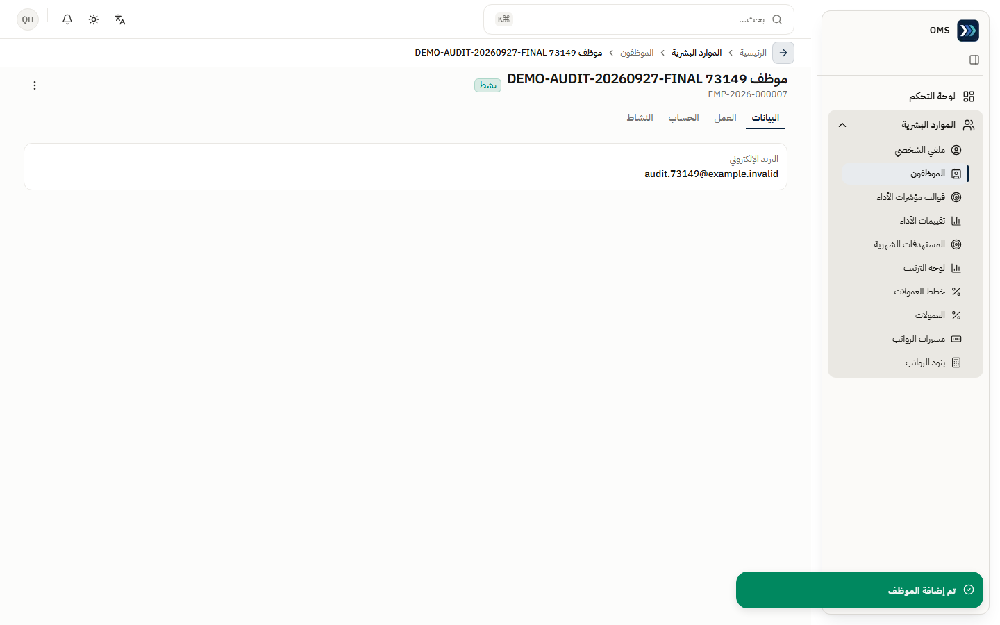

### 2) خطة عمولة

1. **خطط العمولات** ← جديد («خطة جديدة»): **اسم الخطة**، **أساس الاحتساب** (مثل «المبيعات المحصّلة»)، **نوع القاعدة** («نسبة ثابتة»)، **النسبة %** في الشرائح ← **حفظ**.

- **النتيجة المتوقعة:** «تم حفظ خطة العمولة» (J109).

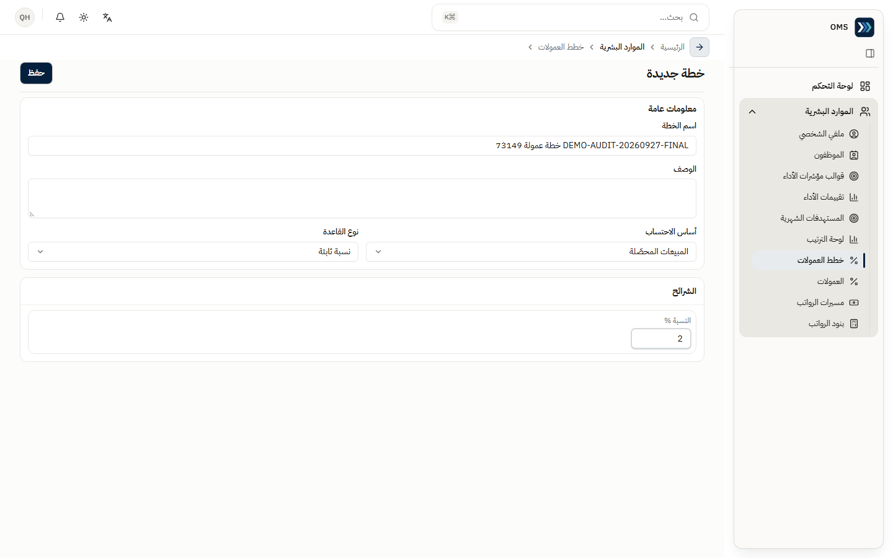

### 3) قالب مؤشرات الأداء وتعيينه

1. **قوالب مؤشرات الأداء** ← جديد («قالب جديد»): **اسم القالب**، ثم في **معايير التقييم**: اسم المعيار، الوزن، نوع القياس (مثل «نسبة مئوية»)، المقيّم («المدير المباشر») ← **إضافة معيار** عند الحاجة حتى **إجمالي الأوزان = 100%** ← **حفظ** («تم حفظ القالب»، J110).
2. في القالب المحفوظ ← قسم **التعيينات** ← اختر النطاق (موظف محدد / مسمى وظيفي / قسم) و**الجهة** ← **تعيين جديد** ← «تم إضافة التعيين» (J112).

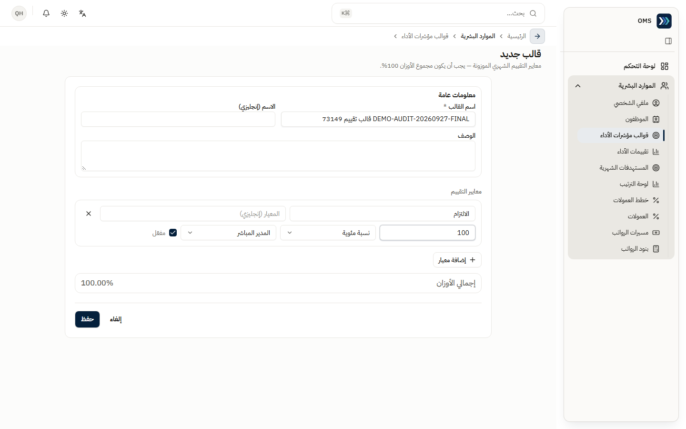
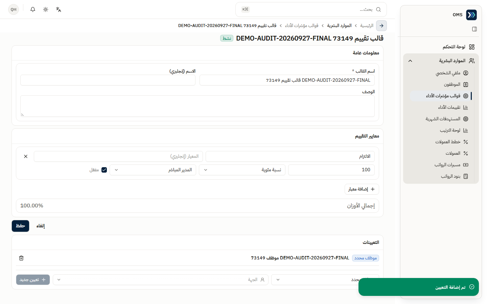

### 4) بدء تقييم أداء شهري

- **المتطلبات المسبقة:** قالب مُعيَّن للموظف (بالموظف أو المسمى أو القسم).

1. **تقييمات الأداء** ← **بدء تقييم جديد** ← **الموظف** و**الفترة** ← **بدء تقييم جديد**.
2. في صفحة التقييم ← **تسجيل الدرجات** لكل معيار + ملاحظة ← **حفظ**.

- **النتيجة المتوقعة:** «تم بدء التقييم» والحالة «مسودة» (J114).
- بدون قالب مُعيَّن يُرفض البدء برسالة عربية واضحة: «لا يوجد قالب مؤشرات أداء مُسند لهذا الموظف (على مستوى الموظف أو المسمى الوظيفي أو القسم)» — عيّن قالباً أولاً (J111).

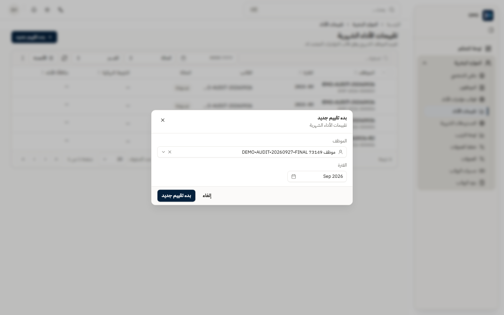
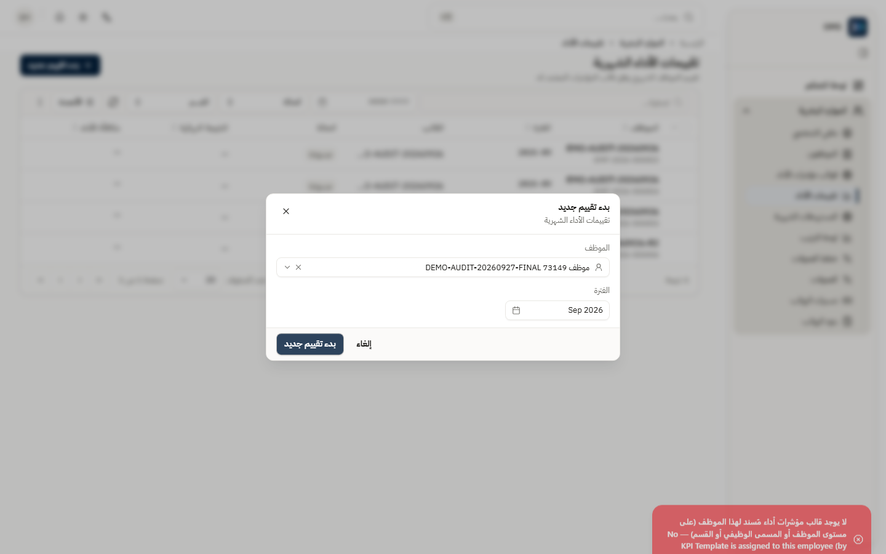
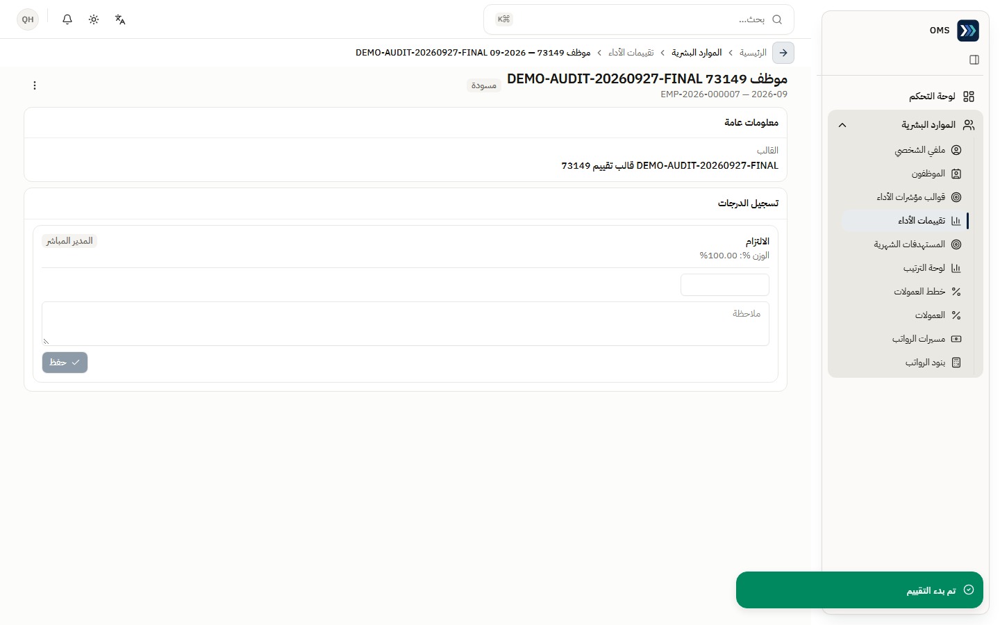

### 5) مستهدف شهري

1. **المستهدفات الشهرية** ← جديد («مستهدف جديد»): **الفترة**، **النطاق** («موظف»)، **الموظف**، **المؤشر** («المبيعات المحصّلة»)، **قيمة المستهدف** ← **حفظ** ← «تم حفظ التارجت» (J113).

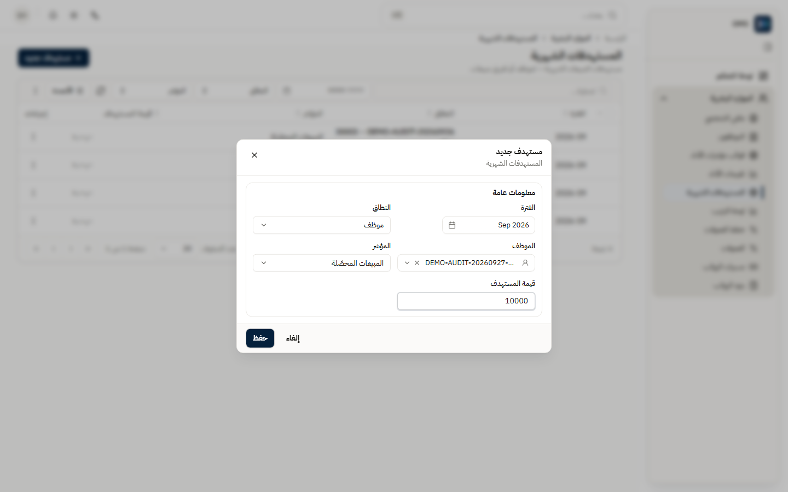

### 6) المتابعة: الترتيب، العمولات، الرواتب

- **لوحة الترتيب**: المحقق مقابل المستهدف للفترة (J115).
- **العمولات**: «احتساب عمولة» للفترة ثم الاعتماد (J116 — عرض فقط).
- **مسيرات الرواتب** ← «مسير جديد»؛ **بنود الرواتب** ← «إضافة جديد» (J117، J118 — عرض فقط).
- **ملفي الشخصي**: إن ظهر «لا يوجد سجل موظف مرتبط» فاطلب ربط حسابك بسجل موظف (J119).
- احتساب العمولة وتشغيل المسير **لم يُنفَّذا** في الجولة — **NOT TESTED**.

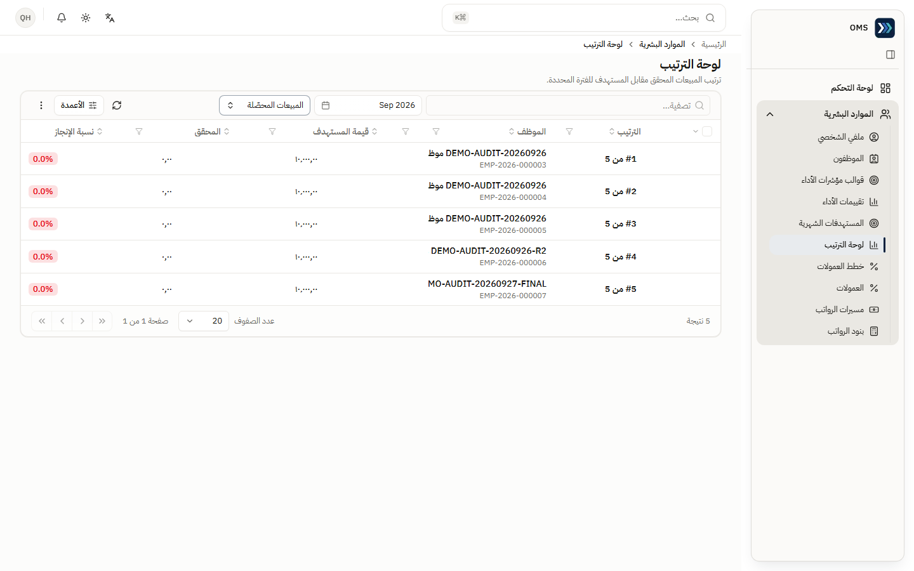
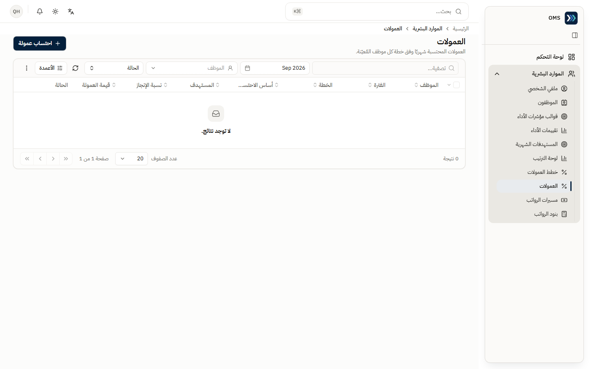
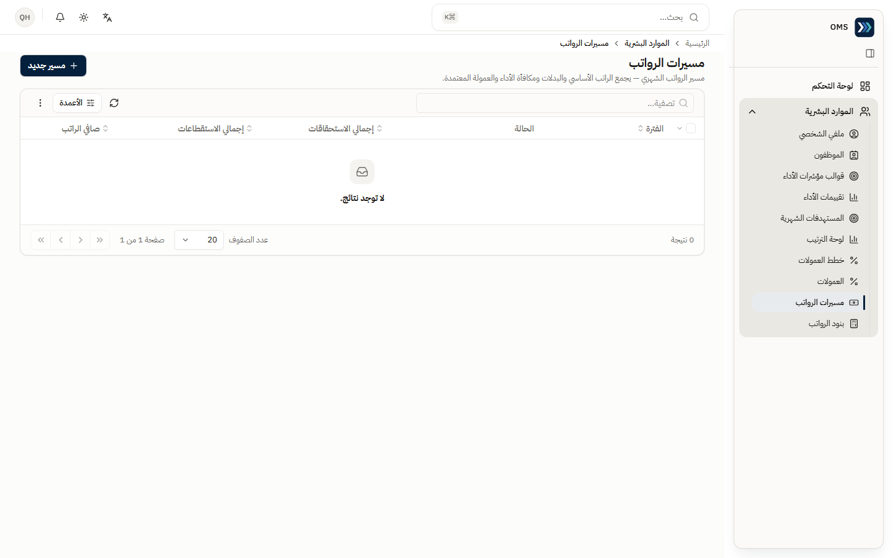
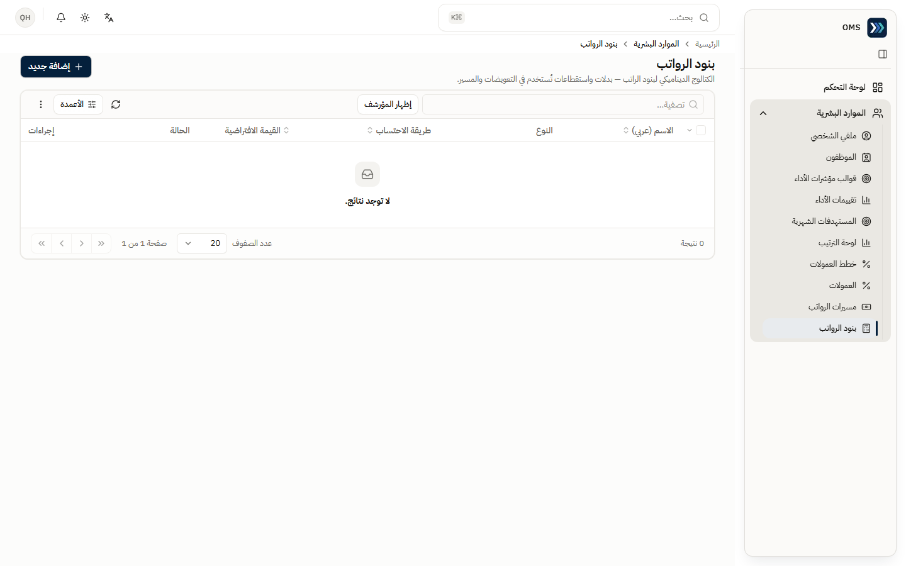
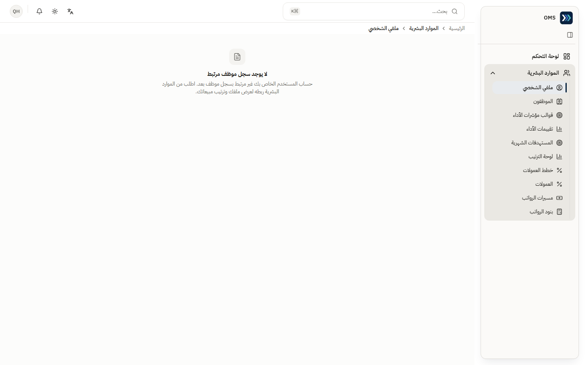

## مراحل المعاملات

| المرحلة                       | المسؤول                   | الأثر اللاحق                          |
| ----------------------------- | ------------------------- | ------------------------------------- |
| موظف جديد (± حساب دخول)       | الموارد البشرية           | يظهر في قوائم الإسناد والتقييم        |
| قالب ← تعيين                  | الموارد البشرية           | شرط لبدء التقييم                      |
| تقييم: مسودة ← إرسال ← اعتماد | المقيّم + الموارد البشرية | النتيجة تغذي مكافأة الأداء في المسير  |
| مستهدف شهري                   | الموارد البشرية           | أساس لوحة الترتيب                     |
| احتساب عمولة ← اعتماد         | الموارد البشرية           | عمولة معتمدة تدخل المسير (NOT TESTED) |
| مسير رواتب ← مراجعة           | الموارد البشرية ← المالية | الترحيل المحاسبي للمسير (NOT TESTED)  |

## التقارير

لا توجد مجموعة تقارير لهذا الدور. **لوحة الترتيب** و**العمولات** و**مسيرات الرواتب** هي أدوات المتابعة.

## أخطاء شائعة وطريقة المعالجة

| السلوك                                        | السبب                    | المعالجة                                                           |
| --------------------------------------------- | ------------------------ | ------------------------------------------------------------------ |
| «لا يوجد قالب مؤشرات أداء مُسند لهذا الموظف…» | لا قالب مُعيَّن          | عيّن قالباً من **التعيينات** ثم أعد المحاولة                       |
| مجموع الأوزان ≠ 100%                          | شرط القالب               | عدّل الأوزان حتى 100.00%                                           |
| «الوصول مرفوض» (مثل المستثمرين أو الفواتير)   | لا تملك الصلاحية المحددة | متوقع (J027–J029)؛ إن احتجتها اطلب الصلاحية المحددة من مدير النظام |
| «الوصول مرفوض» في الأقسام                     | الأقسام لمدير النظام     | اطلب منه إنشاء القسم                                               |
| ملفي الشخصي فارغ                              | الحساب غير مرتبط بموظف   | اربطه من سجل الموظف ← الحساب                                       |

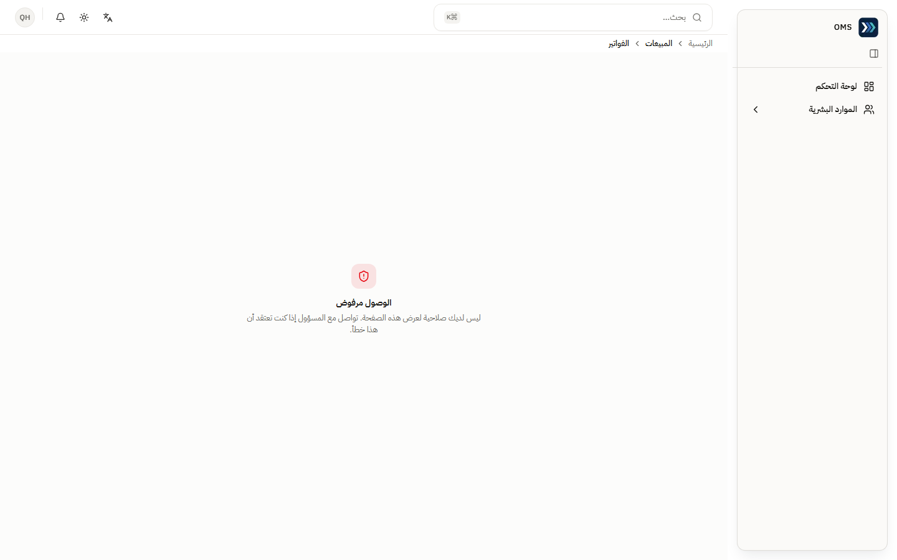

التفاصيل: [issues.md](../issues.md).
