# المستثمرون (Investors)

حساب التحقق: `qa-investors@oms.haseb.org` (المسمى: المدير المالي) — القائمة: **المبيعات، المنتجات والمخازن، المستثمرون** (9 روابط، J022).
مصدر الأدلة: الجولة النهائية **DEMO-AUDIT-20260927-FINAL** على الإنتاج 91b5086؛ منطق الأرباح والتوزيعات مثبت سابقاً عبر API (investor-tour **82/82**، 20260924).

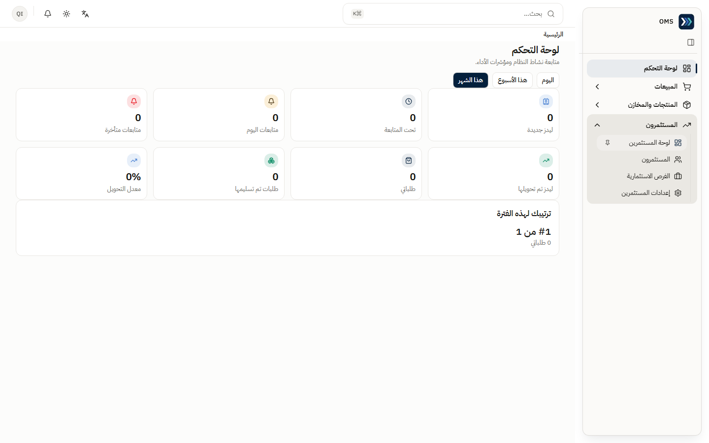

## الأقسام المتاحة

| القسم / الصفحة                  | الغرض                                                    | متى تستخدمه                    |
| ------------------------------- | -------------------------------------------------------- | ------------------------------ |
| المستثمرون ← لوحة المستثمرين    | الفرص النشطة، رأس المال المستهدف والمؤكد                 | متابعة عامة                    |
| المستثمرون ← المستثمرون         | سجل المستثمرين وبياناتهم                                 | عند انضمام مستثمر              |
| المستثمرون ← الفرص الاستثمارية  | الفرصة ومنتجاتها ومستثمروها وتمويلها وأرباحها وتوزيعاتها | دورة حياة كل فرصة              |
| المستثمرون ← إعدادات المستثمرين | أنواع المستثمرين                                         | تهيئة أولية                    |
| المنتجات والمخازن / المبيعات    | عرض المنتجات المؤهلة والطلبات                            | ربط الفرصة بالمنتجات والمبيعات |

فتح أوامر الشراء أو القيود بالرابط المباشر يعرض «الوصول مرفوض» (J023، J024).

## المهام

### 1) إضافة مستثمر

- **المتطلبات المسبقة:** لا شيء.

1. المستثمرون ← **المستثمرون** ← **إضافة جديد**.
2. أدخل **الاسم** (إلزامي) و**النوع** و**الحالة**، و**الجوال** أو **البريد الإلكتروني** — واحد منهما على الأقل (يوضحه النموذج تحت حقل الجوال).
3. **حفظ**.

- **النتيجة المتوقعة:** «تم الحفظ» ويظهر المستثمر في القائمة (J121).
- إن حفظت بالاسم فقط يظهر فوراً تحت البريد: «أدخل رقم الجوال أو البريد الإلكتروني للمستثمر.» ولا يُرسل شيء — أكمل أحدهما ثم احفظ (J120).

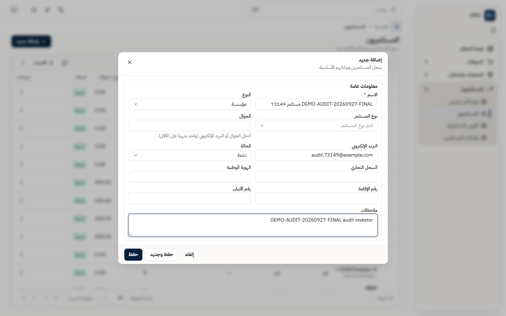
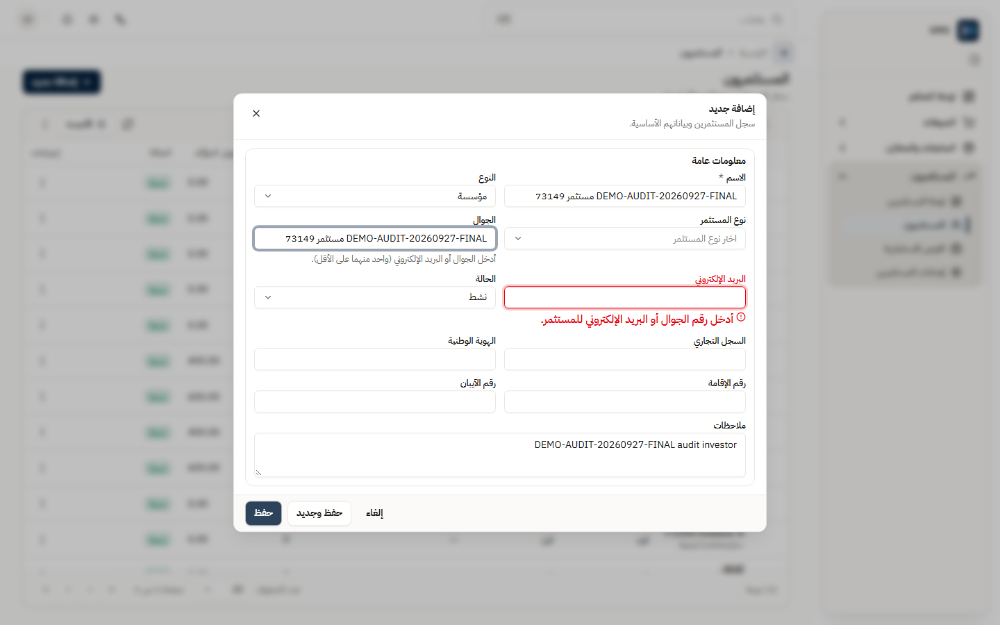
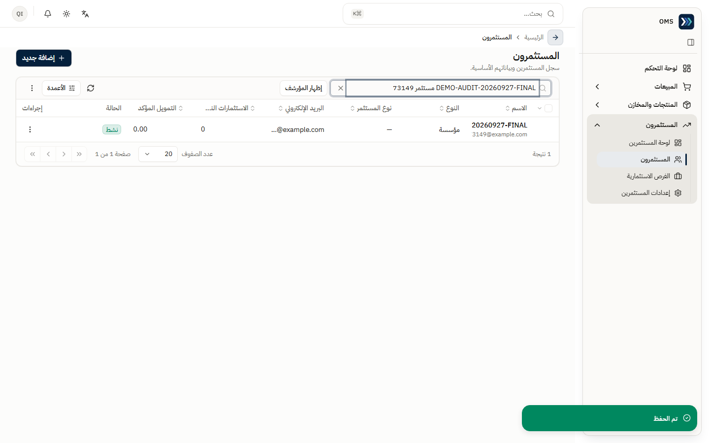

### 2) إنشاء فرصة استثمارية وفتحها

- **المتطلبات المسبقة:** منتج نشط مفعّل عليه «متاح لفرص الاستثمار».

1. المستثمرون ← **الفرص الاستثمارية** ← جديد («إضافة فرصة استثمارية»).
2. **بيانات الفرصة:** **الاسم**، **العملة**، **تاريخ البداية**، **تاريخ النهاية**، **نسبة المستثمرين من صافي الربح**.
3. **المنتجات** ← **إضافة منتج**: المنتج، **عدد الوحدات الممولة**، **تكلفة الوحدة** ← يُحسب **رأس المال** و**رأس المال المستهدف**.
4. **حفظ كمسودة** (`IOP-…`، J122).
5. في الفرصة اضغط **فتح للاستثمار** ← الحالة «مفتوحة» (J123).

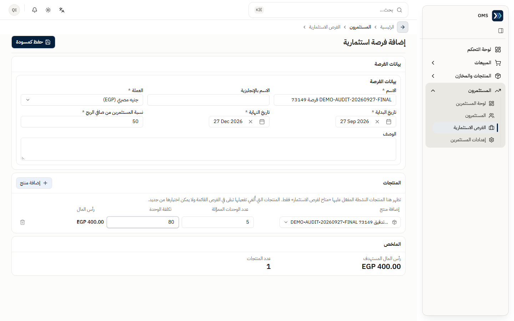
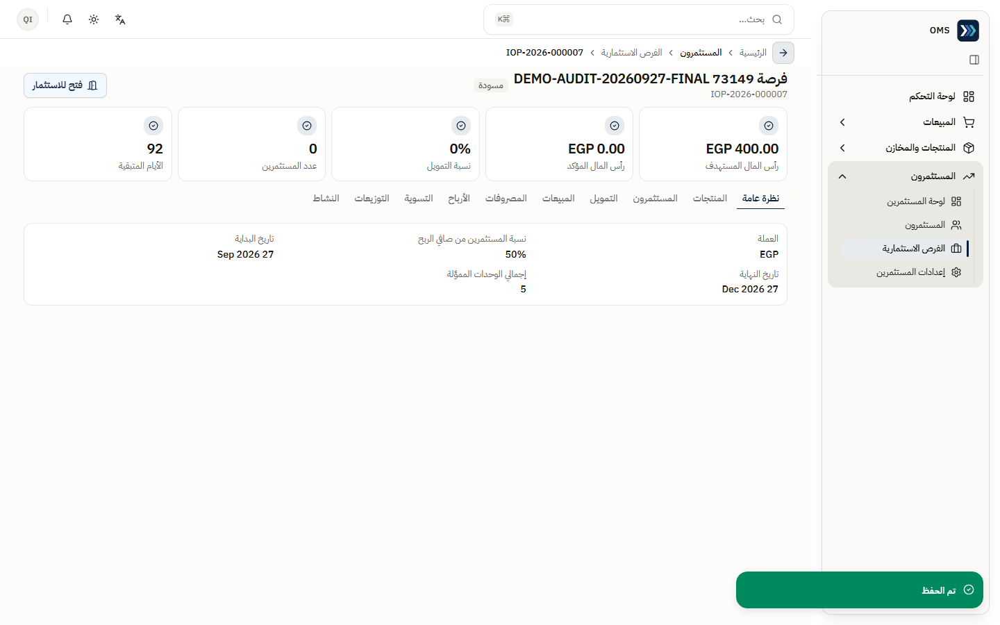

### 3) إضافة اشتراك مستثمر

1. في الفرصة المفتوحة ← تبويب **المستثمرون** ← **إضافة مستثمر**: المستثمر و**المبلغ الملتزم به**.
2. **حفظ**.

- **النتيجة المتوقعة:** «تم الحفظ»، الاشتراك بحالة «ملتزم» (COMMITTED 400) و«عدد المستثمرين» = 1 (J124).

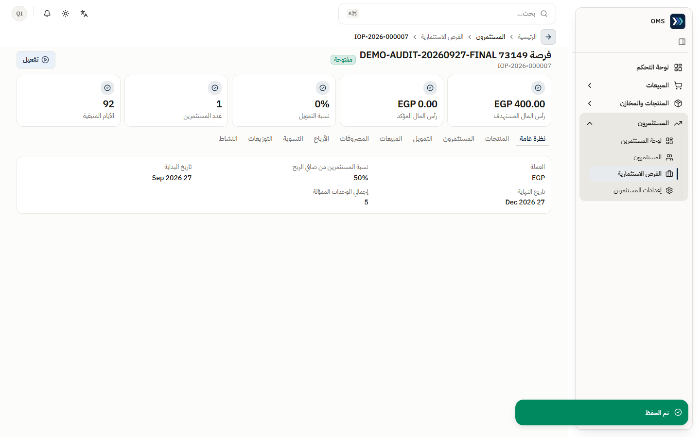

### 4) متابعة التمويل والأرباح والتوزيعات

- تبويبات الفرصة: **نظرة عامة، المنتجات، المستثمرون، التمويل، المبيعات، المصروفات، الأرباح، التسوية، التوزيعات، النشاط**.
- **التمويل**: رأس المال المستهدف/المؤكد، نسبة التمويل، و«إضافة دفعة» (J125).
- **الأرباح**: البضاعة المباعة، المصروفات المعتمدة، المرتجعات/التسويات، صافي الربح، وعاء أرباح المستثمرين (J127).
- **التوزيعات**: «لم يتم إنشاء أي توزيع أرباح لهذه الفرصة بعد» (J126).
- **لم تُنفَّذ** في هذه الجولة أي إجراءات ترحيل (تأكيد دفعات رأس المال، اعتماد الأرباح، التوزيعات، المدفوعات) — **NOT TESTED** في الواجهة؛ مثبتة سابقاً عبر API فقط.

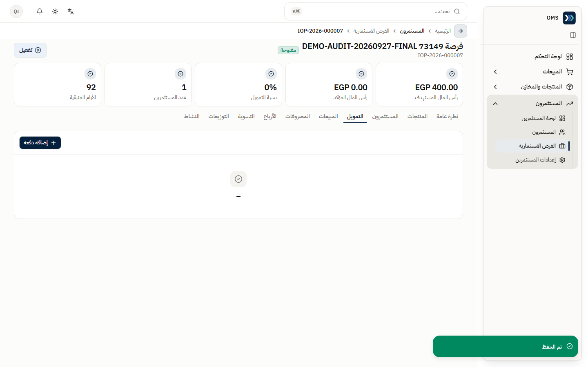
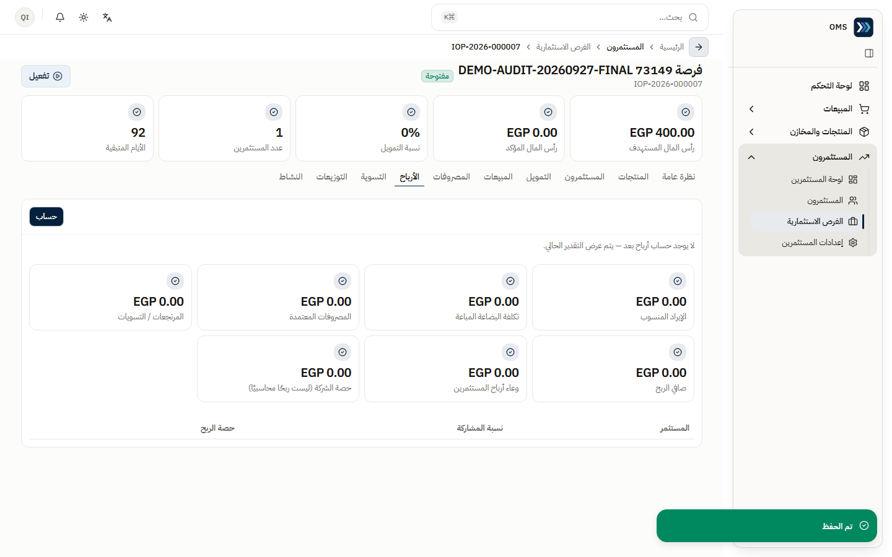

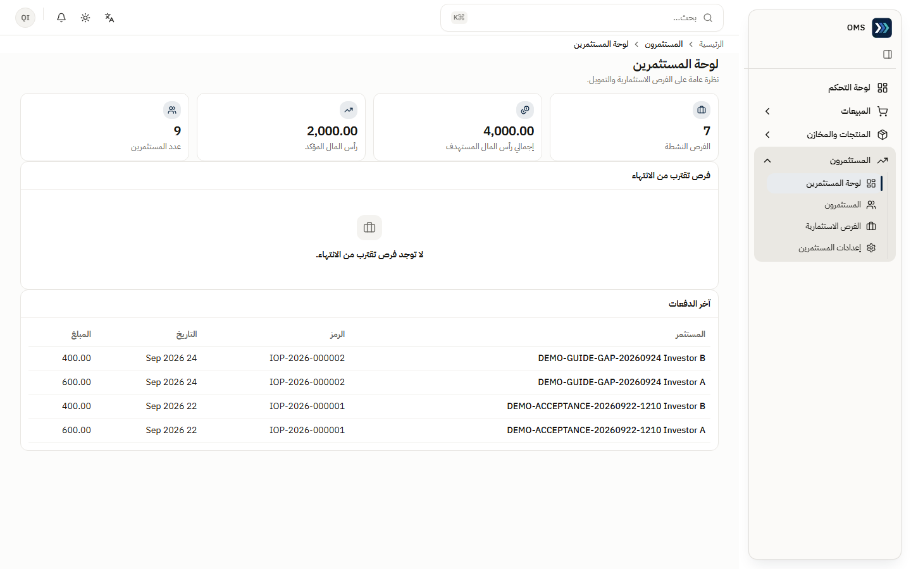

## مراحل المعاملات

| المرحلة                               | المسؤول              | الأثر اللاحق                                              |
| ------------------------------------- | -------------------- | --------------------------------------------------------- |
| فرصة مسودة ← فتح للاستثمار            | المستثمرون           | تقبل الاشتراكات                                           |
| اشتراك (ملتزم)                        | المستثمرون           | التزام فقط — لا قيد                                       |
| دفعة رأس مال ← تأكيد                  | المستثمرون / المالية | قيد يومية + رأس المال المؤكد (API سابق؛ NOT TESTED واجهة) |
| مبيعات/مصروفات الفرصة                 | النظام / المستثمرون  | تغذي حساب الأرباح                                         |
| احتساب الأرباح ← اعتماد ← توزيع ← دفع | المستثمرون + المالية | قيود توزيع ودفع + دفتر أستاذ المستثمر (API سابق)          |
| تفعيل الفرصة                          | المستثمرون           | زر **تفعيل** يظهر بعد الفتح — لم يُضغط في الجولة          |

## التقارير

- لا توجد مجموعة تقارير لهذا الدور؛ لوحة المستثمرين وتبويبات **الأرباح** و**التوزيعات** ودفتر أستاذ المستثمر هي مصدر المتابعة.
- «حصة الشركة» في تبويب الأرباح ليست ربحاً محاسبياً — هي نصيب الشركة من وعاء الفرصة.

## أخطاء شائعة وطريقة المعالجة

| السلوك                                                 | السبب                                           | المعالجة                                               |
| ------------------------------------------------------ | ----------------------------------------------- | ------------------------------------------------------ |
| «أدخل رقم الجوال أو البريد الإلكتروني للمستثمر.»       | يلزم الجوال أو البريد                           | أدخل أحدهما ثم احفظ                                    |
| المنتج لا يظهر عند إضافة منتج للفرصة                   | غير مفعّل عليه «متاح لفرص الاستثمار» أو غير نشط | فعّله من المنتج (مدير المنتجات)                        |
| «الوصول مرفوض» على صفحة (مثل الموظفين أو أوامر الشراء) | لا تملك الصلاحية المحددة                        | متوقع؛ إن احتجتها اطلب الصلاحية المحددة من مدير النظام |
| اعتبار فتح الصفحة = عملية مرحّلة                       | الترحيل يحتاج إجراءات صريحة                     | راجع السجلات المرتبطة والقيود                          |

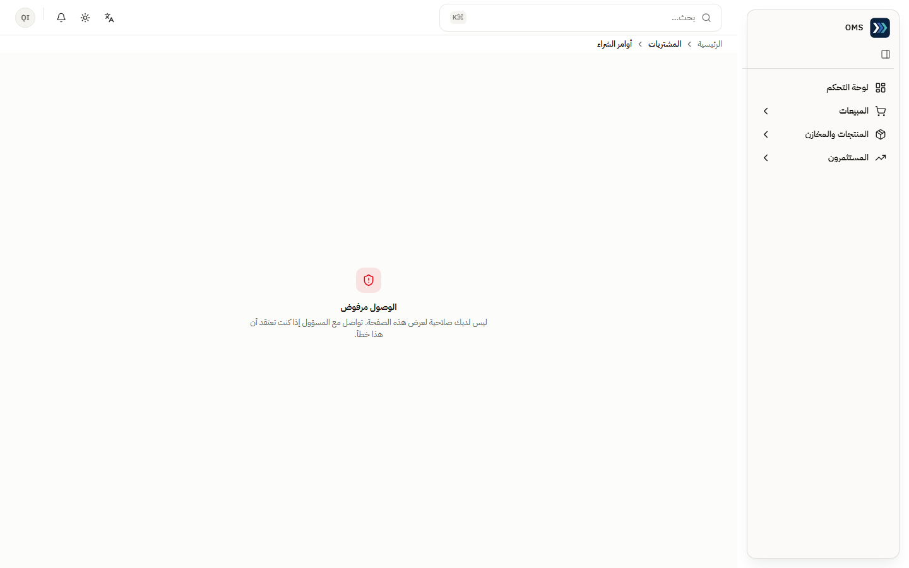

التفاصيل: [issues.md](../issues.md).
