# المشتريات (Purchasing)

حساب التحقق: `qa-purchasing@oms.haseb.org` (المسمى: مدير التشغيل) — القائمة: **المبيعات، المشتريات، المنتجات والمخازن، المالية، التقارير** (37 رابطاً، J018).
مصدر الأدلة: الجولة النهائية **DEMO-AUDIT-20260927-FINAL** على الإنتاج 91b5086.

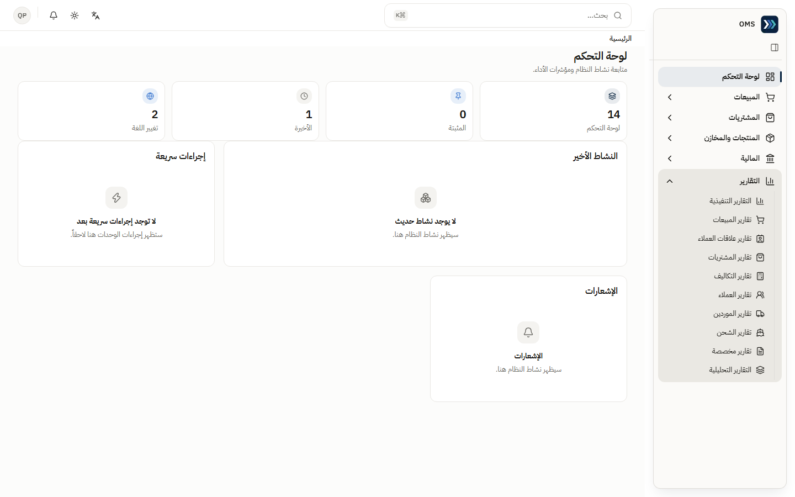

## الأقسام المتاحة

| القسم / الصفحة                          | الغرض                                                                          | متى تستخدمه                  |
| --------------------------------------- | ------------------------------------------------------------------------------ | ---------------------------- |
| المشتريات ← الموردون / مجموعات الموردين | بيانات الموردين                                                                | قبل أول طلب من مورد          |
| المشتريات ← عروض الأسعار                | عرض سعر مورد                                                                   | عند طلب تسعير                |
| المشتريات ← أوامر الشراء                | اتفاق شراء — **لا** يحرك مخزوناً ولا تكلفة ولا قيوداً                          | بعد اختيار المورد            |
| المشتريات ← فواتير الشراء               | استلام البضاعة وتسجيل الذمة                                                    | عند وصول البضاعة والفاتورة   |
| المشتريات ← المرتجعات                   | مرتجع للمورد من فاتورة                                                         | بضاعة معيبة/زائدة            |
| المشتريات ← التكاليف المرحلة            | تكاليف الشحن والجمارك الملحقة بفاتورة شراء — عرض فقط لهذا الدور (بلا زر إنشاء) | متابعة تكاليف الشحن والجمارك |
| المالية ← المدفوعات                     | سند صرف مورد                                                                   | سداد فاتورة شراء             |
| المنتجات والمخازن ← الرصيد الفعلي       | الكمية الحالية والمحجوزة والتكلفة والقيمة                                      | قبل الطلب ولمتابعة الاستلام  |

فتح القيود أو فواتير البيع بالرابط المباشر يعرض «الوصول مرفوض» (J019، J020).

## المهام

### 1) عرض سعر شراء ← اعتماد ← أمر شراء

- **المتطلبات المسبقة:** مورد نشط ومنتج نشط.

1. المشتريات ← **عروض الأسعار** ← جديد («عرض سعر شراء»): **المورد**، **تاريخ المستند**، **الرقم المرجعي**، البنود (**المنتج**، **الكمية**، **سعر الوحدة**) ← **حفظ** (`PQ-…`، J045).
2. **اعتماد** ← «تم اعتماد عرض سعر الشراء.» (J046).
3. **تحويل إلى أمر شراء** ← `PO-…` مسودة، والعرض يصبح «مغلق» (J047).
4. في أمر الشراء ← **اعتماد** وأكّد ← «تم اعتماد أمر الشراء.» (J048).

- **النتيجة المتوقعة:** «تم إنشاء أمر شراء من عرض السعر هذا.» ثم أمر «معتمد» دون أي حركة مخزون أو قيد (J047، J048: PQ-2026-000013 ← PO-2026-000014).

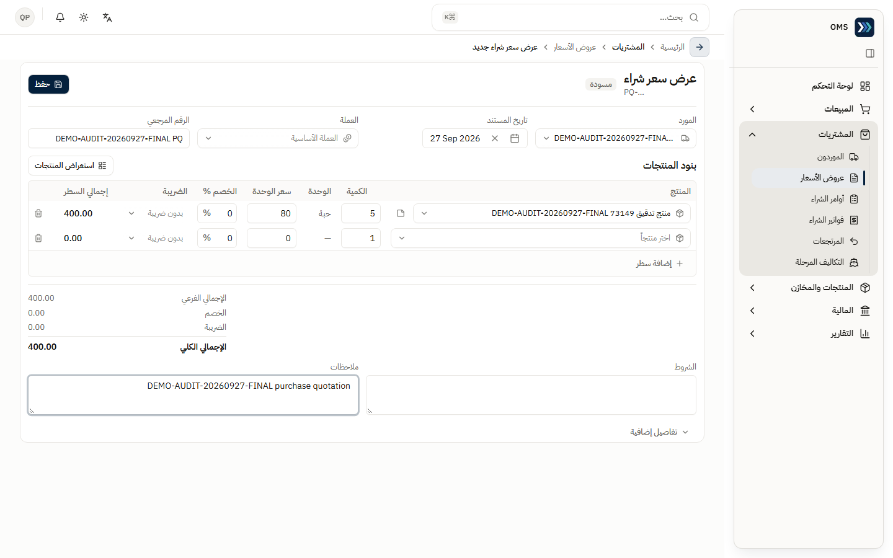
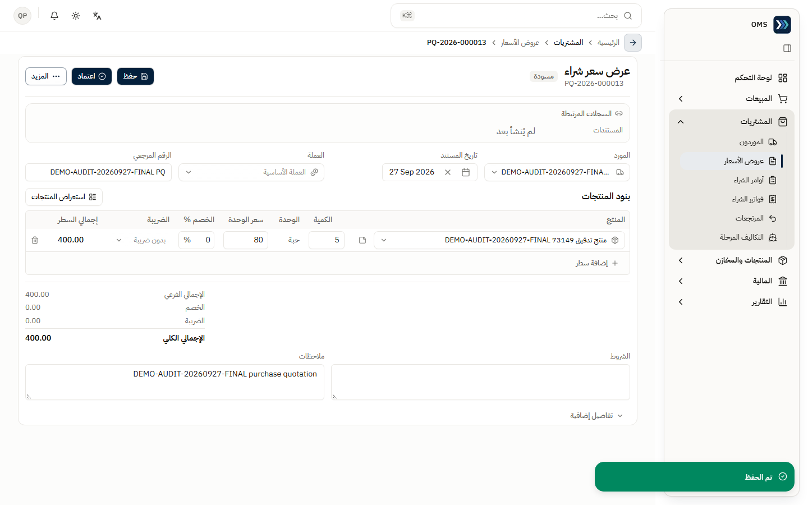
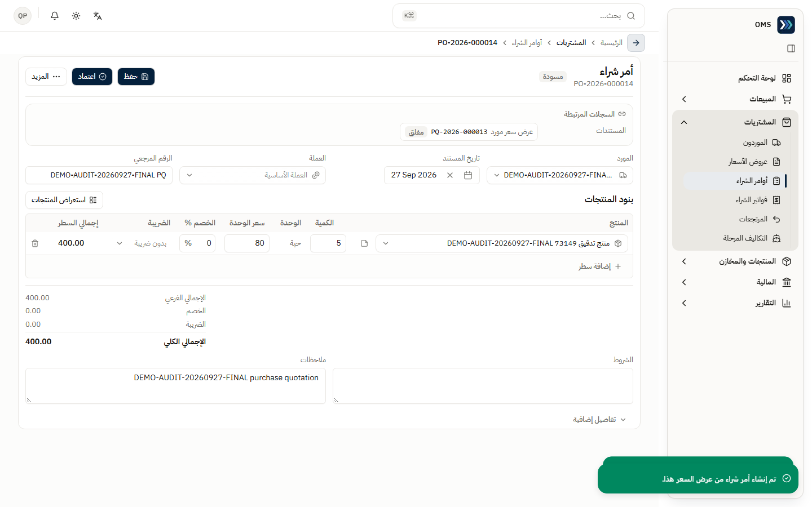

### 2) أمر شراء ← فاتورة شراء (استلام)

1. في أمر الشراء المعتمد ← **تحويل إلى فاتورة** ← حوار «استلام البضاعة — تحويل إلى فاتورة»: كل بند يُستلم بكميته كاملة؛ اختر **مستودع الاستلام** ← **تحويل إلى فاتورة** (`PI-…`، J049).
2. في الفاتورة ← **إرسال للاعتماد** ← «تم إرسال فاتورة الشراء للاعتماد.» (J050).
3. المعتمد (مدير النظام) يعتمد ويؤكد ← «تم تأكيد فاتورة الشراء — تم استلام المخزون.» (J051).

- **النتيجة المتوقعة:** «تم إنشاء فاتورة شراء من أمر الشراء هذا.»؛ بعد التأكيد الفاتورة «مؤكد»، وفي **السجلات المرتبطة**: قيد يومية «مرحّل» وحركة مخزون «استلام» (PI-2026-000041؛ المخزون 21→26).

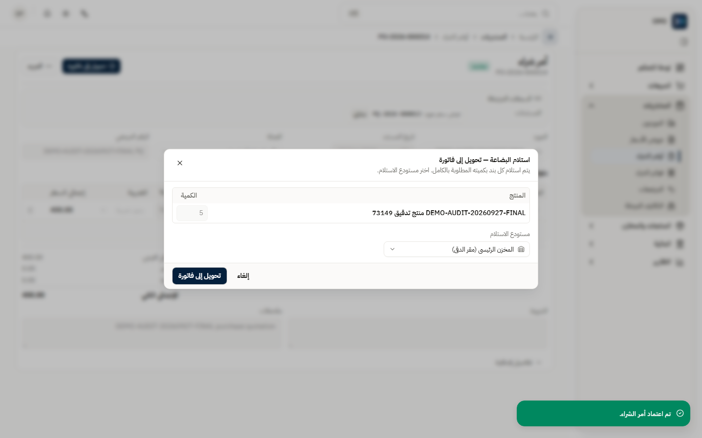
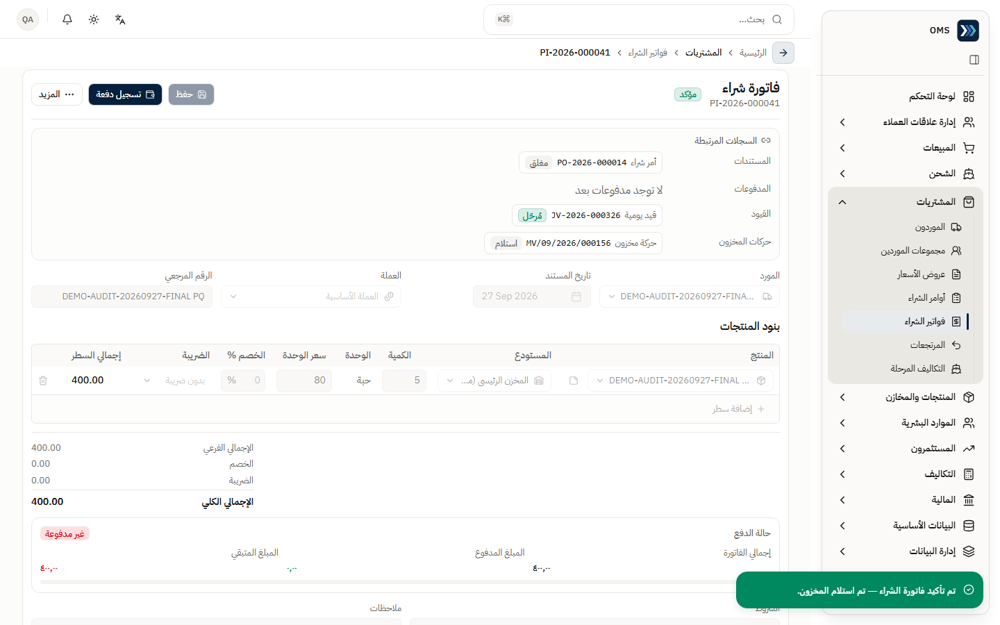

### 3) سداد المورد

1. في الفاتورة المؤكدة ← **تسجيل دفعة** ← يفتح «سند صرف مورد» معبأً (**نوع الحركة** «سداد مورد»، المورد، المبلغ، الفاتورة في **التخصيصات**).
2. راجع **حساب الاستلام** (الخزينة/البنك) و**الرقم المرجعي** ← **تأكيد**.

- **النتيجة المتوقعة:** «تم التأكيد.»، `SP-…`، الفاتورة «مدفوعة بالكامل» والمتبقي 0 (J052).

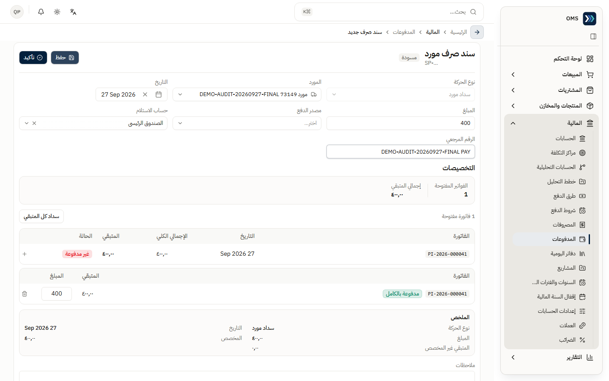
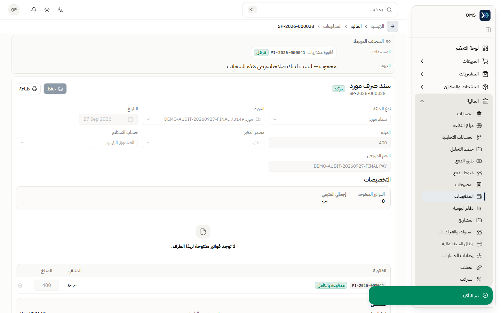

### 4) مرتجع شراء

1. في الفاتورة المؤكدة ← **المزيد** ← **إنشاء مرتجع** ← «إنشاء مرتجع شراء»: حدد البند والكمية (≤ الكمية المستلمة) ← **إنشاء مرتجع** (`PR-…`، J053).
2. **إرسال للاعتماد** ← (المعتمد) **اعتماد** ← **تأكيد** ← «تم تأكيد مرتجع الشراء — تم تخفيض المخزون.» (J054).

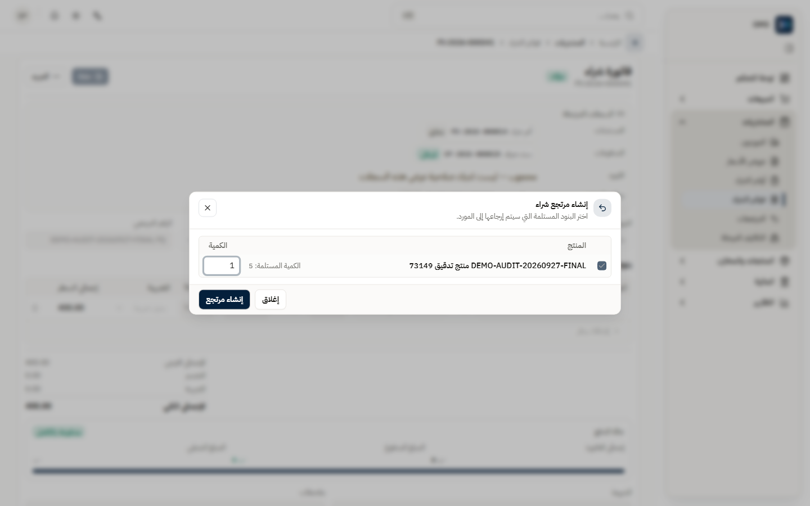
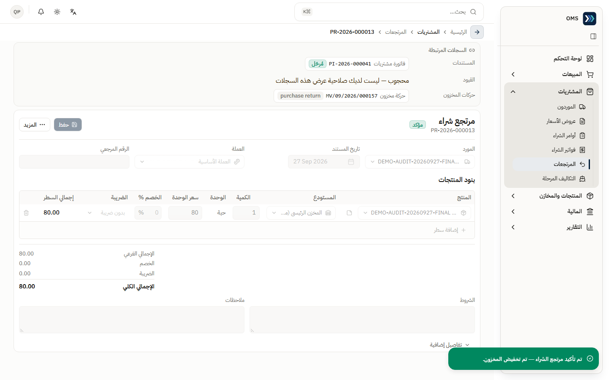

### 5) متابعة الرصيد والتكاليف المرحلة

- المنتجات والمخازن ← **الرصيد الفعلي**: الكمية الحالية والمحجوزة والتكلفة والقيمة (طريقة التقييم: متوسط التكلفة) (J044).
- المشتريات ← **التكاليف المرحلة**: عرض القائمة فقط لهذا الدور (J055).

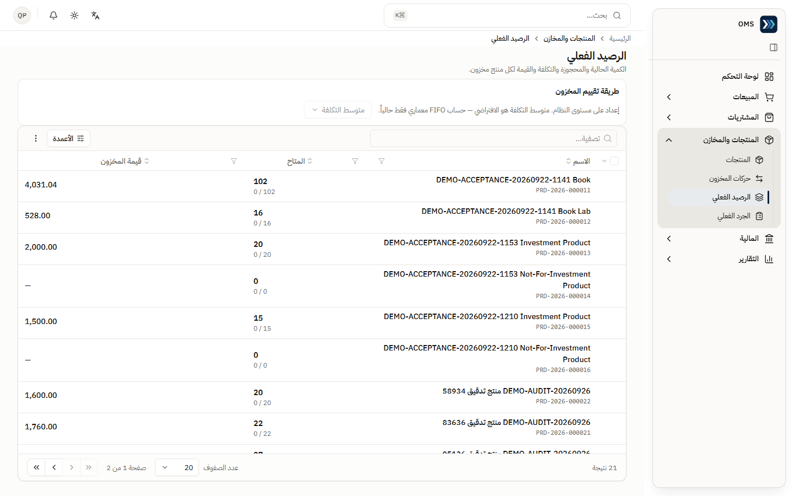
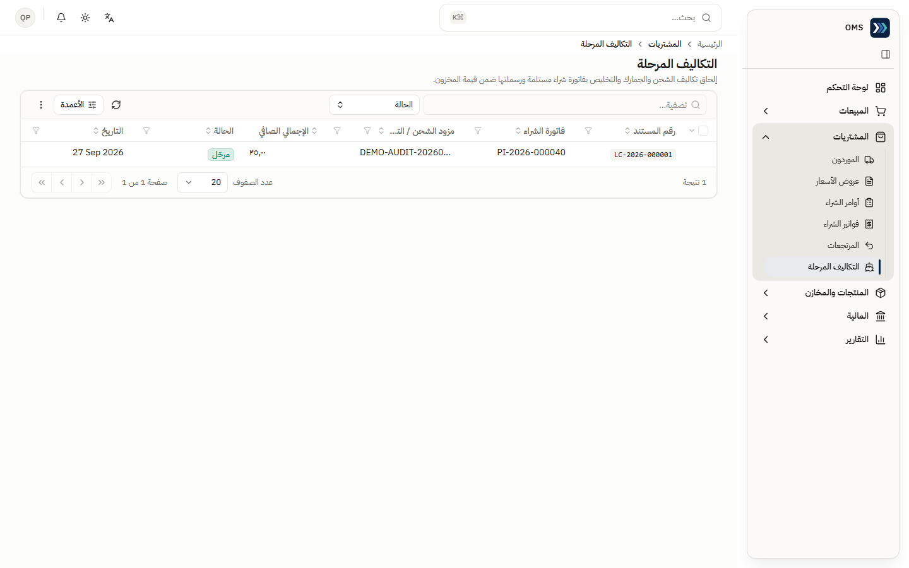

### 6) التكاليف المرحلة (الشحن الوارد والجمارك) — ينفّذها مدير النظام

- **المتطلبات المسبقة:** فاتورة شراء **مؤكدة**، وصلاحية إنشاء التكاليف المرحلة (مدير النظام في الإعداد الحالي).

1. المشتريات ← **التكاليف المرحلة** ← إنشاء: **فاتورة الشراء**، **مزود الشحن / التخليص**، **المرجع**، **التاريخ**، **طريقة التوزيع** («حسب قيمة الشراء»). **العملة** تُضبط تلقائياً على **EGP** إذا كانت الفاتورة بالعملة الأساسية.
2. **سطور التكلفة**: **فئة التكلفة** (مثل «شحن وارد» أو «الجمارك»)، **الوصف**، **المبلغ الصافي**، **ضريبة القيمة المضافة** ← **حفظ**.
3. راجع **معاينة التوزيع** ← اعتماد («تم اعتماد التكاليف المرحلة — تم تثبيت التوزيع.») ← ترحيل («تم ترحيل التكاليف المرحلة — تمت رسملتها ضمن المخزون.»).

- **النتيجة المتوقعة:** الحالة «مرحّل»، التكلفة موزّعة على منتجات الفاتورة ومُرسمَلة في قيمة المخزون، وقيد يومية «مرحّل» في **السجلات المرتبطة** (J056: LC-2026-000002، «شحن وارد» 25 EGP على PI-2026-000041، JV-2026-000329).
- **ملاحظة:** الفئات القابلة للرسملة: الجمارك، الشحن الوارد، تجهيز المنتج للبيع. التصنيف قابل للتعديل من **التكاليف ← فئات التكلفة**. «تكلفة المنتج» غير قابلة للرسملة عمداً لأنها مضمّنة في سعر الفاتورة.

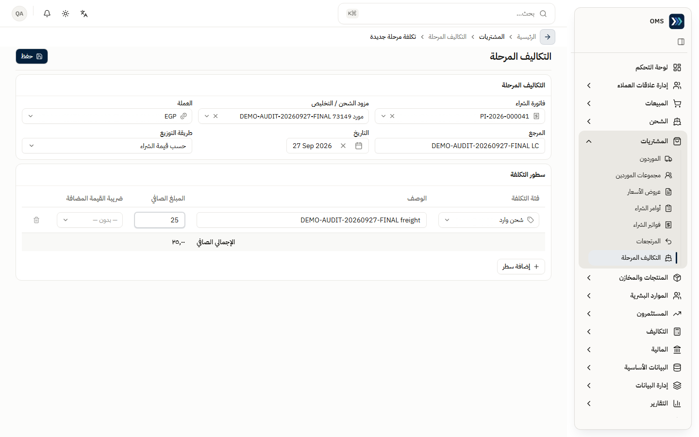
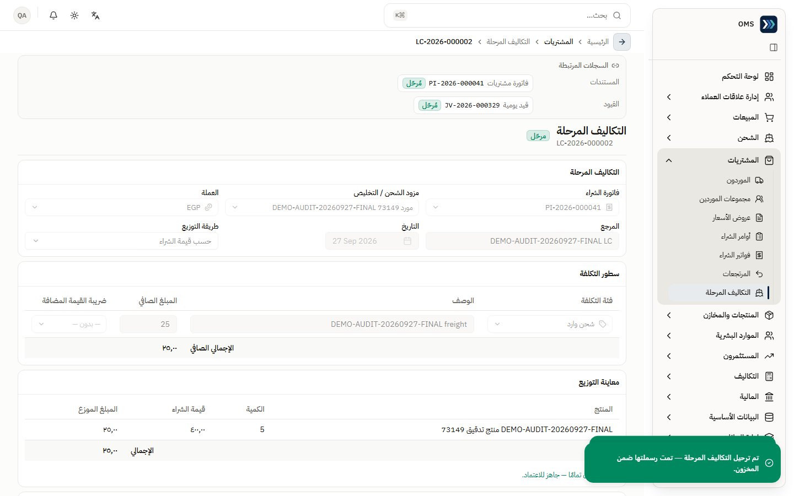

## مراحل المعاملات

| المرحلة                       | المسؤول             | الأثر اللاحق                                                      |
| ----------------------------- | ------------------- | ----------------------------------------------------------------- |
| عرض سعر ← اعتماد ← تحويل      | المشتريات           | العرض «مغلق»؛ لا أثر                                              |
| أمر شراء ← اعتماد             | المشتريات           | **لا** مخزون ولا تكلفة ولا قيد (ADR-0015)                         |
| أمر ← فاتورة ← إرسال للاعتماد | المشتريات           | فاتورة «بانتظار الاعتماد»                                         |
| اعتماد وتأكيد الفاتورة        | مدير/معتمد          | حركة «استلام» + قيد (مدين مخزون، دائن مورد) + تحديث متوسط التكلفة |
| سداد المورد                   | المشتريات / المالية | قيد صرف؛ الفاتورة «مدفوعة»                                        |
| مرتجع ← اعتماد ← تأكيد        | المشتريات + معتمد   | تخفيض المخزون + عكس ذمة المورد                                    |
| تكلفة مرحلة ← اعتماد ← ترحيل  | مدير النظام         | رسملة التكلفة في قيمة المخزون + قيد يومية (J056)                  |

## التقارير

- التقارير ← **تقارير المشتريات**: قشرة «قريباً».
- كشف حساب المورد (التقارير المالية) مثبت سابقاً عبر API (F4/F7)؛ هذا الدور لا يملك `reports.financial.view` افتراضياً.
- **الرصيد الفعلي** هو المرجع اليومي للكميات والقيمة.

## أخطاء شائعة وطريقة المعالجة

| السلوك                               | السبب                                 | المعالجة                                          |
| ------------------------------------ | ------------------------------------- | ------------------------------------------------- |
| لا يوجد زر اعتماد للفاتورة           | لا تملك `purchasing.invoices.approve` | أرسلها للاعتماد؛ يعتمدها المدير                   |
| لا يظهر زر إنشاء في التكاليف المرحلة | لا تملك صلاحية الإنشاء                | يطلبها المدير أو يُنفّذها بنفسه                   |
| «الوصول مرفوض» على صفحة أو زر        | لا تملك الصلاحية المحددة              | اطلب من مدير النظام الصلاحية المحددة لتلك العملية |
| كمية مرتجع أكبر من المستلمة          | مرفوض                                 | ضمن «الكمية المستلمة»                             |

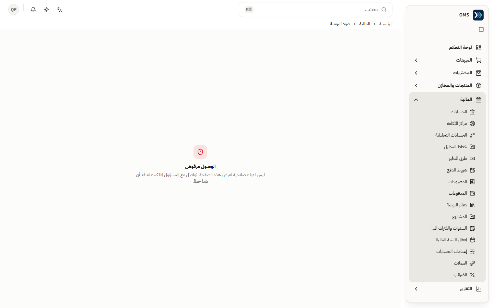

التفاصيل: [issues.md](../issues.md).
