# مندوب المبيعات (Sales Agent)

حساب التحقق: `qa-sales-agent@oms.haseb.org` — القائمة: **إدارة علاقات العملاء، المبيعات، المنتجات والمخازن** (11 رابطاً، J010).
مصدر الأدلة: الجولة النهائية **DEMO-AUDIT-20260927-FINAL** على الإنتاج 91b5086، و**الإبلاغ عن الدفع** من جولة **DEMO-PDR-20260927** على الإنتاج 0331a58 ([الملخص](../evidence/PAYMENT-RECON-20260927/summary.md)، فحوص `P###`).

## الأقسام المتاحة

| القسم / الصفحة                               | الغرض                                   | متى تستخدمه             |
| -------------------------------------------- | --------------------------------------- | ----------------------- |
| إدارة علاقات العملاء ← العملاء المحتملون     | تسجيل الليدز ومتابعتها وتحويلها لطلب    | عند أي اتصال بعميل جديد |
| إدارة علاقات العملاء ← قمع العملاء المحتملين | مراحل الليدز                            | متابعة التحويل          |
| المبيعات ← عروض الأسعار                      | عرض سعر لعميل B2B                       | قبل الاتفاق النهائي     |
| المبيعات ← الطلبات                           | أمر البيع (يحجز المخزون عند التأكيد)    | بعد قبول العرض          |
| المبيعات ← طلبات المتجر                      | طلبات التجزئة (دفع مسبق / عند الاستلام) | بيع مباشر أو من ليد     |
| المبيعات ← استيراد الطلبات / يحتاج مراجعة    | طلبات مستوردة تحتاج تأكيد مطابقة العميل | بعد الاستيراد           |
| المبيعات ← الفواتير                          | فاتورة البيع (تصرف المخزون عند التأكيد) | بعد أمر البيع           |
| المبيعات ← المرتجعات                         | مرتجع من فاتورة                         | عند إرجاع العميل لصنف   |
| المنتجات والمخازن ← المنتجات                 | الاطلاع على الأصناف                     | عند إضافة البنود        |

قائمة **العميل** في المستندات تعرض الاسم والرمز وبيانات العميل اللازمة للاختيار فقط (لا دليل الشركاء الكامل).

لا يرى المندوب: المالية، الشحن، المشتريات، الإعدادات — فتحها بالرابط المباشر يعرض «الوصول مرفوض» (J011، J012).

## المهام

> القوائم المنسدلة تظهر **زراً رمادياً بسهم ⌄** (حقول الكتابة بيضاء)، وهي قابلة للبحث بالكتابة، وصف **«+ جديد»** أعلى القائمة يتيح الإنشاء السريع إن كانت لديك الصلاحية، و **×** يمسح الحقل الاختياري. إن نقص حقل عند الحفظ يظهر **ملخص الأخطاء** أعلى النموذج — اضغط البند للانتقال إلى الحقل.

### 1) تسجيل عميل محتمل (ليد)

- **المتطلبات المسبقة:** لا شيء.

1. إدارة علاقات العملاء ← **العملاء المحتملون** ← **إضافة جديد**.
2. أدخل **اسم العميل**، **الدولة**، **الهاتف** (بصيغة دولية مثل `+20 1001234567`) — هذه الحقول فقط إلزامية.
3. اضغط **حفظ كعميل محتمل**.

- **النتيجة المتوقعة:** رسالة «تم إضافة العميل» ورقم `LD-…` تلقائي (J057).
- **ملاحظة:** التوزيع التلقائي قد يسند الليد فوراً لموظف آخر فيختفي من قائمتك حتى يعيد المدير إسناده.

### 2) تحويل الليد إلى طلب متجر

- **المتطلبات المسبقة:** ليد مسند إليك، منتج نشط، مبلغ > 0.

1. افتح الليد ← **تحويل إلى طلب**.
2. أضف البنود، ثم في **الدفع / التسوية** اختر **نمط التسوية** (مثل «مسبق الدفع» أو «الدفع عند الاستلام») و**التنفيذ** («شحن» أو «استلام من المقر») و**العملة**، وأكمل **عنوان الشحن**.
3. للدفع المسبق أجب عن **هل دفع العميل؟** داخل نفس النموذج — ثلاثة أزرار متجاورة، الافتراضي **لم يدفع بعد** (نفس خيارات المهمة 3: **لم يدفع بعد** / **دفع كامل المبلغ** / **دفع جزئي** مع **المبلغ المدفوع**، **طريقة الدفع**، **تاريخ الدفع الفعلي**، **مرجع الدفع**).
4. **الملخص** ← راجع (يعرض «هل دفع العميل؟» و«المبلغ المدفوع») ← **تأكيد وإنشاء الطلب**.

- **النتيجة المتوقعة:** «تم إنشاء الطلب STO-…»، حالة الليد «محوَّل» (J059). الإبلاغ ينتقل مع الطلب كمطالبة واحدة «بانتظار مطابقة المالية» مصدرها «تحويل العميل المحتمل» (P043: STO-2026-000121، دفع جزئي 100 من 500).

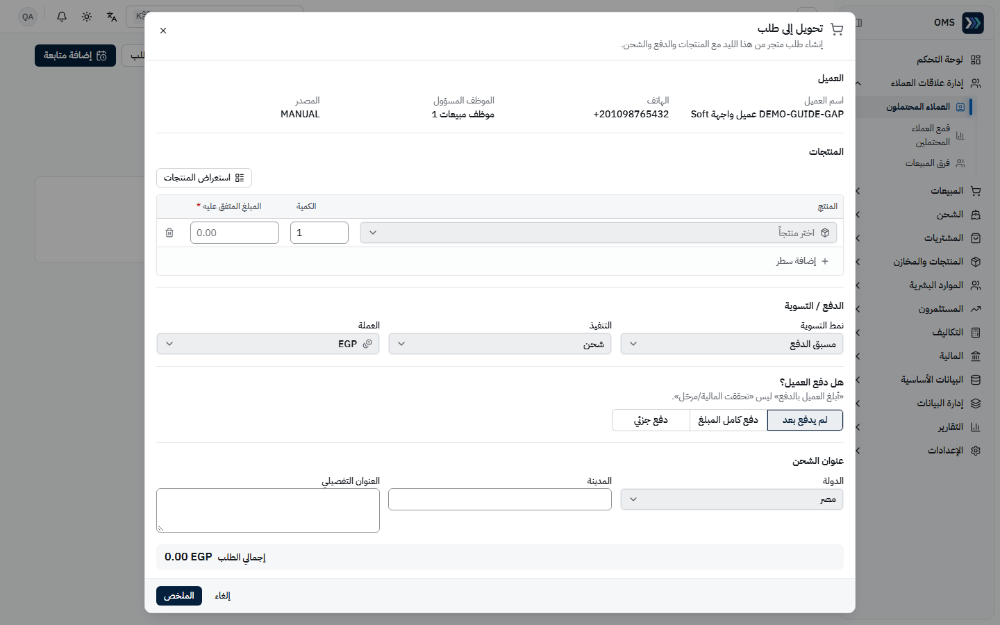
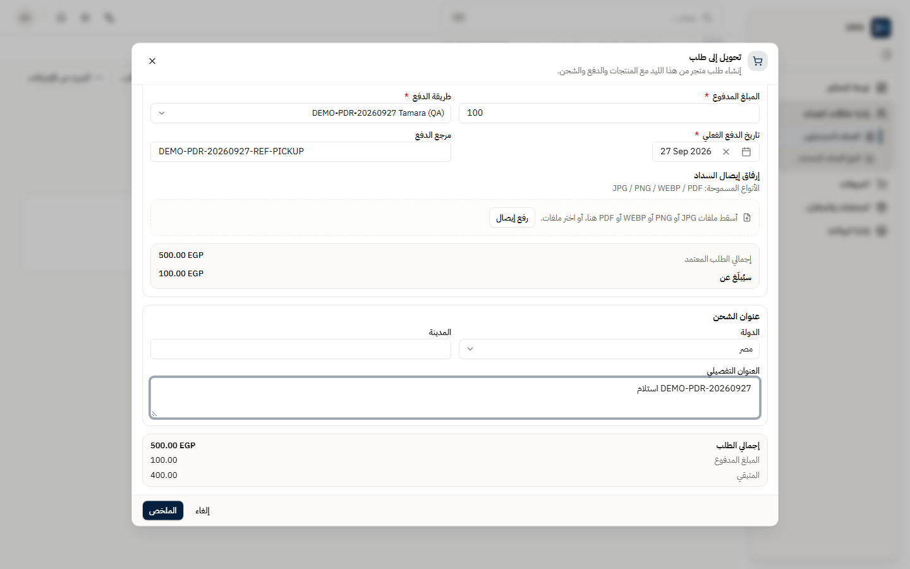
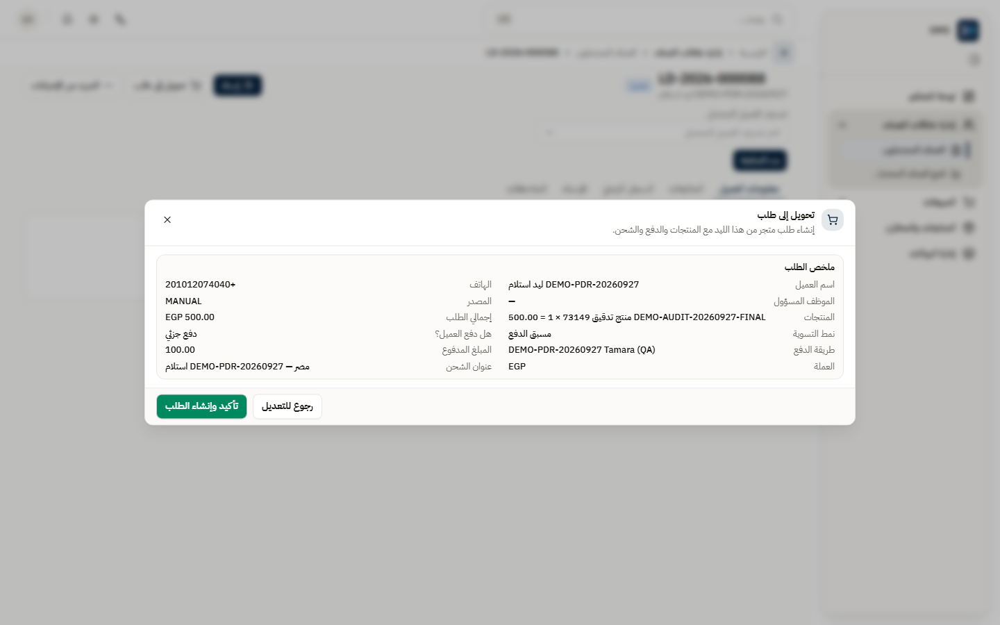

### 3) الإبلاغ بالدفع («إبلاغ دفع العميل») — بدلاً من إدخال سند

المندوب **لا يُدخل سند قبض ولا يختار حساباً** بعد الآن؛ يسجّل فقط ما أبلغه به العميل. زر «إضافة دفعة» القديم استُبدل بـ **«إبلاغ دفع العميل»**. التحقق والترحيل عمل المالية وحدها.

- **المتطلبات المسبقة:** طلب متجر «دفع مسبق» ببنود مسعّرة (> 0)، وطريقة دفع نشطة.

**عند إنشاء الطلب:**

1. المبيعات ← **طلبات المتجر** ← **طلب جديد**: **الهاتف**، **اسم العميل**، **العملة**، البنود (**الكمية**، **سعر الوحدة المتفق**).
2. في قسم **هل دفع العميل؟** اختر واحداً:
   - **لم يدفع بعد** — لا تُنشأ أي مطالبة.
   - **دفع كامل المبلغ** — المبلغ = إجمالي الطلب تلقائياً («يُسجَّل المتبقي من إجمالي الطلب تلقائياً — دون إدخال مبلغ»).
   - **دفع جزئي** — أدخل **المبلغ المدفوع** فعلاً فقط.
3. للدفع الكامل أو الجزئي: **طريقة الدفع** (إلزامي)، **تاريخ الدفع الفعلي** (إلزامي، لا يكون في المستقبل)، **مرجع الدفع** و**إرفاق إيصال السداد** (اختياريان).
4. **إنشاء الطلب** ← «تم إنشاء طلب المتجر.»

**لطلب موجود:** افتح الطلب ← **إبلاغ دفع العميل** (الزر الأساسي في **رأس الطلب** فقط؛ لم يعد في بطاقة **الدفع**) ← نفس الحقول؛ الحوار يعرض **إجمالي الطلب المعتمد** و**سيُبلَغ عن** ← **حفظ الإبلاغ** ← «تم الإبلاغ عن الدفع — بانتظار تحقق المالية.»

- **النتيجة المتوقعة (C1 PASS):**
  - «لم يدفع بعد»: شارة «غير مُبلَغ بالدفع» و«لم يدفع العميل»، لا مطالبات ولا قيود (P016: STO-2026-000102).
  - «دفع جزئي» 200 من 500: شارة «مُبلَغ جزئياً»، مطالبة واحدة PAY-2026-000053 «بانتظار مطابقة المالية»، **0 قيود** (P017: STO-2026-000103).
  - «دفع كامل المبلغ»: شارة «مُبلَغ بالدفع»، مطالبة واحدة PAY-2026-000054 بمبلغ 500 = إجمالي الطلب، **0 قيود** (P018: STO-2026-000104).
- رأس الطلب يعرض مجموعتين منفصلتين: **الدفع** (إبلاغ المبيعات · تحقق المالية) و**التنفيذ والشحن**. وفي بطاقة **الدفع** أسفل الصفحة قسمان منفصلان: **إبلاغ المبيعات** (ما قلته أنت) و**تحقق المالية** (ما رحّلته المالية). **«أبلغ العميل بالدفع» ليس «تحققت المالية/مرحّل»** — الأولى إقرار منك، والثانية تعني أن المالية طابقت ورحّلت (P053).
- **الدفع الجزئي لا يجعل الطلب جاهزاً** للشحن أو الاستلام أبداً؛ **الدفع الكامل** يجعله مؤهلاً دون انتظار المالية (انظر [الشحن](./shipping.md)). طلبات **الدفع عند الاستلام** لا تحتاج إبلاغاً (P041).
- **الإعادة آمنة:** الضغط المزدوج على **حفظ الإبلاغ** يُنشئ مطالبة واحدة (P020). إن ظهرت «تعذر الاتصال بالخادم…» فأعد الحفظ: تظهر «تم حفظ هذا الإبلاغ مسبقاً — لم يتكرر شيء.» ولا تتكرر المطالبة (P019، C5 PASS).

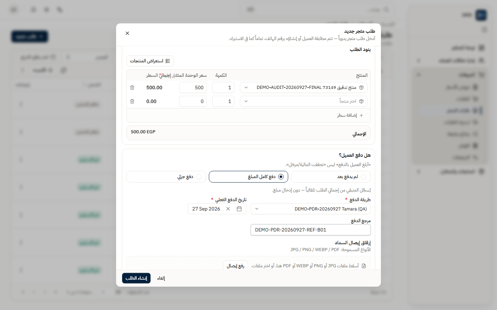
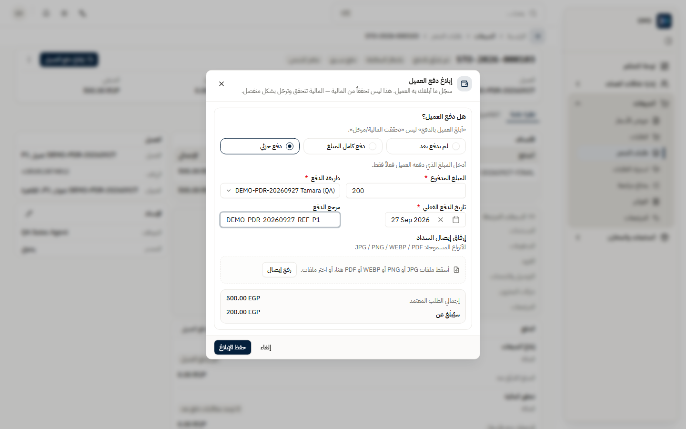
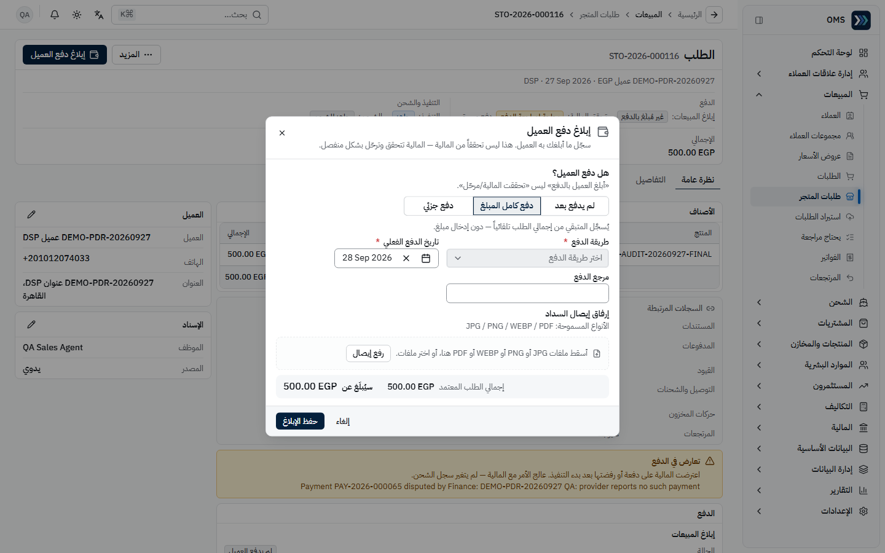
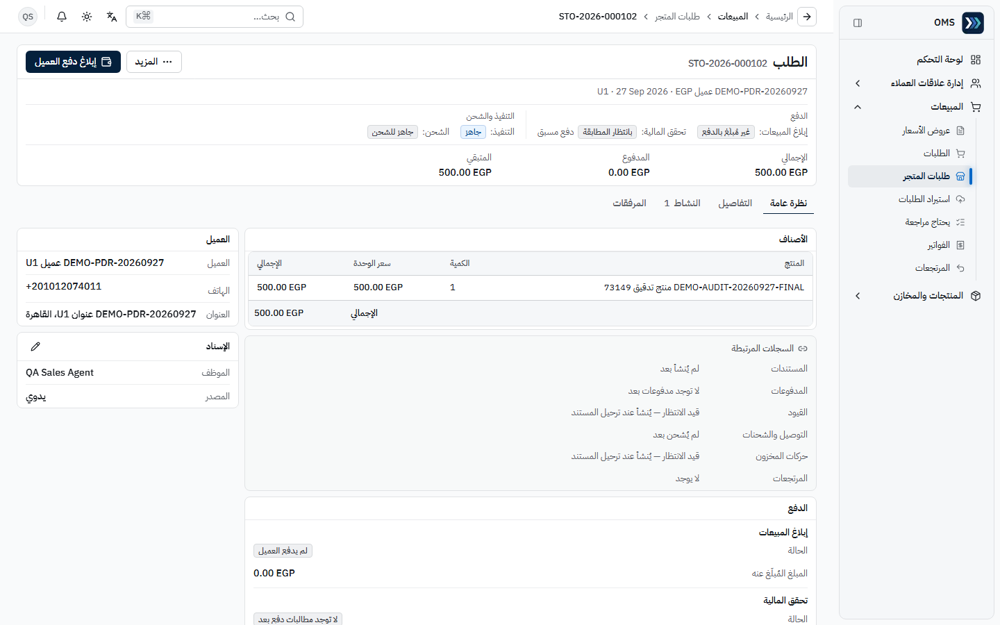
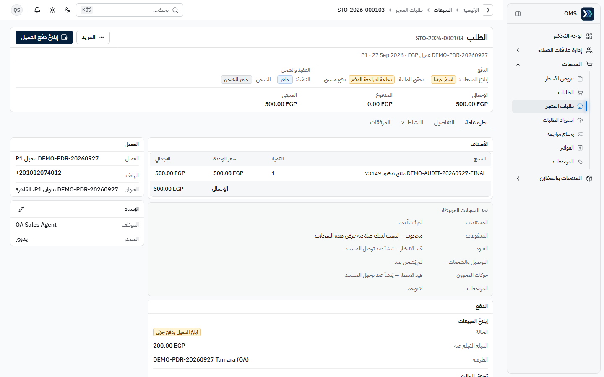
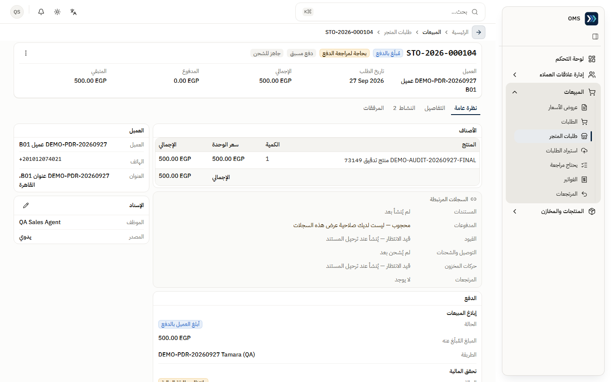
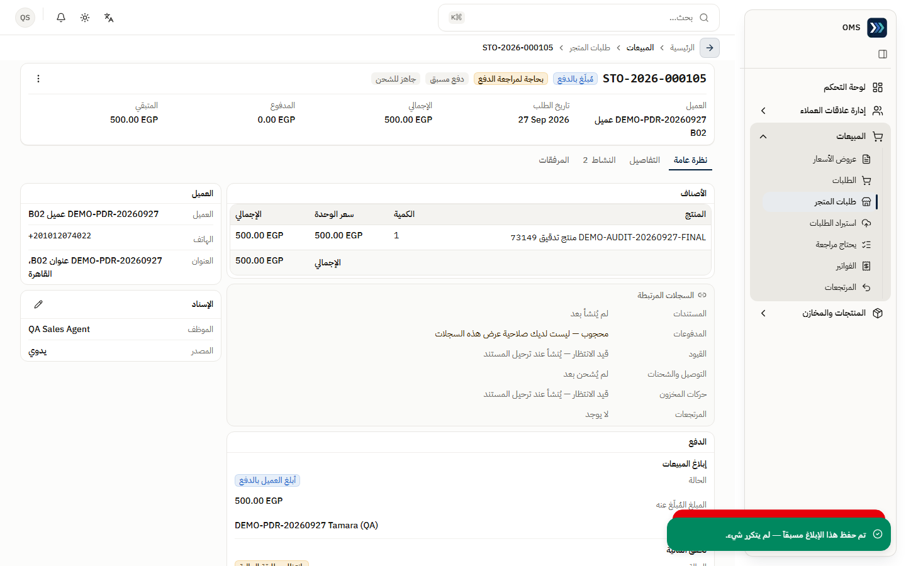

**تصحيح الإبلاغ بعد التنفيذ:** بعد إنشاء الشحنة لم يُعرض زر الإبلاغ للمندوب (P071: STO-2026-000116). أي إبلاغ جديد بعد التنفيذ أو بعد تحقق المالية يتطلب **صلاحية تصحيح** (المالية أو المدير) ويُسجَّل في السجل (S4 PASS؛ قاعدة الخادم مغطاة باختبار آلي L8). ملاحظة: بعد أن اعترضت المالية على الدفعة ظهر الزر مجدداً في لقطة الشريط أدناه، ولم تُختبر نتيجة الضغط عليه من حساب المندوب — انظر [issues.md](../issues.md). إن ظهر على الطلب شريط **«تعارض في الدفع»** فالمالية اعترضت على الدفعة أو رفضتها بعد بدء التنفيذ — تواصل معها؛ سجل الشحن لم يتغير (P070).

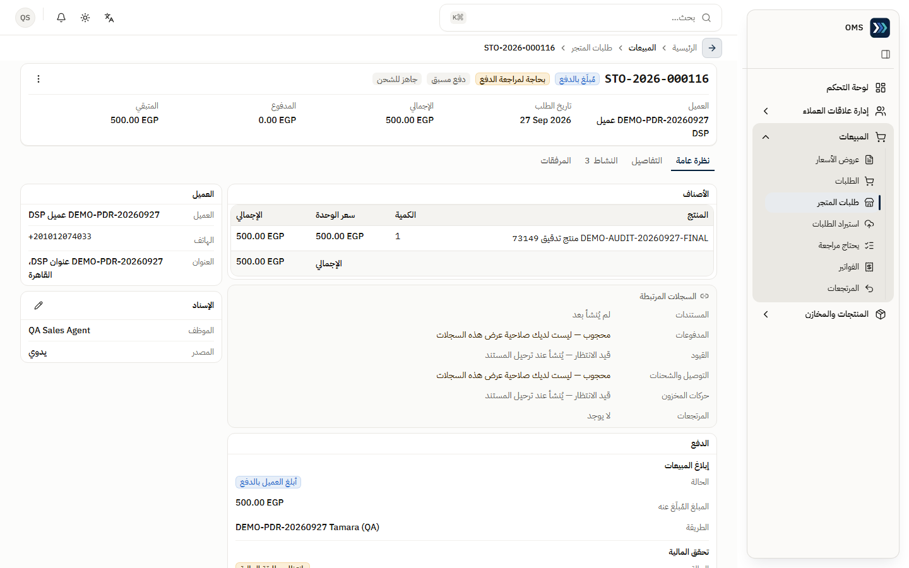

### 4) مسار B2B: عرض سعر ← أمر بيع ← فاتورة

- **المتطلبات المسبقة:** عميل موجود، منتج نشط برصيد متاح.

1. المبيعات ← **عروض الأسعار** ← جديد: **العميل**، **تاريخ المستند**، البنود (**المنتج**، **المستودع**، **الكمية**، **سعر الوحدة**) ← **حفظ** (`QT-…`، J060).
2. **اعتماد** العرض ← «تم اعتماد عرض السعر.» (J061).
3. **تحويل إلى أمر بيع**: اختر المستودع لكل بند وعدّل الكمية ← **تحويل إلى أمر بيع** (`SO-…`، J062).
4. في أمر البيع ← **تأكيد** ← «تم تأكيد أمر البيع — تم حجز المخزون.» (J063).
5. **تحويل إلى فاتورة** (`INV-…`) ← **تأكيد** ← «تم تأكيد الفاتورة — تم تسليم المخزون.» (J064، J065).

- **النتيجة المتوقعة:** الفاتورة «مؤكد» وحالة الدفع «غير مدفوعة» حتى يُسجَّل القبض.

### 5) مرتجع بيع من فاتورة

1. افتح الفاتورة المؤكدة ← **المزيد** ← **إنشاء مرتجع** ← في «إنشاء مرتجع بيع» حدد البند والكمية (≤ الكمية المفوترة) ← **إنشاء مرتجع** (`SR-…`، J068).
2. في المرتجع: **إرسال للاعتماد** ← **اعتماد** ← **تأكيد** ← «تم تأكيد المرتجع — تمت زيادة المخزون.» (J069).

- **النتيجة المتوقعة:** رصيد دائن للعميل بقيمة المرتجع؛ المالية تصرف «رد مبلغ» لاحقاً.

### 6) قائمة «يحتاج مراجعة»

- المبيعات ← **يحتاج مراجعة**: صفوف مستوردة طابقت عميلاً برقم الهاتف — أكّد للربط أو ارفض (J075).

## مراحل المعاملات

| المرحلة                        | المسؤول    | الأثر اللاحق                                                  |
| ------------------------------ | ---------- | ------------------------------------------------------------- |
| ليد جديد ← تحويل               | المندوب    | إنشاء عميل + طلب متجر؛ الليد «محوَّل»                         |
| طلب متجر ← إبلاغ دفع العميل    | المندوب    | مطالبة واحدة «بانتظار مطابقة المالية» — **لا قيد** (C1)       |
| إبلاغ كامل (دفع مسبق)          | المندوب    | الطلب مؤهل للشحن/الاستلام **قبل** المالية (C2)؛ الجزئي لا     |
| مطابقة وترحيل الدفعة           | المالية    | سند قبض + قيد يومية؛ «تحققت المالية/مرحّل» (C3)               |
| إصدار فاتورة الطلب             | المالية    | قيد فاتورة (إيراد + تكلفة مبيعات)                             |
| جاهز للشحن ← شحن ← تسليم       | مدير/الشحن | حالة الشحنة فقط — **الدفع ≠ الشحن**                           |
| عرض سعر ← اعتماد               | المندوب    | لا أثر مخزني أو محاسبي                                        |
| أمر بيع ← تأكيد                | المندوب    | **حجز** مخزون (المتاح ينقص، المتوفر ثابت)                     |
| فاتورة بيع ← تأكيد             | المندوب    | صرف المخزون (J065: 25→23) + قيد إيراد وتكلفة + ذمة على العميل |
| مرتجع ← إرسال ← اعتماد ← تأكيد | المندوب    | زيادة المخزون + قيد عكسي + رصيد دائن للعميل                   |

## التقارير

لا تظهر للمندوب مجموعة «التقارير» في القائمة. تقارير المبيعات / علاقات العملاء قشرة «قريباً». مؤشرات لوحة التحكم في قسم **«أداء المبيعات»** (ليدز جديدة، تحت المتابعة، متابعات اليوم والمتأخرة، طلباتي، معدل التحويل، ترتيبك للفترة) هي أداة المتابعة اليومية. أي عمل ينتظرك يظهر أولاً في قسم **«أعمال بانتظارك»**.

## أخطاء شائعة وطريقة المعالجة

| السلوك                                                        | السبب                        | المعالجة                                                             |
| ------------------------------------------------------------- | ---------------------------- | -------------------------------------------------------------------- |
| الليد الذي أنشأته اختفى من قائمتي                             | التوزيع التلقائي أسنده لغيرك | اطلب من مدير المبيعات **إسناد** الليد لك                             |
| تحويل بمبلغ 0                                                 | مرفوض                        | أدخل مبلغاً > 0                                                      |
| كمية مرتجع أكبر من المفوترة                                   | مرفوض                        | أرجِع ضمن الكمية المفوترة                                            |
| «تعذر الاتصال بالخادم…» بعد حفظ الإبلاغ                       | انقطاع الاستجابة             | أعد **حفظ الإبلاغ**؛ «تم حفظ هذا الإبلاغ مسبقاً — لم يتكرر شيء.»     |
| الطلب المُبلَغ جزئياً لا يصبح «جاهز للشحن»                    | الجزئي لا يكفي للدفع المسبق  | أبلغ عن المتبقي عند دفعه (يصبح «مُبلَغ بالدفع»)                      |
| لا يظهر زر «إبلاغ دفع العميل» بعد الشحن/التحقق                | التصحيح يتطلب صلاحية تصحيح   | اطلب التصحيح من المالية أو المدير                                    |
| شريط «تعارض في الدفع» على الطلب                               | المالية اعترضت/رفضت الدفعة   | راجع السبب مع المالية؛ الشحنة لا تتغير                               |
| «محجوب — ليس لديك صلاحية عرض هذه السجلات» في السجلات المرتبطة | القيود/الحركات للمالية فقط   | طبيعي؛ اطلب من المالية عند الحاجة                                    |
| فتح صفحة مالية بالرابط، أو صفحة «جديد» لا تملك صلاحية إنشائها | «الوصول مرفوض»               | طبيعي حسب الصلاحيات؛ اطلب الصلاحية المحددة من مدير النظام إن احتجتها |

التفاصيل: [issues.md](../issues.md) · المراحل: [workflows.md](../workflows.md).
