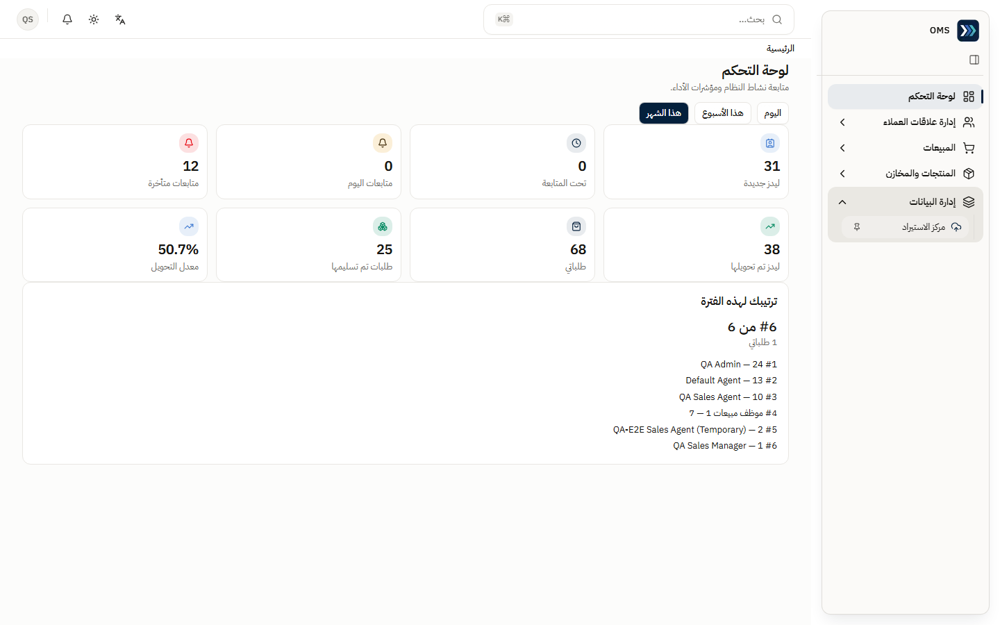
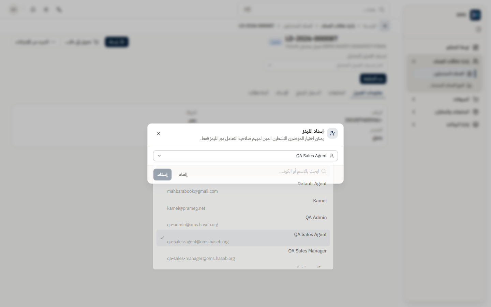
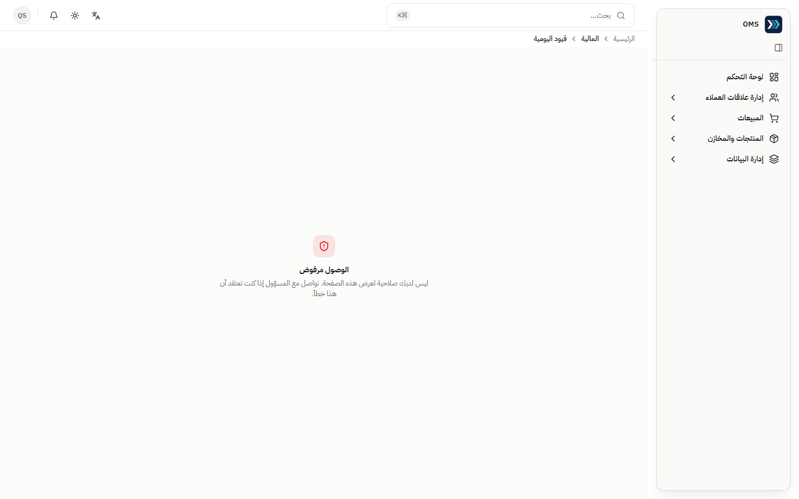

# مدير المبيعات (Sales Manager)

حساب التحقق: `qa-sales-manager@oms.haseb.org` — القائمة: **إدارة علاقات العملاء، المبيعات، المنتجات والمخازن، إدارة البيانات** (11 رابطاً، J006).
مصدر الأدلة: الجولة النهائية **DEMO-AUDIT-20260927-FINAL** على الإنتاج 91b5086.
يملك مهام [مندوب المبيعات](./sales-agent.md) (عدا **المرتجعات** غير الظاهرة في قائمته بالإعداد الحالي) **إضافةً إلى**: إدارة الليدز وإسنادها وأرشفتها (`crm.leads.manage` / `archive`) ومركز الاستيراد.

## الأقسام المتاحة

| القسم / الصفحة                                           | الغرض                                         | متى تستخدمه               |
| -------------------------------------------------------- | --------------------------------------------- | ------------------------- |
| لوحة التحكم                                              | مؤشرات الفريق + «ترتيبك لهذه الفترة» لكل موظف | متابعة يومية وأسبوعية     |
| إدارة علاقات العملاء ← العملاء المحتملون                 | إسناد الليدز ونقلها بين الموظفين، الأرشفة     | عند التوزيع أو غياب موظف  |
| إدارة علاقات العملاء ← قمع العملاء المحتملين             | مراحل التحويل                                 | مراجعة الأداء             |
| المبيعات ← عروض الأسعار / الطلبات / الفواتير             | مسار B2B                                      | الإشراف والتنفيذ          |
| المبيعات ← طلبات المتجر / استيراد الطلبات / يحتاج مراجعة | طلبات التجزئة والمستوردة                      | متابعة الطلبات والاستيراد |
| إدارة البيانات ← مركز الاستيراد                          | استيراد Excel/CSV/Google Sheets               | إدخال دفعات بيانات        |
| المنتجات والمخازن ← المنتجات                             | الأصناف                                       | عند إضافة البنود          |

فتح القيود أو أوامر الشراء بالرابط المباشر يعرض «الوصول مرفوض» (J007، J009).

## المهام

### 1) إسناد ليد أو نقله لموظف

- **المتطلبات المسبقة:** صلاحية إدارة الليدز.

1. إدارة علاقات العملاء ← **العملاء المحتملون** ← افتح الليد.
2. اضغط **إسناد** ← في «إسناد الليدز» ابحث بالاسم أو الكود واختر الموظف (تظهر فقط الأسماء النشطة التي لديها صلاحية الليدز).
3. اضغط **إسناد**.

- **النتيجة المتوقعة:** رسالة «تم إسناد الليد.» ويظهر الموظف في بطاقة **الإسناد** (J058).

### 2) متابعة تحويل الليد إلى طلب

1. بعد الإسناد، ينفّذ المندوب **تحويل إلى طلب** (انظر دليل المندوب).
2. تحقق أن الليد صار «محوَّل» والطلب `STO-…` ظهر في **طلبات المتجر** (J059).

### 3) مراجعة طلبات «يحتاج مراجعة» بعد الاستيراد

1. المبيعات ← **يحتاج مراجعة**.
2. لكل صف طابق عميلاً موجوداً برقم الهاتف: **أكّد** للربط أو **ارفض** لتجاهل الصف.

- **النتيجة المتوقعة:** لا صفوف معلّقة؛ على الإنتاج وقت التدقيق: «لا توجد عمليات استيراد لطلبات المتجر بعد» (J075).

### 4) الإشراف على مسار B2B

- راجع حالات: عرض السعر (مسودة ← معتمد ← مغلق عند التحويل)، أمر البيع (مؤكد = حجز مخزون)، الفاتورة (مؤكد = صرف مخزون + ذمة)، المرتجع (مؤكد = مخزون يعود).
- سجل **السجلات المرتبطة** أعلى كل مستند يربط العرض والأمر والفاتورة والمدفوعات.

### 5) مركز الاستيراد

1. إدارة البيانات ← **مركز الاستيراد** ← اختر القالب والملف.

- **ملاحظة تغطية:** لم تُنفَّذ عملية استيراد في جولة التدقيق — **NOT TESTED**.

## مراحل المعاملات

| المرحلة              | المسؤول                   | الأثر اللاحق                                  |
| -------------------- | ------------------------- | --------------------------------------------- |
| إسناد / نقل ليد      | مدير المبيعات             | يظهر الليد في قائمة الموظف المسند إليه        |
| تحويل ليد ← طلب متجر | مندوب / مدير              | عميل + طلب؛ لا قيد                            |
| تأكيد دفعة الطلب     | المالية                   | سند قبض + قيد؛ «مدفوع بالكامل (مُسوّى)»       |
| أمر بيع مؤكد         | مبيعات                    | حجز مخزون                                     |
| فاتورة بيع مؤكدة     | مبيعات                    | صرف مخزون + قيد إيراد/تكلفة + ذمة عميل        |
| مرتجع مؤكد ← رد مبلغ | مبيعات ← المالية          | مخزون يعود + رصيد دائن ← صرف نقدي يغلق الرصيد |
| الشحن                | مدير النظام (بدء) + الشحن | حالة الشحنة فقط                               |

## التقارير

- لا تظهر مجموعة «التقارير» لهذا الدور. مؤشر «ترتيبك لهذه الفترة» في لوحة التحكم يعرض ترتيب الموظفين بعدد الطلبات.
- تقارير المبيعات وعلاقات العملاء في النظام قشرة «قريباً» — راجع [reports.md](../reports.md).

## أخطاء شائعة وطريقة المعالجة

| السلوك                        | السبب                        | المعالجة                                          |
| ----------------------------- | ---------------------------- | ------------------------------------------------- |
| ليد جديد اختفى من قائمة منشئه | التوزيع التلقائي أسنده فوراً | أعد **إسناده** للموظف المطلوب                     |
| موظف لا يظهر في قائمة الإسناد | غير نشط أو بلا صلاحية ليدز   | فعّل الحساب/الصلاحية عبر مدير النظام              |
| «الوصول مرفوض» على صفحة أو زر | لا تملك الصلاحية المحددة     | اطلب من مدير النظام الصلاحية المحددة لتلك العملية |

التفاصيل: [issues.md](../issues.md).
