# الشحن (Shipping)

حساب التحقق: `qa-shipping@oms.haseb.org` (موظف الشحن) — القائمة: **المبيعات، الشحن** (6 روابط، J014).
مصدر الأدلة: الجولة النهائية **DEMO-AUDIT-20260927-FINAL** على الإنتاج 91b5086، وقواعد الجاهزية والاستلام من **DEMO-PDR-20260927** على 0331a58 ([الملخص](../evidence/PAYMENT-RECON-20260927/summary.md)).
الصلاحيات: `store-orders.view`، `shipping.view/edit/print/export` — **بدون** `shipping.manage`.

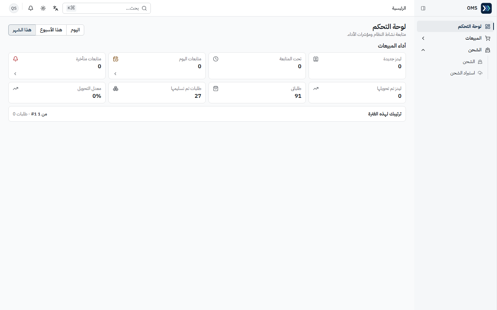

## الأقسام المتاحة

| القسم / الصفحة                                           | الغرض                                                                          | متى تستخدمه                |
| -------------------------------------------------------- | ------------------------------------------------------------------------------ | -------------------------- |
| الشحن ← الشحن                                            | كل شحنة عبر طلبات المتجر: تتبع، تحديث الحالة، رقم التتبع، شركة الشحن، المرفقات | يومياً لتحديث حالة الشحنات |
| الشحن ← استيراد الشحن                                    | تحديثات جماعية من ملف                                                          | عند وصول كشف من شركة الشحن |
| المبيعات ← طلبات المتجر / استيراد الطلبات / يحتاج مراجعة | عرض الطلب المرتبط بالشحنة                                                      | للتحقق من العنوان والبنود  |

**حالات الشحن** و**شركات الشحن** (البيانات المرجعية) ليست في قائمة هذا الدور — يديرها مدير النظام.

فتح الفواتير أو القيود أو أوامر الشراء بالرابط المباشر يعرض «الوصول مرفوض» (J015–J017).

## المهام

### 1) معرفة الطلبات الجاهزة للشحن

1. الشحن ← **الشحن**.
2. استخدم الفلاتر: **الحالة**، **شركة الشحن**، **الدولة**، **المصدر**، **رقم التتبع**، **المرفقات**، **اختر نطاق التاريخ**؛ أو اكتب رقم الطلب في **تصفية…**.

- **النتيجة المتوقعة:** جدول بالأعمدة رقم الطلب، العميل، شركة الشحن، رقم التتبع، الحالة، المرفقات، تاريخ الشحن، عرض قيد اليومية (J076).

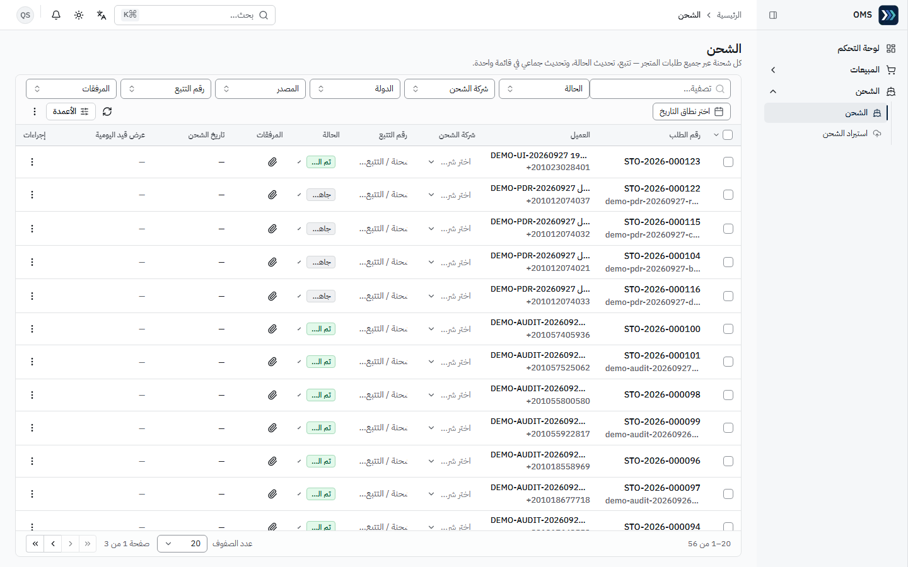

### 1أ) قاعدة الجاهزية للطلبات المدفوعة مسبقاً

| حالة دفع الطلب المسبق                             | يمكن تجهيزه؟                         | الدليل                                       |
| ------------------------------------------------- | ------------------------------------ | -------------------------------------------- |
| «مُبلَغ بالدفع» (أبلغت المبيعات بدفع كامل المبلغ) | **نعم — دون انتظار المالية**         | P038: STO-2026-000122 شُحن ولم تطابق المالية |
| «تحققت المالية/مرحّل»                             | نعم                                  | C3                                           |
| «مُبلَغ جزئياً» أو «غير مُبلَغ بالدفع»            | **لا** — «تعذر تحديث 1 طلبات: STO-…» | P040: STO-2026-000103                        |
| الدفع عند الاستلام                                | نعم دون أي إبلاغ (القاعدة لم تتغير)  | P041: STO-2026-000115                        |

- في صفحة الطلب تظهر معاً: شارة **«مُبلَغ بالدفع»** وقسم **تحقق المالية** بحالة **«بانتظار مطابقة المالية»** — هذا طبيعي؛ الشحن لا ينتظر المالية (P039).
- **الدفع لا يغيّر حالة الشحن أبداً:** لا يُسجَّل «تم الشحن» أو «تم التسليم» أو «تم الاستلام» تلقائياً، ولا تحقق المالية يحرّك الشحنة (P052: «shipment unchanged»).
- موانع أخرى صحيحة (مثل مخزون غير متاح أو طلب ملغى) تبقى سارية.

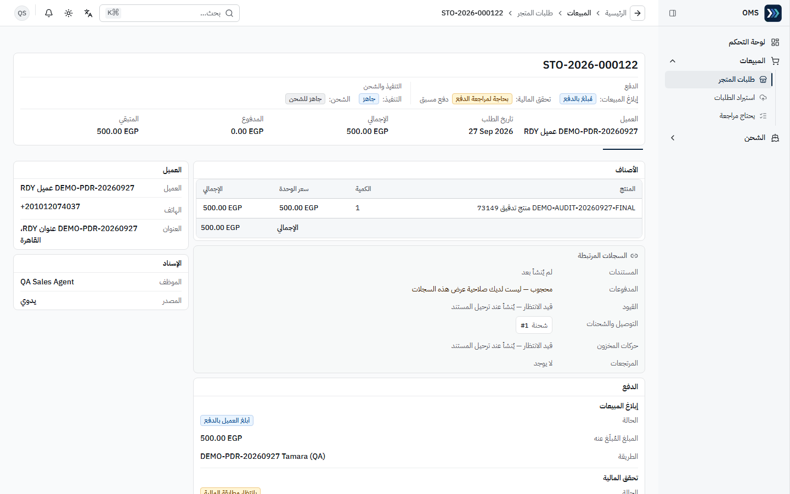
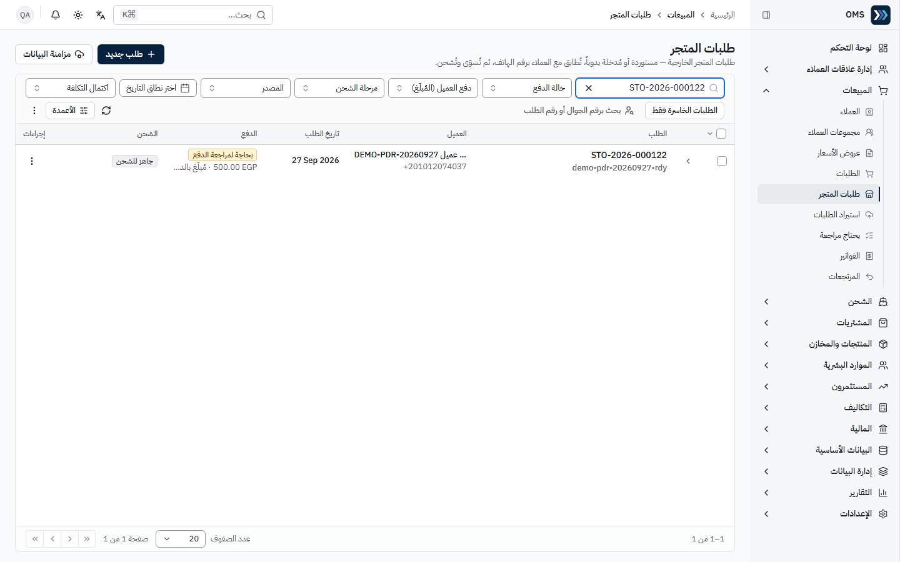
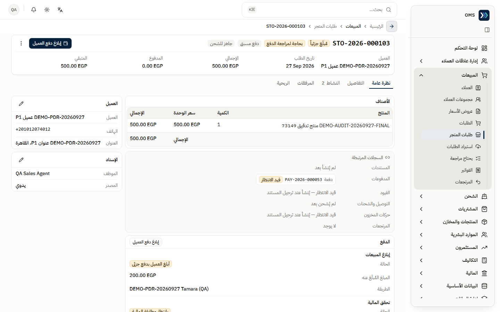
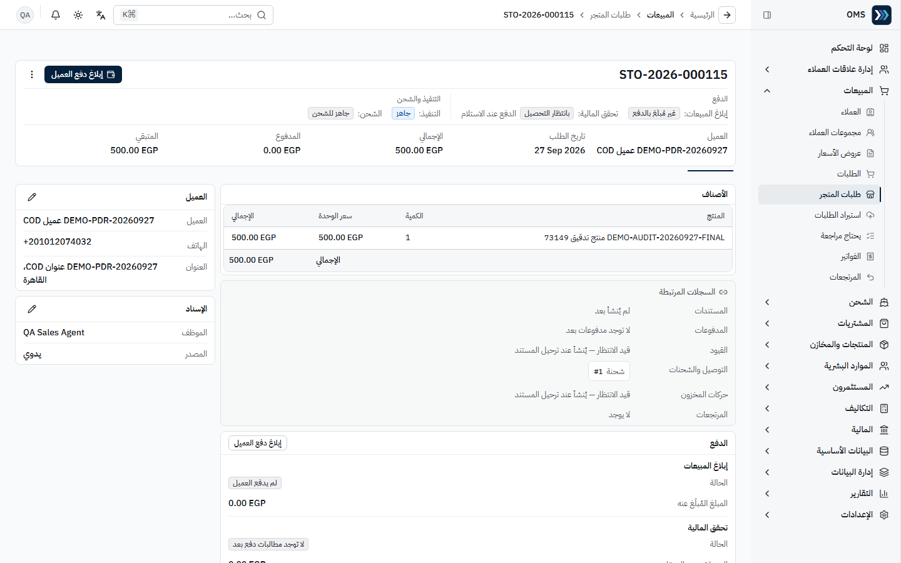

### 2) بدء الشحنة («جاهز للشحن»)

- **المتطلبات المسبقة:** صلاحية `shipping.manage`.
- **موظف الشحن لا يستطيع بدء الشحنة بالإعداد الحالي** — تحديد الصفوف وزر **تغيير حالة الشحن** يتطلبان `shipping.manage` (J077، J081 **BLOCKED** — إعداد دور لا عيب). إن كان موظفو الشحن يبدؤون الشحنات فليمنح مدير النظام `shipping.manage` لهذا الدور.
- ينفّذها مدير النظام: المبيعات ← **طلبات المتجر** ← حدد الطلب ← **تغيير حالة الشحن** ← **الحالة الجديدة** «جاهز للشحن» ← **تغيير الحالة** ← «تم تحديث 1 طلبًا بنجاح» (J078، J082).

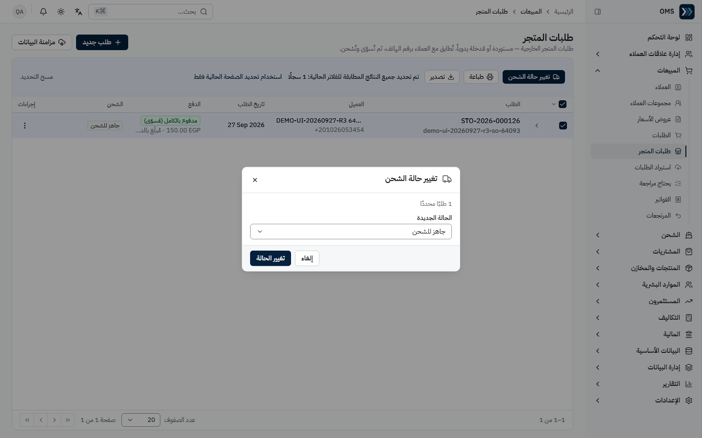

### 3) تسجيل «تم الشحن» ثم «تم التسليم»

- **المتطلبات المسبقة:** شحنة موجودة للطلب.

1. في **الشحن** ابحث برقم الطلب.
2. في عمود **الحالة** افتح القائمة المنسدلة للصف واختر **تم الشحن**؛ أدخل **رقم التتبع** و**شركة الشحن** في نفس الصف إن توفرا.
3. عند وصول الطلب اختر **تم التسليم**.

- **النتيجة المتوقعة:** تتغير شارة الحالة فوراً في الصف (تحديث سريع بدون رسالة منبثقة — التغذية الراجعة داخل الصف) (J079، J080، J083، J084).
- تكلفة الشحن لا تُعدَّل من الصف لهذا الدور؛ تحتاج «إدارة الشحنة» (صلاحية أعلى).

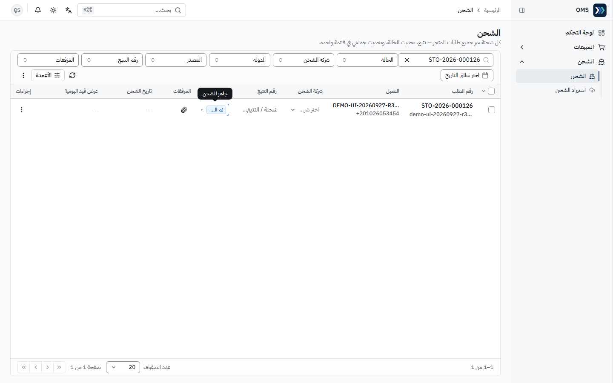
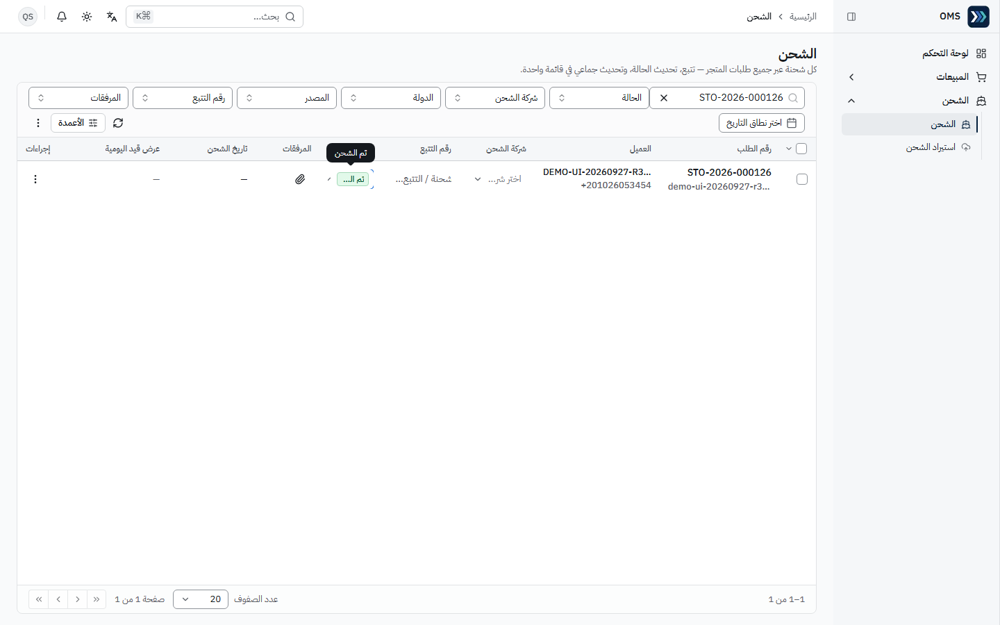
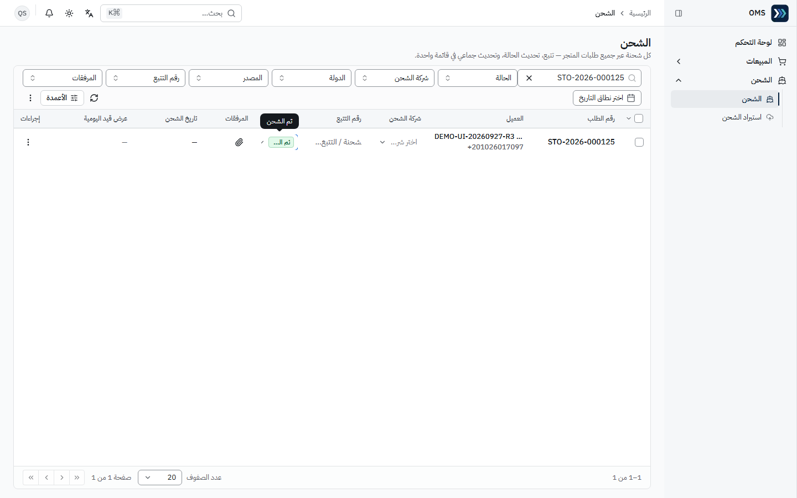

### 3أ) الاستلام من المقر (بدون شحنة أو ملصق)

- **المتطلبات المسبقة:** طلب تنفيذه «استلام من المقر». للدفع المسبق: **إبلاغ بدفع كامل المبلغ** (الجزئي لا يكفي)؛ للدفع عند الاستلام لا يلزم إبلاغ.

1. افتح الطلب من **المبيعات ← طلبات المتجر**؛ القسم **الاستلام من الفرع** في أسفل صفحة الطلب.
2. عند تجهيز الطلب اضغط **جاهز للاستلام** ← «تم تحديث حالة الاستلام.»
3. عند حضور العميل اضغط **تسجيل الاستلام** وأكّد («تسجيل الاستلام؟» — لا يمكن التراجع) ← «تم تحديث حالة الاستلام.»

- **النتيجة المتوقعة:** حالة الاستلام «تم الاستلام»، **0 شحنات** ولا ملصق؛ مطالبات الدفع تبقى «بانتظار مطابقة المالية» — الاستلام لا يتحقق من الدفع (P046: STO-2026-000121).
- إن كان الإبلاغ **جزئياً** يكون **جاهز للاستلام** معطّلاً ولا يظهر **تسجيل الاستلام**، والحالة «بانتظار التجهيز» (P044).
- إبلاغ المبيعات بالدفع الكامل لا يسجّل «تم الاستلام» تلقائياً — التسجيل يدوي بواسطة موظف مخوّل (P045).

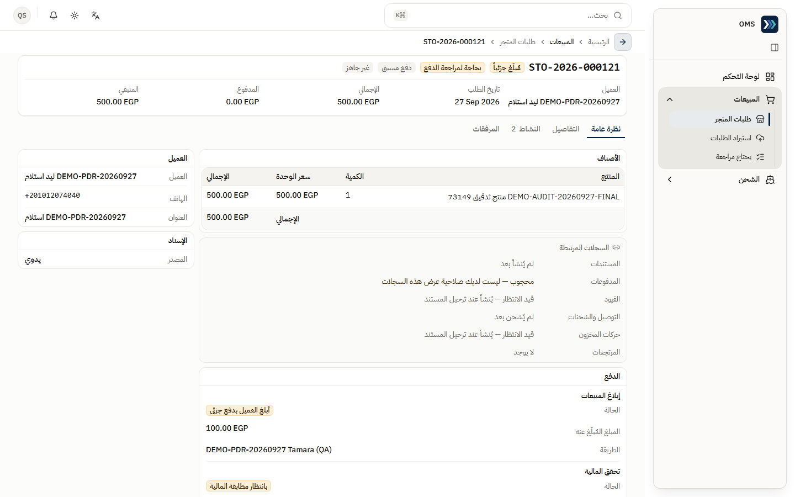
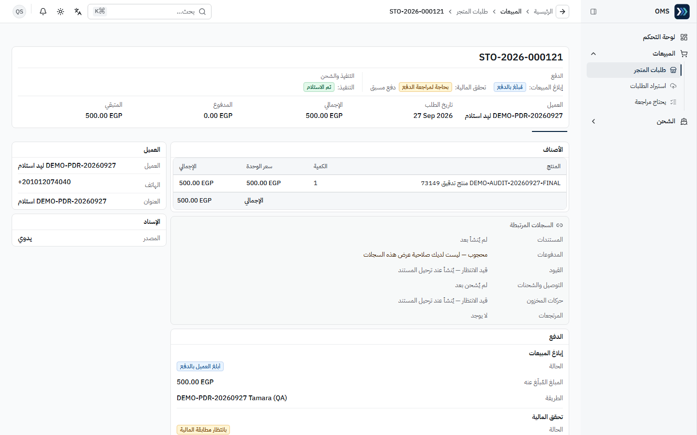

### 3ب) شريط «تعارض في الدفع»

- يظهر على الطلب حين تعترض المالية على دفعة أو ترفضها **بعد** بدء التنفيذ: «اعترضت المالية على دفعة أو رفضتها بعد بدء التنفيذ. عالج الأمر مع المالية — لم يتغير سجل الشحن.»
- لا تعدّل الشحنة بسببه؛ الشحنة كما هي (P069: STO-2026-000116 — الشحنة لم تتغير). القرار (استرجاع/متابعة التحصيل) للمبيعات والمالية.

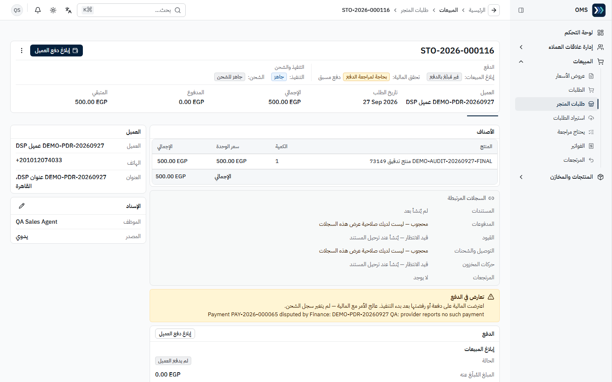

### 4) استيراد تحديثات الشحن

- الشحن ← **استيراد الشحن** — الصفحة متاحة؛ لم يُنفَّذ استيراد في جولة التدقيق (**NOT TESTED**).

## مراحل المعاملات

| المرحلة                                                                     | المسؤول                  | الأثر اللاحق                                                                                                              |
| --------------------------------------------------------------------------- | ------------------------ | ------------------------------------------------------------------------------------------------------------------------- |
| الطلب مدفوع / الدفع عند الاستلام                                            | المبيعات + المالية       | **لا** يغيّر حالة الشحن                                                                                                   |
| إبلاغ بدفع كامل (دفع مسبق)                                                  | المبيعات                 | الطلب مؤهل للتجهيز قبل تحقق المالية؛ الإبلاغ الجزئي لا يكفي (C2)                                                          |
| جاهز للاستلام ← تسجيل الاستلام (استلام من المقر)                            | الشحن / موظف مخوّل       | «تم الاستلام» بلا شحنة؛ مطالبات الدفع لا تتغير (P046)                                                                     |
| اعتراض المالية بعد التنفيذ                                                  | المالية                  | شريط «تعارض في الدفع»؛ الشحنة لا تتغير (S1)                                                                               |
| جاهز للشحن (إنشاء الشحنة)                                                   | مدير (`shipping.manage`) | تظهر الشحنة في قائمة الشحن                                                                                                |
| تم الشحن (+ رقم التتبع)                                                     | الشحن                    | تحديث حالة الشحنة                                                                                                         |
| خرج للتسليم (اختياري؛ موثّق سابقاً عبر API في F2، لم يُستخدم في هذه الجولة) | الشحن                    | تحديث حالة الشحنة                                                                                                         |
| تم التسليم                                                                  | الشحن                    | إغلاق الشحنة؛ قيد تكلفة الشحن يُرحَّل **مرة واحدة** عند التسليم إن سُجّلت تكلفة (تحقق سابق F2: STO-2026-000084، تكلفة 30) |

**الدفع ≠ الشحن:** STO-2026-000101 «مدفوع بالكامل (مُسوّى)» وكان «جاهز للشحن» قبل أن يُشحن؛ STO-2026-000100 «الدفع عند الاستلام» وسُلّم دون تسجيل دفعة.

## التقارير

- التقارير ← **تقارير الشحن**: قشرة «قريباً»، ولا تظهر مجموعة التقارير لهذا الدور.
- قائمة **الشحن** نفسها مع الفلاتر والتصدير هي أداة المتابعة (صلاحية `shipping.export`).

## أخطاء شائعة وطريقة المعالجة

| السلوك                                             | السبب                                                    | المعالجة                                                                 |
| -------------------------------------------------- | -------------------------------------------------------- | ------------------------------------------------------------------------ |
| لا أستطيع تحديد صفوف أو «تغيير حالة الشحن»         | تتطلب `shipping.manage`                                  | اطلب من المدير بدء الشحنة، أو منحك `shipping.manage` إن كان ذلك من مهامك |
| لا تظهر رسالة نجاح بعد تغيير الحالة                | التحديث السريع داخل الصف بتصميمه                         | تحقق من شارة الحالة في الصف                                              |
| لا أستطيع إدخال تكلفة الشحن                        | تحتاج «إدارة الشحنة»                                     | اطلب من المسؤول                                                          |
| اعتبار «مدفوع» = «تم التسليم»                      | خطأ مفهوم                                                | راجع عمود الحالة في قائمة الشحن                                          |
| «تعذر تحديث 1 طلبات: STO-…» عند التجهيز            | طلب مسبق الدفع غير مُبلَغ بدفع كامل                      | اطلب من المبيعات الإبلاغ عن كامل المبلغ؛ الجزئي لا يكفي                  |
| **جاهز للاستلام** معطّل                            | الإبلاغ جزئي أو غير موجود                                | نفس الحل؛ طلبات الدفع عند الاستلام لا تحتاج إبلاغاً                      |
| الطلب «مُبلَغ بالدفع» لكن «بانتظار مطابقة المالية» | تحقق المالية منفصل                                       | طبيعي — جهّز الطلب ولا تنتظر المالية                                     |
| فتح صفحة فواتير أو قيود بالرابط                    | «الوصول مرفوض»                                           | متوقع؛ إن احتجتها اطلب الصلاحية المحددة من مدير النظام                   |
| أخطاء 403 في وحدة تحكم المتصفح على صفحة الشحن      | الصفحة تطلب قيود تكلفة الشحن ولا تملك صلاحية القيود (N1) | لا أثر على العمل — تجاهلها                                               |

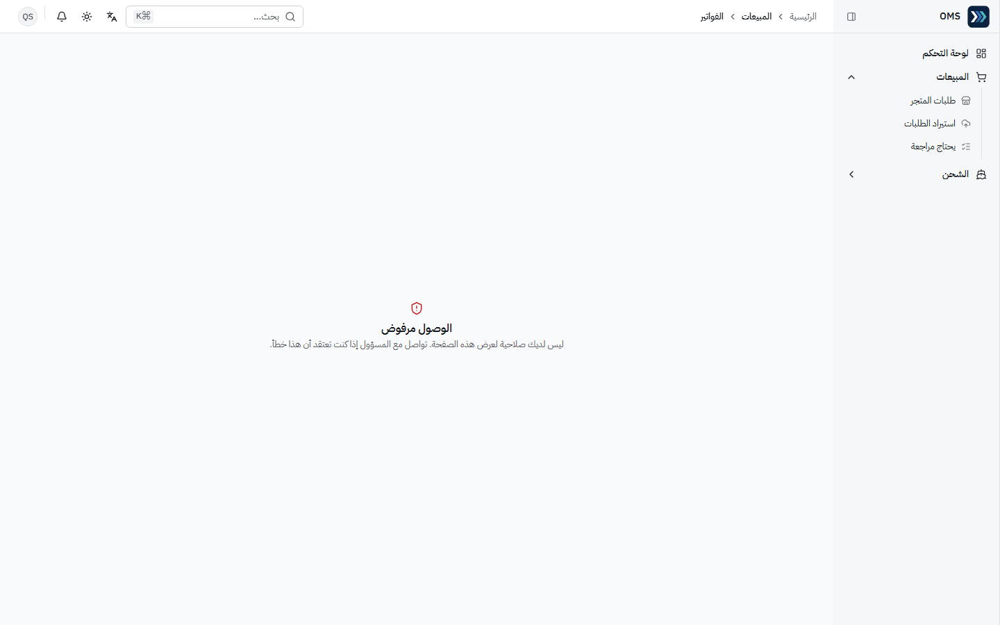

التفاصيل: [issues.md](../issues.md) · [workflows.md](../workflows.md).
