# مدير النظام (Super Admin)

حساب التحقق: `qa-admin@oms.haseb.org` — كل الصلاحيات (13 مجموعة، 113 رابطاً في القائمة الجانبية — فحص J001).
مصدر الأدلة: الجولة النهائية **DEMO-AUDIT-20260927-FINAL** على الإنتاج 91b5086 (أرقام الفحوص `J###` من [`journey-audit-report.json`](../evidence/SYSTEM-AUDIT-UI-20260926/journeys/journey-audit-report.json)).

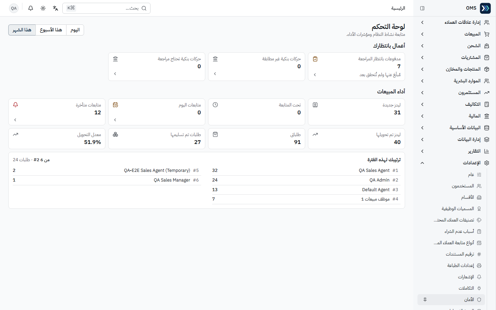

## الأقسام المتاحة

| القسم / الصفحة                                                 | الغرض                                                                                    | متى تستخدمه                         |
| -------------------------------------------------------------- | ---------------------------------------------------------------------------------------- | ----------------------------------- |
| لوحة التحكم                                                    | مؤشرات الفترة (ليدز جديدة، طلبات، معدل التحويل) مع أزرار اليوم / هذا الأسبوع / هذا الشهر | بداية اليوم لمتابعة النشاط          |
| المنتجات والمخازن ← المنتجات، الفئات، المستودعات               | تعريف الأصناف والفئات والمستودع                                                          | قبل أي بيع أو شراء                  |
| المنتجات والمخازن ← حركات المخزون، الرصيد الفعلي، الجرد الفعلي | رصيد افتتاحي، تسوية، تحويل، جرد                                                          | إعداد المخزون أو تصحيحه             |
| المبيعات ← العملاء / المشتريات ← الموردون                      | سجلات الشركاء                                                                            | قبل إصدار مستند لطرف جديد           |
| المالية ← قيود اليومية، المقبوضات، إعدادات الحسابات            | القيود اليدوية والقبض والحسابات الافتراضية                                               | تصحيحات محاسبية ودعم المالية        |
| المشتريات ← التكاليف المرحلة                                   | إلحاق تكاليف الشحن والجمارك بفاتورة شراء ورسملتها في المخزون                             | عند وصول فواتير الشحن/الجمارك       |
| التكاليف ← فئات التكلفة                                        | الفئات وتصنيفها المحاسبي (قابلة للرسملة أم لا)                                           | عند إضافة نوع تكلفة أو تغيير تصنيفه |
| الشحن ← الشحن / المبيعات ← طلبات المتجر                        | بدء الشحنة («تغيير حالة الشحن»)                                                          | لأن موظف الشحن لا يملك بدء الشحنة   |
| الإعدادات ← المستخدمون، الأقسام، ترقيم المستندات               | الحسابات والصلاحيات والأقسام والترقيم                                                    | إضافة موظف أو منح صلاحية            |
| التقارير ← المالية / المخزون                                   | ميزان المراجعة، الأستاذ، كشوف الشركاء، رصيد المخزون                                      | المراجعة الدورية                    |

صفحات **عام / إعدادات الطباعة / الإشعارات / التكاملات / الأمان / النسخ الاحتياطي** تعرض «قريباً — هذه الصفحة قيد الإنشاء» (J129، J132–J136).

## المهام

> جميع القوائم تستخدم عناصر التحكم الموحدة: اكتب في أي قائمة منسدلة للبحث (تتطابق صيغ الحروف العربية)، وصف **«+ جديد»** يظهر أعلى القائمة إن كنت مخولاً بالإنشاء، و **×** يمسح الحقل الاختياري. فلاتر القوائم نوافذ منبثقة فيها خيار **«الكل»**.

### 1) إنشاء فئة منتج

- **المتطلبات المسبقة:** لا شيء.

1. المنتجات والمخازن ← **الفئات** ← **إضافة جديد**.
2. أدخل **الاسم** (إلزامي) و**الوصف**؛ حسابات الإيراد/المخزون/التكلفة/المشتريات اختيارية.
3. اضغط **حفظ**.

- **النتيجة المتوقعة:** رسالة «تم الحفظ» وتظهر الفئة في القائمة (J031).

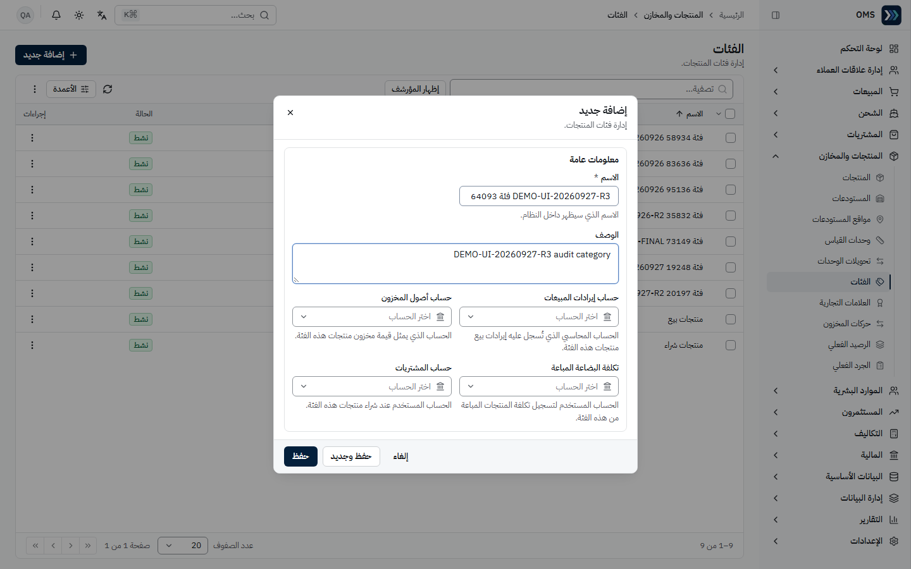

### 2) إنشاء منتج بالمعالج وتفعيله

- **المتطلبات المسبقة:** فئة ووحدة قياس موجودتان.

1. المنتجات والمخازن ← **المنتجات** ← **إضافة جديد** ← يفتح «إضافة منتج» بأربع خطوات: **الأساسيات، التسعير والتجارة، المخزون، مراجعة وإنشاء**.
2. في **الأساسيات**: **الاسم بالعربية**، **الفئة**، **وحدة القياس** (إلزامية)، و**نوع المنتج** (مثل «شراء وبيع»).
3. في **المخزون**: فعّل **تتبع المخزون** ثم أدخل **الوزن / العرض / الارتفاع / الطول** (إلزامية للصنف المخزني). فعّل **متاح لفرص الاستثمار** إن كان سيُموَّل.
4. **التالي** حتى **مراجعة وإنشاء** ثم أنشئ. (يمكن «إنشاء كمسودة الآن» في أي خطوة.)
5. في حوار «تم إنشاء المنتج بنجاح» اختر **فتح هذا المنتج** ثم فعّله من قائمة الإجراءات (⋮).

- **النتيجة المتوقعة:** رمز تلقائي `PRD-…`، الحالة مسودة ثم «نشط» مع رسالة «تم تفعيل المنتج.» (J033، J034).

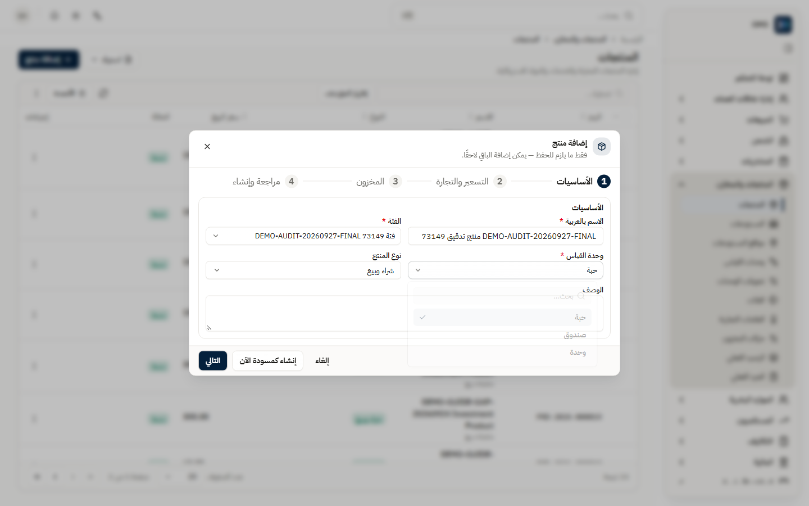
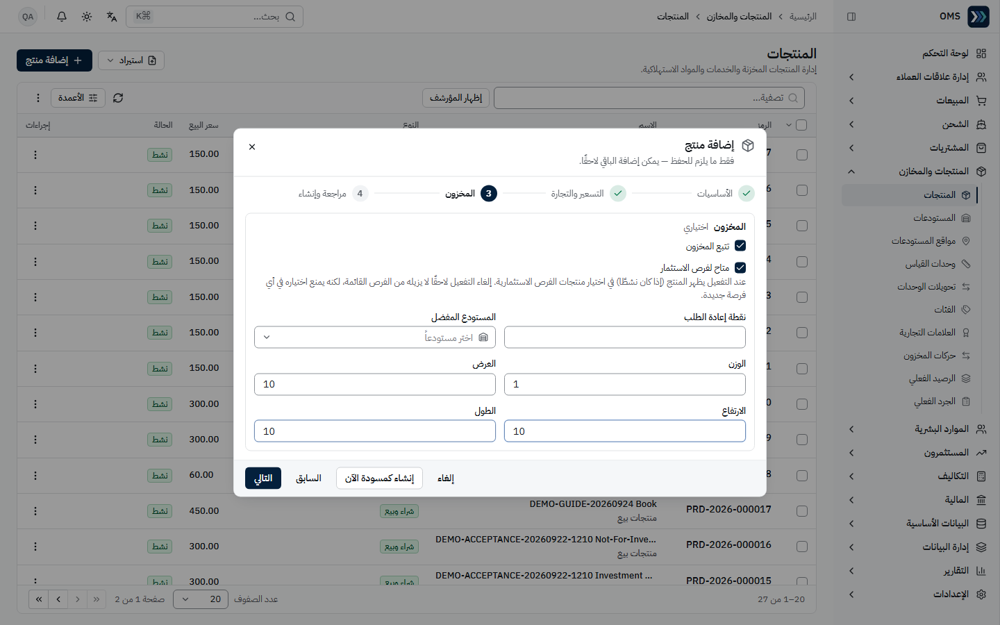
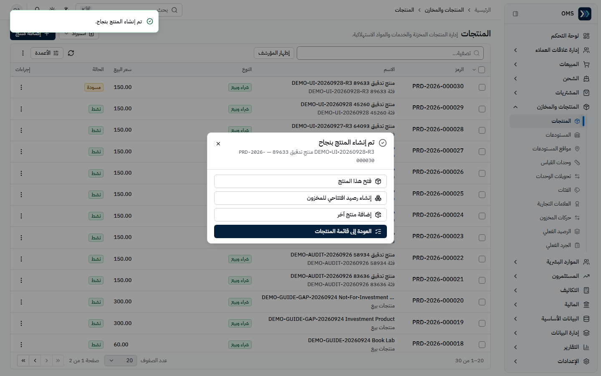
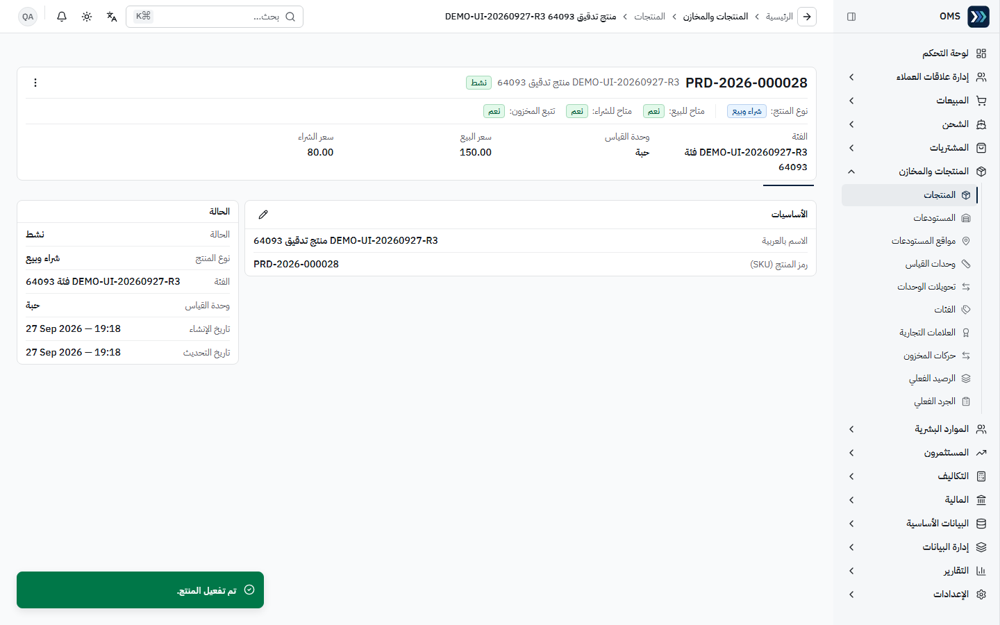

### 3) رصيد افتتاحي، تسوية، جرد فعلي

- **المتطلبات المسبقة:** منتج **نشط** مع تتبع المخزون، ومستودع نشط.

1. **حركات المخزون** ← **حركة جديدة** ← **الرصيد الافتتاحي**: المنتج، المستودع، **الكمية**، **متوسط التكلفة** ← **حفظ** ← «تم تسجيل الرصيد الافتتاحي.» (J039: 0→20).
2. **حركة جديدة** ← **تسوية المخزون**: **الاتجاه** (زيادة الكمية/نقص)، الكمية، **السبب** (إلزامي، مثل «تصحيح») ← **حفظ** ← «تم تسجيل الحركة.» (J040: 20→22).
3. **الجرد الفعلي** ← **جرد فعلي جديد**: المستودع، ابحث واختر المنتجات ← **حفظ** ← أدخل الكمية المعدودة ← أكّد ← «تم تأكيد الجرد الفعلي.» (J042: الفرق −1 يُسجَّل حركة).

- **النتيجة المتوقعة:** كل عملية تنشئ حركة غير قابلة للتعديل؛ تظهر في **حركات المخزون** بفلتر المنتج والنوع (J043).

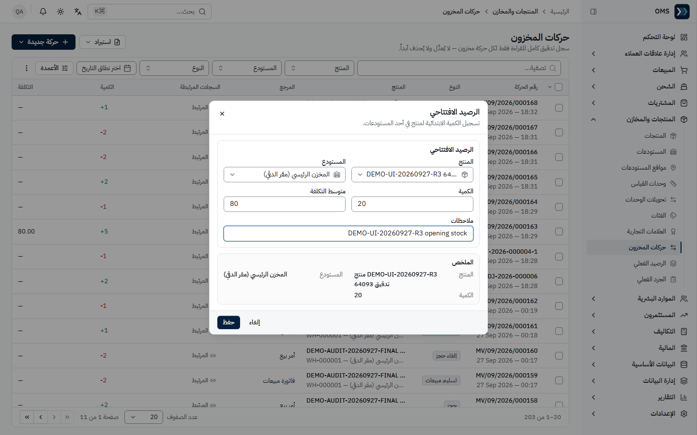
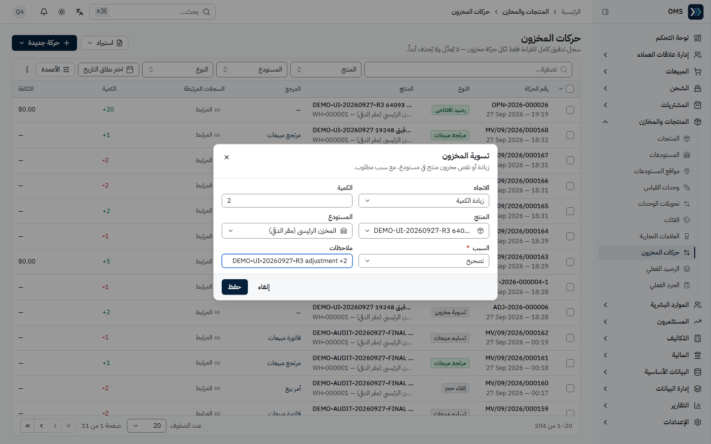
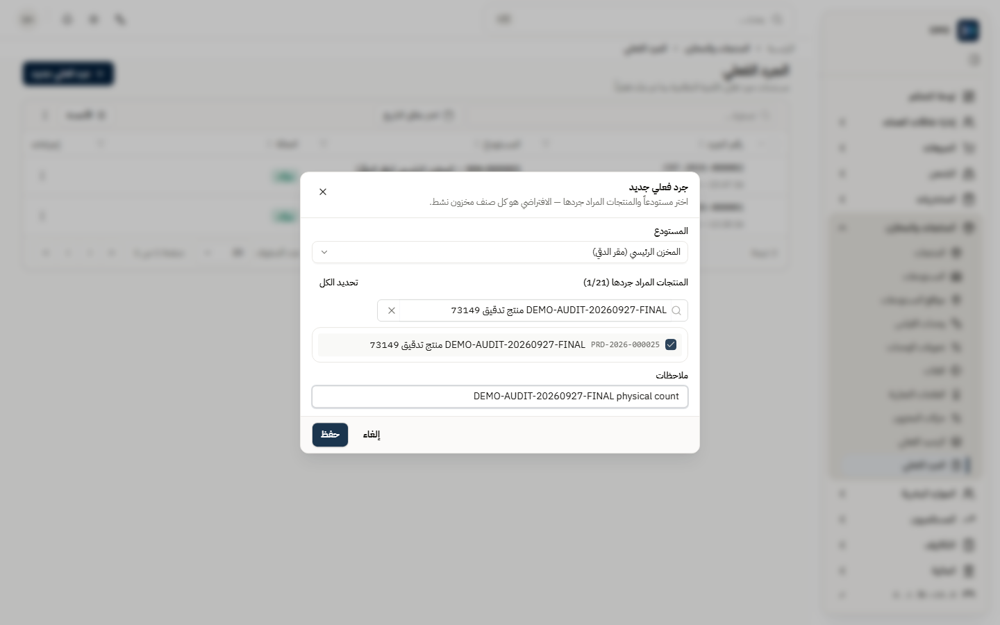
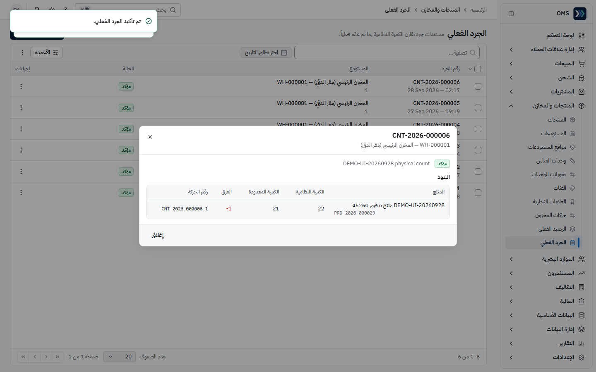
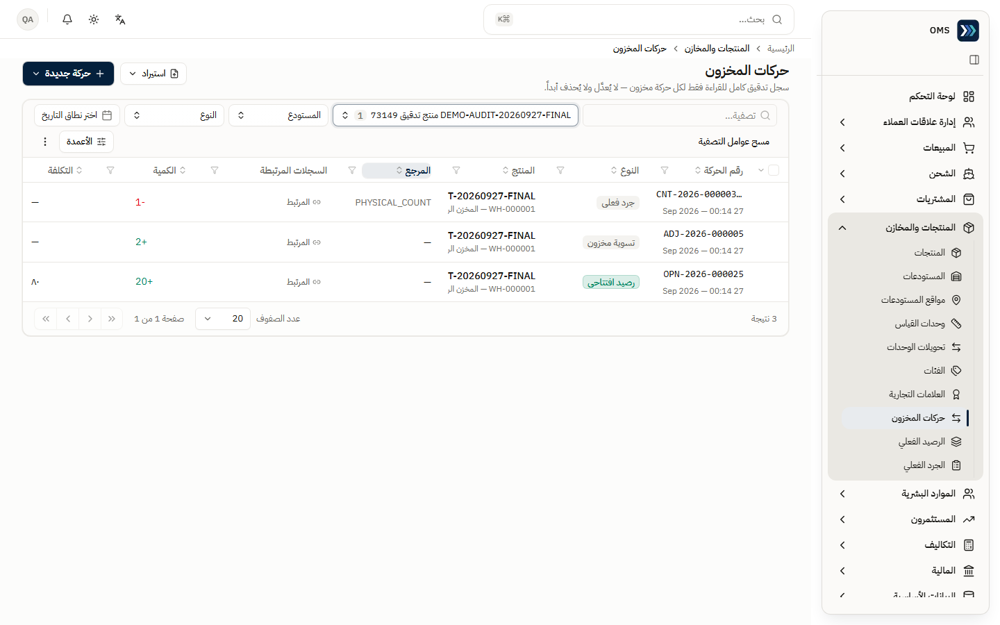

### 4) عميل ومورد جديدان

1. المبيعات ← **العملاء** ← **إضافة جديد** ← الاسم وبيانات التواصل ← **حفظ** (رقم `PT-…` تلقائي، J035).
2. المشتريات ← **الموردون** ← **إضافة جديد** بنفس الطريقة (J037).

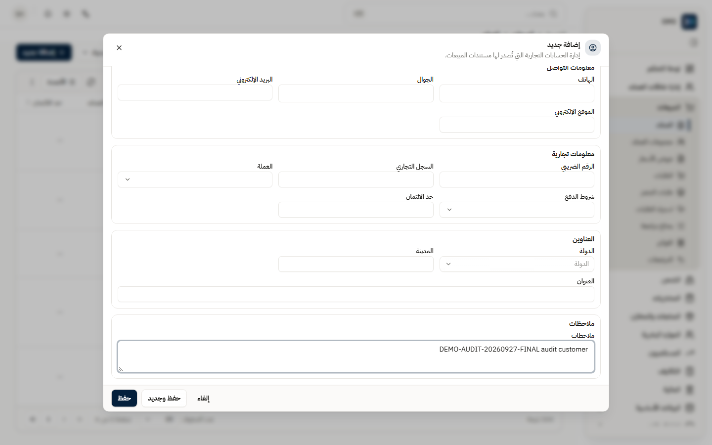
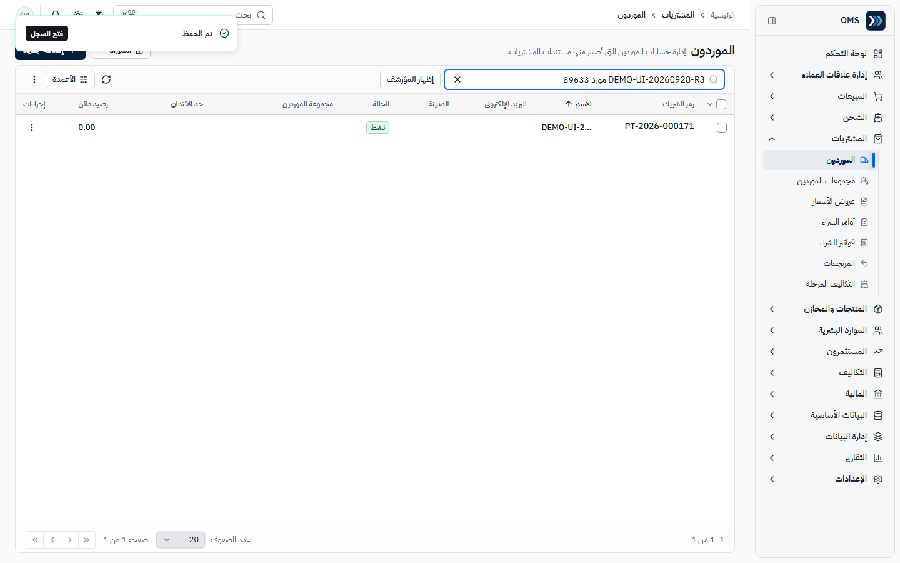

### 5) اعتماد فاتورة شراء مرسلة للاعتماد

- **المتطلبات المسبقة:** فاتورة شراء بحالة «بانتظار الاعتماد» أرسلها موظف المشتريات.

1. المشتريات ← **فواتير الشراء** ← افتح الفاتورة ← **اعتماد** ثم **تأكيد**.

- **النتيجة المتوقعة:** «تم تأكيد فاتورة الشراء — تم استلام المخزون.»؛ قيد يومية وحركة «استلام» في السجلات المرتبطة (J051).

### 6) قيد يومية يدوي

1. المالية ← **قيود اليومية** ← جديد ← **دفتر اليومية** (مثل «دفتر اليومية العامة — GJ»)، **تاريخ القيد**، **المرجع**، **الوصف**.
2. أضف سطرين (**الحساب**، **مدين** / **دائن**) حتى يظهر **متوازن** ← **حفظ**.
3. اضغط **ترحيل** وأكّد.

- **النتيجة المتوقعة:** «تم ترحيل القيد.»، رقم `JV-…` وحالة «مرحّل» مع أزرار إعادة إلى مسودة / عكس / نسخ / طباعة (J086–J087: JV-2026-000336).

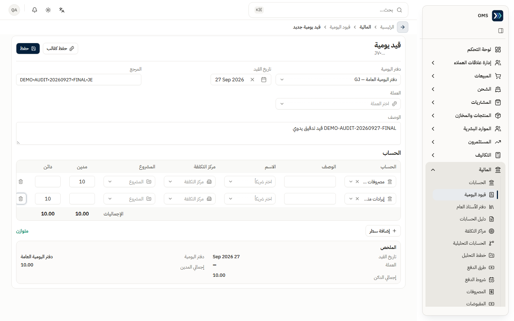
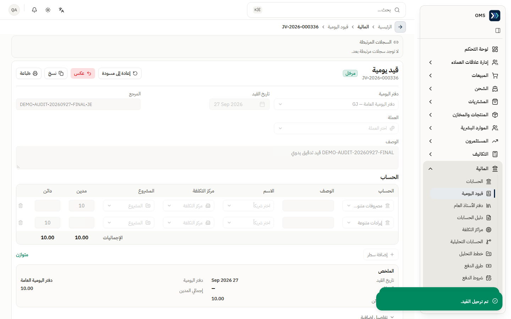

### 7) بدء شحنة لطلب متجر

1. المبيعات ← **طلبات المتجر** ← حدد الطلب ← **تغيير حالة الشحن** ← **الحالة الجديدة** = «جاهز للشحن» ← **تغيير الحالة**.

- **النتيجة المتوقعة:** «تم تحديث 1 طلبًا بنجاح» وتُنشأ الشحنة؛ يكمل موظف الشحن بعدها (J078، J082).

### 8) استلام دفعة من فاتورة بيع

1. افتح فاتورة البيع المؤكدة ← من إجراءات الفاتورة (**المزيد**) اختر **استلام دفعة** (يفتح «سند قبض عميل» معبأً بالعميل والمبلغ والفاتورة).
2. راجع **حساب الاستلام** و**التخصيصات** ← **تأكيد**.

- **النتيجة المتوقعة:** «تم التأكيد.»، سند `CR-…` وحالة الفاتورة «مدفوعة بالكامل» (J067 — مثبت في جولة 7e61bd5: CR-2026-000053؛ في الجولة النهائية سدّدت المالية الفاتورة بسند قبض مباشر فلم يلزم).
- الشاشة نفسها «سند قبض عميل» — اللقطتان من الجولة النهائية (المالية):

### 9) تكلفة مرحلة: إنشاء ← اعتماد ← ترحيل

- **المتطلبات المسبقة:** فاتورة شراء **مؤكدة**، وفئة تكلفة قابلة للرسملة.

1. المشتريات ← **التكاليف المرحلة** ← إنشاء («تكلفة مرحلة جديدة»): **فاتورة الشراء**، **مزود الشحن / التخليص**، **المرجع**، **التاريخ**، **طريقة التوزيع** (مثل «حسب قيمة الشراء»). **العملة** تُضبط تلقائياً على **EGP** لفواتير العملة الأساسية.
2. في **سطور التكلفة**: **فئة التكلفة** (مثل «شحن وارد»)، **الوصف**، **المبلغ الصافي**، **ضريبة القيمة المضافة** ← **إضافة سطر** عند الحاجة ← **حفظ**.
3. راجع **معاينة التوزيع** (نصيب كل منتج)، ثم اعتمد المستند ← «تم اعتماد التكاليف المرحلة — تم تثبيت التوزيع.»، ثم رحّله ← «تم ترحيل التكاليف المرحلة — تمت رسملتها ضمن المخزون.»

- **النتيجة المتوقعة:** الحالة «مرحّل»، وفي **السجلات المرتبطة** فاتورة الشراء وقيد يومية «مرحّل» (J056: LC-2026-000002، 25 EGP، JV-2026-000329).
- **فئات التكلفة (9):** الجمارك، الشحن الوارد، تجهيز المنتج للبيع = **قابلة للرسملة** (اقتناء المخزون)؛ تجهيز وتغليف الطلبات = **التنفيذ**؛ الطباعة، التغليف، علب مخصصة، أخرى = «أخرى» حتى تقرر الإدارة. التصنيف قابل للتعديل من **التكاليف ← فئات التكلفة**. **«تكلفة المنتج» غير قابلة للرسملة عمداً** — فهي مضمّنة في سعر فاتورة الشراء.

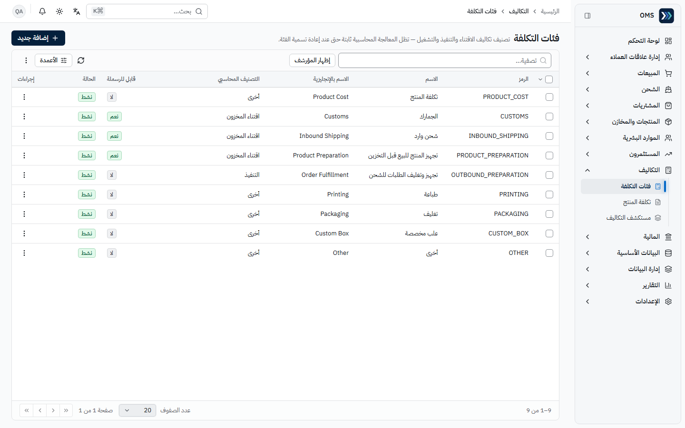

### 10) مراجعة الإعدادات والمستخدمين

1. الإعدادات ← **المستخدمون** ← **مستخدم جديد**؛ الصلاحيات تُمنح مباشرة للمستخدم («المسمى الوظيفي تسمية فقط»).
2. **ترقيم المستندات**: الأرقام تُنشأ تلقائياً؛ «إضافة سلسلة ترقيم» عند الحاجة.

- جولة التدقيق **عرضت** الصفحات فقط ولم تغيّر إعدادات (J129–J137).

**الصلاحيات بعد تحسينات الأمان (64679e7):**

- **المنتقيات حسب الدور:** من لا يملك دليل الشركاء يرى في قوائم اختيار العميل/المورد الاسم والرمز فقط (لا جهات اتصال ولا أرصدة ولا بيانات حساسة)؛ الشحن والموارد البشرية لا يصلون للكتالوج (62 PASS).
- **الجلسات:** تسجيل الخروج يمسح كل البيانات المخزنة مؤقتاً، فلا يرى المستخدم التالي في نفس التبويب شيئاً من بيانات السابق (25 PASS). إعادة تحميل التبويبات الأخرى عند الخروج جزء من الإصلاح لكنها لم تُقَس في التقرير.
- **إجراءات الكتابة تتطلب الصلاحية المطابقة:** صفحات «جديد» تُفتح فقط لمن يملك صلاحية الإنشاء؛ والعناصر التي لا يستطيع المستخدم فتحها مخفية من القائمة.
- **صلاحيات المجموعات** (مجموعات العملاء/الموردين) لم تعد تمنح ضمنياً الوصول لكامل دليل العملاء أو المنتجات — امنح الصلاحية المحددة بدلاً من ذلك.
- إن أبلغك موظف بـ «الوصول مرفوض» في عملية يحتاجها، امنحه **الصلاحية المحددة** لتلك العملية من محرر المستخدم.

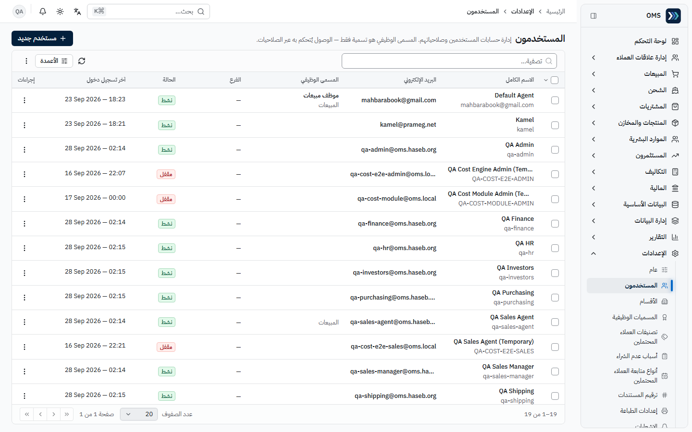
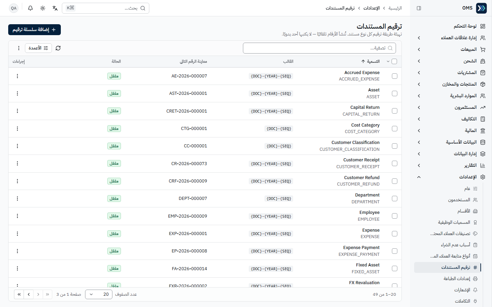
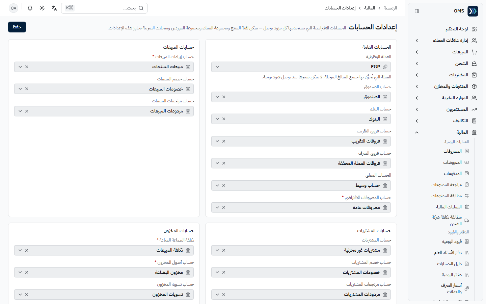

## مراحل المعاملات

| المرحلة                      | المسؤول                         | الأثر اللاحق                                                   |
| ---------------------------- | ------------------------------- | -------------------------------------------------------------- |
| إنشاء منتج ← تفعيل           | مدير النظام / المنتجات          | يصبح متاحاً في البنود والحركات                                 |
| رصيد افتتاحي / تسوية / جرد   | مدير النظام / المخزون           | حركة مخزون (OPN / ADJ / CNT)؛ الرصيد = مجموع الحركات           |
| تحويل مخزون                  | المخزون                         | حركة خروج + دخول بين مستودعين — **محجوب حالياً** (مستودع واحد) |
| اعتماد وتأكيد فاتورة شراء    | المعتمد                         | حركة «استلام» + قيد يومية + ذمة مورد                           |
| قيد يدوي ← ترحيل             | مدير / محاسب مخول               | يؤثر على الأستاذ والميزان                                      |
| تكلفة مرحلة ← اعتماد ← ترحيل | مدير النظام                     | تثبيت التوزيع ثم رسملة التكلفة في قيمة المخزون + قيد يومية     |
| بدء الشحنة                   | مدير (صلاحية `shipping.manage`) | يُنشئ شحنة يكملها موظف الشحن                                   |

## التقارير

| التقرير                            | الغرض                              | الفلاتر                                                            | القراءة                                                                                              |
| ---------------------------------- | ---------------------------------- | ------------------------------------------------------------------ | ---------------------------------------------------------------------------------------------------- |
| التقارير المالية ← كشف حساب العميل | حركة ذمة عميل                      | العميل، نطاق التاريخ، العملة، المشروع، مركز التكلفة، «المرحّل فقط» | الرصيد الافتتاحي + مدين − دائن = الختامي (J097: فاتورة 300، قبض 300، مرتجع 150، رد 150 ← ختامي 0.00) |
| تقارير المخزون ← الرصيد الحالي     | الكمية المتوفرة / المحجوز / المتاح | المنتج، المستودع                                                   | المتاح = المتوفر − المحجوز (J099)                                                                    |
| مستكشف التكاليف ← المنتج           | سجل تكلفة كل منتج وسبب التغيير     | المنتج                                                             | راجع متوسط التكلفة بعد كل شراء (J101)                                                                |

## أخطاء شائعة وطريقة المعالجة

| السلوك                                                 | السبب                                       | المعالجة                                                                      |
| ------------------------------------------------------ | ------------------------------------------- | ----------------------------------------------------------------------------- |
| تحويل المخزون لا يكتمل                                 | يوجد مستودع نشط واحد فقط على الإنتاج        | أضف مستودعاً ثانياً (قرار المالك) — **BLOCKED** (J041)                        |
| موظف يرى «الوصول مرفوض»                                | لا يملك الصلاحية المحددة للصفحة/العملية     | امنحه الصلاحية المحددة من الإعدادات ← المستخدمون                              |
| فئة تكلفة لا تظهر كقابلة للرسملة                       | تصنيفها «أخرى» أو «التنفيذ»                 | عدّل التصنيف من التكاليف ← فئات التكلفة إن كانت تكلفة اقتناء                  |
| موظف الشحن لا يستطيع بدء شحنة                          | يلزم `shipping.manage` (J077، J081 BLOCKED) | ابدأها أنت، أو امنح `shipping.manage` لدور الشحن إن كان موظفوه يبدؤون الشحنات |
| مبلغ متفق عليه 0 عند تحويل ليد / دفعة على مستند مسدَّد | قواعد عمل                                   | أدخل مبلغاً > 0؛ لا دفعة إضافية على المسدَّد                                  |

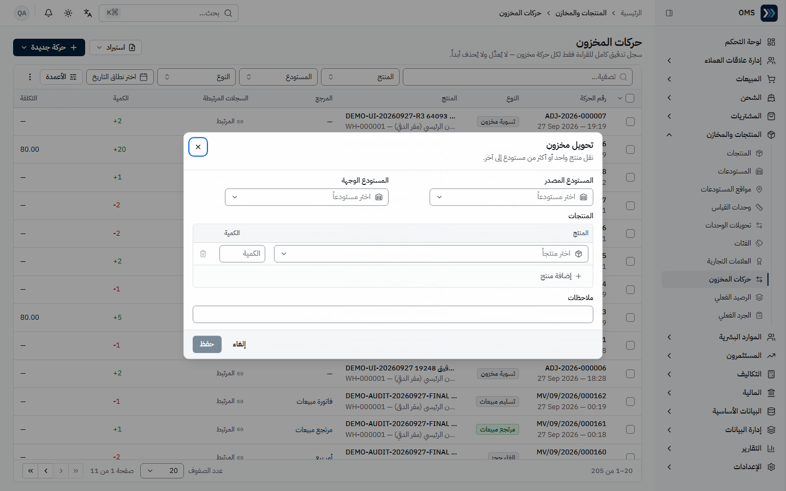

التفاصيل: [issues.md](../issues.md) · المراحل: [workflows.md](../workflows.md).
