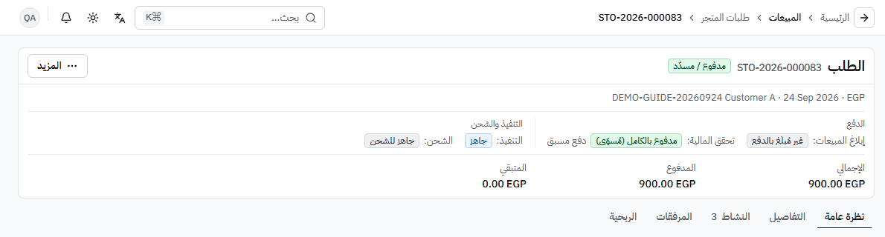

# مسارات العمل والمراحل

مرجع عملي مبني على الجولة النهائية **DEMO-AUDIT-20260927-FINAL** على الإنتاج 91b5086 (فحوص `J###`) مع الإبقاء على ما ثبت في **DEMO-GUIDE-20260924** (F1–F7 عبر API)، ومسار المدفوعات (القسم 9) من **DEMO-PDR-20260927** على الإنتاج 0331a58 (فحوص `P###` — [الملخص](./evidence/PAYMENT-RECON-20260927/summary.md)). العملة الوظيفية: **EGP**.

## قاعدة حرجة: الدفع ≠ الشحن

| المحور                    | يصف                                                                                                   | لا يعني                |
| ------------------------- | ----------------------------------------------------------------------------------------------------- | ---------------------- |
| إبلاغ المبيعات            | ما قاله العميل: «لم يدفع العميل» / «أبلغ العميل بدفع جزئي» / «أبلغ العميل بالدفع»                     | أن المالية تحققت       |
| تحقق المالية / حالة الدفع | هل المبلغ مطابَق ومُرحّل؟ («بانتظار مطابقة المالية»، «تحققت المالية/مرحّل»، «مدفوع بالكامل (مُسوّى)») | أن الطلب خرج مع الناقل |
| تسوية مزوّد الدفع         | هل حوّل المزوّد المبلغ للبنك؟ («بانتظار تسوية المزوّد»، «مسوّى»)                                      | أي شيء عن الشحن        |
| حالة الشحن / التنفيذ      | «جاهز للشحن»، «تم الشحن»، «تم التسليم»، «جاهز للاستلام»، «تم الاستلام»                                | أن العميل دفع          |

**على الشاشة (منذ 2026-09-28):** رأس طلب المتجر يفصل المحورين في مجموعتين: **الدفع** (إبلاغ المبيعات · تحقق المالية) و**التنفيذ والشحن** (التنفيذ · الشحن)، والإجراء الأساسي (مثل **إبلاغ دفع العميل**) في الرأس نفسه وبقية الإجراءات في **«المزيد»**.

**أمثلة الجولة النهائية:**

- [STO-2026-000101](https://oms.haseb.org/store-orders/504da18f-aa35-4cbd-81c3-89147ae01420) — دفع مسبق 150: مدفوع بالكامل (مُسوّى) وفاتورة INV-2026-000079 **قبل** أن يُشحن، ثم شُحن وسُلّم.
- [STO-2026-000100](https://oms.haseb.org/store-orders/ff9b30e4-dc8b-4fbe-9c56-dc2c2f7e8c81) — من ليد، الدفع عند الاستلام: شُحن وسُلّم دون تسجيل أي دفعة في الجولة.

**أمثلة سابقة (20260924):** STO-2026-000083 مسدَّد 900 وجاهز للشحن ولم يُشحن · STO-2026-000084 سُلّم مع تكلفة شحن 30.

---

## 1) ليد ← طلب متجر ← دفعة ← فاتورة

| المرحلة                                                   | المسؤول                  | الأثر اللاحق                                                           | دليل                     |
| --------------------------------------------------------- | ------------------------ | ---------------------------------------------------------------------- | ------------------------ |
| ليد جديد                                                  | المندوب                  | لا قيد؛ قد يُسنَد تلقائياً لموظف آخر                                   | J057                     |
| إسناد / نقل                                               | مدير المبيعات            | يظهر للموظف المسند إليه                                                | J058                     |
| تحويل إلى طلب (مبلغ > 0)                                  | المندوب                  | عميل + طلب متجر؛ الليد «محوَّل»                                        | J059                     |
| تحويل بمبلغ 0                                             | —                        | **مرفوض**؛ يبقى ليداً                                                  | F1 سابق                  |
| إبلاغ دفع العميل (بدل «إضافة دفعة» السابقة؛ من رأس الطلب) | المندوب                  | مطالبة «بانتظار مطابقة المالية» — لا قيد (انظر القسم 9)                | P016–P018 (سابقاً J072)  |
| تأكيد وترحيل / مطابقة وترحيل                              | المالية                  | سند قبض + قيد؛ التكرار لا يكرر القيد                                   | P052، P065 (سابقاً J073) |
| دفعة على طلب مسدَّد                                       | —                        | **مرفوضة**                                                             | F1 سابق                  |
| إصدار فاتورة                                              | المالية                  | قيد فاتورة (إيراد + تكلفة مبيعات) وحركة مخزون عند الترحيل؛ منع التكرار | J074، F1                 |
| جاهز للشحن                                                | مدير (`shipping.manage`) | إنشاء الشحنة؛ لا يغيّر الدفع؛ للدفع المسبق يلزم إبلاغ كامل             | J078، P038               |

## 2) الشحن

| المرحلة                       | المسؤول                         | الأثر                                                             | دليل                          |
| ----------------------------- | ------------------------------- | ----------------------------------------------------------------- | ----------------------------- |
| جاهز للشحن (تغيير حالة الشحن) | مدير النظام (`shipping.manage`) | إنشاء الشحنة — دور الشحن الحالي بلا `shipping.manage` (إعداد دور) | J077/J081 BLOCKED، J078، J082 |
| تم الشحن (+ رقم التتبع)       | الشحن                           | تحديث داخل صف قائمة الشحن                                         | J079، J083                    |
| خرج للتسليم                   | الشحن                           | تحديث الحالة                                                      | F2 سابق (API)                 |
| تم التسليم                    | الشحن                           | إغلاق الشحنة؛ قيد تكلفة الشحن مرة واحدة إن سُجّلت تكلفة           | J080، J084، F2                |

## 3) B2B: عرض ← أمر ← فاتورة ← قبض ← مرتجع ← رد

| المرحلة                         | المسؤول          | الأثر اللاحق                                                               | دليل                  |
| ------------------------------- | ---------------- | -------------------------------------------------------------------------- | --------------------- |
| عرض سعر ← اعتماد                | المبيعات         | لا أثر                                                                     | J060، J061            |
| تحويل إلى أمر بيع ← تأكيد       | المبيعات         | **حجز** مخزون (المتاح ينقص)                                                | J062، J063            |
| تحويل إلى فاتورة ← تأكيد        | المبيعات         | صرف المخزون (25→23) + قيد JV-2026-000330 + ذمة 300                         | J064، J065            |
| سند قبض                         | المالية / المخول | قيد JV-2026-000331؛ الفاتورة «مدفوعة»                                      | J066 (CR-2026-000057) |
| مرتجع ← إرسال ← اعتماد ← تأكيد  | المبيعات         | مخزون +1 + قيد JV-2026-000332 + رصيد دائن 150                              | J068، J069            |
| مرتجع بكمية زائدة / إعادة تأكيد | —                | مرفوض / لا قيد جديد                                                        | F2 سابق               |
| رد المبلغ (CRF)                 | المالية          | صرف نقدي + قيد JV-2026-000333؛ المتاح للرد 150→0؛ كشف العميل يغلق على 0.00 | J070، J097            |

مراجع سابقة: SO-2026-000012 / INV-2026-000060 / CR-042 + CR-043 (قبض جزئي ثم كامل) · SR-2026-000015 → CRF-2026-000002 · SR-2026-000016 → CRF-2026-000003 + JV-2026-000270.

## 4) المشتريات

| المرحلة                                             | المسؤول             | الأثر اللاحق                                                                                                                            | دليل       |
| --------------------------------------------------- | ------------------- | --------------------------------------------------------------------------------------------------------------------------------------- | ---------- |
| عرض سعر شراء ← اعتماد                               | المشتريات           | لا أثر                                                                                                                                  | J045، J046 |
| تحويل إلى أمر شراء ← اعتماد                         | المشتريات           | **لا** مخزون ولا تكلفة ولا قيد (ADR-0015)                                                                                               | J047، J048 |
| تحويل إلى فاتورة (مستودع الاستلام) ← إرسال للاعتماد | المشتريات           | فاتورة بانتظار الاعتماد                                                                                                                 | J049، J050 |
| اعتماد وتأكيد الفاتورة                              | مدير/معتمد          | حركة «استلام» (21→26) + قيد يومية + ذمة مورد + تحديث متوسط التكلفة                                                                      | J051       |
| سداد المورد                                         | المشتريات / المالية | الفاتورة «مدفوعة»، المتبقي 0                                                                                                            | J052       |
| مرتجع شراء ← اعتماد ← تأكيد                         | المشتريات + معتمد   | تخفيض المخزون + عكس الذمة                                                                                                               | J053، J054 |
| تكلفة مرحلة ← اعتماد ← ترحيل                        | مدير النظام         | تثبيت التوزيع ثم رسملة في قيمة المخزون + قيد (LC-2026-000002 ← JV-2026-000329)؛ فئات الرسملة: الجمارك، الشحن الوارد، تجهيز المنتج للبيع | J056       |

## 5) المخزون

| العملية                           | المسؤول        | الأثر                                                         | دليل       |
| --------------------------------- | -------------- | ------------------------------------------------------------- | ---------- |
| رصيد افتتاحي (كمية + متوسط تكلفة) | المخزون / مدير | حركة OPN؛ 0→20                                                | J039       |
| تسوية (زيادة/نقص + سبب)           | المخزون        | حركة ADJ؛ 20→22                                               | J040       |
| جرد فعلي ← تأكيد                  | المخزون        | حركة بالفرق فقط (CNT)؛ 22→21                                  | J042       |
| تحويل بين مستودعين                | المخزون        | خروج + دخول — **BLOCKED** (مستودع نشط واحد؛ يلزم مستودع ثانٍ) | J041       |
| حجز أمر البيع / فك الحجز          | النظام         | يغير «المحجوز» لا «المتوفر»؛ المتاح = المتوفر − المحجوز       | J063، J099 |

- الحركات **لا تُعدَّل ولا تُحذف**؛ الرصيد = مجموع الحركات (ADR-0013).
- متوسط التكلفة يتحدث بالمشتريات؛ البيع يستهلك تكلفة = الكمية × المتوسط (F5 سابق).

## 6) قيود اليومية

| النوع                            | بعد الترحيل                                                                             |
| -------------------------------- | --------------------------------------------------------------------------------------- |
| قيد يدوي                         | «إعادة إلى مسودة» أو «عكس» أو «نسخ» متاحة (J087: JV-2026-000336؛ JV-2026-000252 سابقاً) |
| قيد نظامي (فاتورة/قبض/رد/استلام) | **ممنوع** التعديل أو الإعادة لمسودة — صحّح المستند المصدر                               |
| فترة مغلقة                       | لا ترحيل (السنوات والفترات المالية)                                                     |

## 7) الموارد البشرية

| المرحلة                   | المسؤول      | الأثر                    | دليل                                     |
| ------------------------- | ------------ | ------------------------ | ---------------------------------------- |
| موظف جديد                 | HR           | يظهر في الإسناد والتقييم | J108                                     |
| قالب مؤشرات ← تعيين       | HR           | شرط لبدء التقييم         | J110، J112                               |
| بدء تقييم                 | HR / المقيّم | تقييم «مسودة»            | J114 (J111: بدون قالب رسالة عربية واضحة) |
| مستهدف شهري               | HR           | لوحة الترتيب             | J113                                     |
| احتساب عمولة / مسير رواتب | HR ← المالية | NOT TESTED               | —                                        |

## 8) المستثمرون

| المرحلة                                        | المسؤول              | الأثر                                                      | دليل                         |
| ---------------------------------------------- | -------------------- | ---------------------------------------------------------- | ---------------------------- |
| مستثمر (يلزم جوال أو بريد)                     | المستثمرون           | سجل                                                        | J121 (J120: تنبيه قبل الحفظ) |
| فرصة مسودة ← فتح للاستثمار                     | المستثمرون           | تقبل الاشتراكات                                            | J122، J123                   |
| اشتراك ملتزم                                   | المستثمرون           | التزام — لا قيد                                            | J124                         |
| دفعات رأس المال، الأرباح، التوزيعات، المدفوعات | المستثمرون + المالية | قيود ودفتر المستثمر — API سابق 82/82؛ **NOT TESTED** واجهة | —                            |

## 9) المدفوعات: إبلاغ المبيعات ← التنفيذ ← المالية (مطابقة وتسوية)

**الفصل الأساسي:** المبيعات **تُبلغ** (لا قيد) — الشحن/الاستلام **ينفّذ** بناءً على الإبلاغ الكامل — المالية **تطابق وترحّل** ثم **تسوّي** تحويل المزوّد. لا يحرّك أيٌّ منها حالة الآخر تلقائياً.

### أ) حالات إبلاغ الطلب (المبيعات)

| الحالة على الشاشة                         | المعنى                         | أثر على التنفيذ (دفع مسبق)                   |
| ----------------------------------------- | ------------------------------ | -------------------------------------------- |
| «غير مُبلَغ بالدفع» / «لم يدفع العميل»    | لا إبلاغ أو «لم يدفع بعد»      | غير جاهز                                     |
| «مُبلَغ جزئياً» / «أبلغ العميل بدفع جزئي» | مبلغ أقل من الإجمالي           | **غير جاهز** — الجزئي لا يكفي أبداً          |
| «مُبلَغ بالدفع» / «أبلغ العميل بالدفع»    | المبلغ المُبلَغ = إجمالي الطلب | **جاهز للشحن / للاستلام دون انتظار المالية** |
| الدفع عند الاستلام                        | لا يحتاج إبلاغاً               | القاعدة القديمة دون تغيير                    |

كل إبلاغ «مدفوع» يُنشئ **مطالبة واحدة** (`PAY-…`)؛ التكرار أو إعادة الإرسال لا يُنشئ مطالبة ثانية (C5).

### ب) حالات المطالبة (Claim)

| الحالة                                                             | متى                                                       | الانتقال التالي                                |
| ------------------------------------------------------------------ | --------------------------------------------------------- | ---------------------------------------------- |
| **PENDING** — «مُبلَغ عنها · بانتظار المطابقة» / «بانتظار التأكيد» | بعد الإبلاغ                                               | مطابقة جزئية / تأكيد / اعتراض / رفض            |
| **MATCHED** — مطابَقة جزئياً (تخصيص غير مكتمل)                     | تخصيص حركة كشف لا يغطي المطالبة كاملة                     | يكتمل التخصيص ← VERIFIED؛ **لا ترحيل قبل ذلك** |
| **VERIFIED** — «تحققت المالية/مرحّل»                               | مطابقة كاملة وترحيل، أو «تأكيد وترحيل» لطريقة غير مطابَقة | تسوية (للطرق المطابَقة) / تصحيح المطابقة       |
| **DISPUTED** — «معترض عليه من المالية»                             | المالية تشك في الإقرار (مع السبب)                         | الطلب المنفَّذ يحمل «تعارض في الدفع»           |
| **REJECTED** — «مرفوض من المالية»                                  | المالية ترفض المطالبة                                     | —                                              |

الاعتراض والرفض ممنوعان ما دامت المطالبة مطابَقة؛ **تصحيح المطابقة** أولاً (يلغي سند القبض بقيد عكسي ويعيد المطالبة إلى PENDING).

### ج) حالات التسوية (Settlement) — للطرق التي «تتطلب مطابقة» فقط

| حالة المطالبة               | المعنى                                             |
| --------------------------- | -------------------------------------------------- |
| «لا ينطبق» (NOT_APPLICABLE) | طريقة لا تتطلب مطابقة — رُحّلت على حسابها مباشرة   |
| «بانتظار التسوية»           | مرحّلة على حساب التسوية الوسيط ولم يحوّلها المزوّد |
| «مسوّاة جزئيًا»             | سُوّي جزء منها؛ المتبقي لا يُعلَّم مسوّى أبداً     |
| «مسوّاة»                    | ضمن تسوية مرحّلة `PST-…`                           |

مستند التسوية نفسه: «مرحّلة» أو «معكوسة» (بـ **عكس التسوية** — يعيد المطالبات إلى «بانتظار التسوية»).

### د) القيود المحاسبية

| الحدث                                | مدين                                                                                           | دائن                                                       | سعر الصرف           | مثال الإنتاج                                                                                                  |
| ------------------------------------ | ---------------------------------------------------------------------------------------------- | ---------------------------------------------------------- | ------------------- | ------------------------------------------------------------------------------------------------------------- |
| إبلاغ المبيعات                       | —                                                                                              | —                                                          | —                   | 0 قيود (P093)                                                                                                 |
| استيراد كشف المزوّد                  | —                                                                                              | —                                                          | —                   | 0 قيود (P049)                                                                                                 |
| مطابقة وترحيل (طريقة تتطلب مطابقة)   | حساب التسوية الوسيط للطريقة (114)                                                              | 121 الذمم المدينة التجارية                                 | تاريخ عملية المزوّد | JV-2026-000337: 500/500؛ JV-2026-000347: 10,356.64 (200 USD × 51.7832)                                        |
| تأكيد وترحيل (طريقة لا تتطلب مطابقة) | الحساب المرتبط بالطريقة (115)                                                                  | 121 الذمم المدينة التجارية                                 | تاريخ الدفع الفعلي  | [JV-2026-000351](https://oms.haseb.org/finance/journal-entries/ea60e0ef-0314-4306-a959-817228393046): 500/500 |
| تسوية — نفس العملة                   | البنك (116) = المستلم؛ 522 عمولات بوابات الدفع = الإجمالي − المستلم                            | حساب التسوية الوسيط = الإجمالي                             | تاريخ التسوية       | PST-2026-000002 ← JV-2026-000350: 4,500 + 500 / 5,000                                                         |
| تسوية — عملة مختلفة                  | البنك = المستلم؛ 522 = العمولة المُدخلة × سعر تاريخ التسوية؛ 546 فروقات العملة المحققة (خسارة) | حساب التسوية الوسيط = القيمة الدفترية (± 546 إن كان ربحاً) | تاريخ التسوية       | PST-2026-000001 ← JV-2026-000349: 19,672.62 + 1,035.66 + 5.00 / 20,713.28                                     |
| اعتراض / رفض                         | —                                                                                              | —                                                          | —                   | لا قيد (P069)                                                                                                 |
| تصحيح المطابقة                       | قيد عكسي لسند القبض                                                                            | —                                                          | سعر القيد الأصلي    | NOT TESTED على الإنتاج                                                                                        |

- المطابقة **لا تثبت** وصول المال للبنك ولا تخصم العمولة — ذلك عند التسوية.
- السعر والتاريخ والمصدر تُجمَّد على كل قيد مرحّل؛ تشغيل استيراد الأسعار أو إضافة/حذف سعر مخصص لاحقاً لا يغيّرها (P085، P089، P091).

### هـ) مثال الإنتاج خطوة بخطوة (DEMO-PDR-20260927)

1. المندوب ينشئ STO-2026-000104 ويختار «دفع كامل المبلغ» (Tamara (QA)) ← PAY-2026-000054 «بانتظار مطابقة المالية»، 0 قيود (P018).
2. طلب مشابه STO-2026-000122 يُجهَّز «جاهز للشحن» **قبل** أي مطابقة (P038).
3. المالية تستورد الكشف (11 حركة) وتطابق B01 ← JV-2026-000337، المطالبة «تحققت المالية/مرحّل» + «بانتظار تسوية المزوّد»، الشحنة دون تغيير (P049، P052).
4. المالية تسوّي 10 مطالبات (5,000) باستلام 4,500 ← PST-2026-000002 / JV-2026-000350؛ رصيد المزوّد يعود «متطابق» (P075، C8).

---

## مسرد الحالات

| الحالة على الشاشة                      | المعنى العملي                        |
| -------------------------------------- | ------------------------------------ |
| مسودة                                  | غير مرحّل؛ قابل للتعديل              |
| مُرسل للاعتماد / بانتظار الاعتماد      | ينتظر صاحب صلاحية الاعتماد           |
| معتمد                                  | جاهز للمرحلة التالية                 |
| مؤكد                                   | نفّذ أثره (مخزون/قيد)                |
| مرحّل                                  | ظهر في الأستاذ والميزان              |
| مغلق                                   | حُوّل لمستند لاحق                    |
| بانتظار التحصيل / بانتظار المطابقة     | لا دفعة / دفعة تنتظر تأكيد المالية   |
| مُبلَغ بالدفع / مُبلَغ جزئياً          | إقرار المبيعات (ليس تحققاً)          |
| بانتظار مطابقة المالية                 | مطالبة لم تُطابَق أو تُؤكَّد بعد     |
| تحققت المالية/مرحّل                    | سند قبض + قيد مرحّل                  |
| بانتظار تسوية المزوّد / مسوّى          | المال عند المزوّد / وصل البنك        |
| معترض عليه من المالية / تعارض في الدفع | المالية تشك في الإقرار؛ متابعة الطلب |
| جاهز للاستلام / تم الاستلام            | مراحل الاستلام من الفرع (بلا شحنة)   |
| مدفوع بالكامل (مُسوّى)                 | لا دفعة إضافية مقبولة                |
| غير مدفوعة / مدفوعة بالكامل (فاتورة)   | المتبقي على الفاتورة                 |
| جاهز للشحن / تم الشحن / تم التسليم     | مراحل الشحنة                         |
| `alreadyPosted`                        | تأكيد مكرر دون أثر محاسبي جديد       |

## من يملك ماذا؟

| الدور           | يملك عادةً                                                                                                        |
| --------------- | ----------------------------------------------------------------------------------------------------------------- |
| مندوب المبيعات  | الليدز، التحويل، طلبات المتجر و**الإبلاغ عن الدفع** (بلا سندات)، العروض والأوامر والفواتير والمرتجعات             |
| مدير المبيعات   | ما سبق + إسناد الليدز والأرشفة ومركز الاستيراد                                                                    |
| المالية         | مراجعة المدفوعات، مطابقة المدفوعات والتسويات، أسعار الصرف، إصدار فاتورة الطلب، القبض، رد المبلغ، التقارير المالية |
| الشحن           | تم الشحن / تم التسليم ورقم التتبع (البدء للمدير)؛ جاهز للاستلام / تسجيل الاستلام                                  |
| المشتريات       | المورد حتى الفاتورة والسداد والمرتجع (الاعتماد للمدير)                                                            |
| الموارد البشرية | الموظفون، القوالب والتقييمات، المستهدفات، العمولات والرواتب                                                       |
| المستثمرون      | المستثمرون والفرص والاشتراكات                                                                                     |
| مدير النظام     | البيانات الأساسية، المستخدمون والصلاحيات، الاعتمادات، بدء الشحنة، القيود اليدوية، التكاليف المرحلة وفئات التكلفة  |
